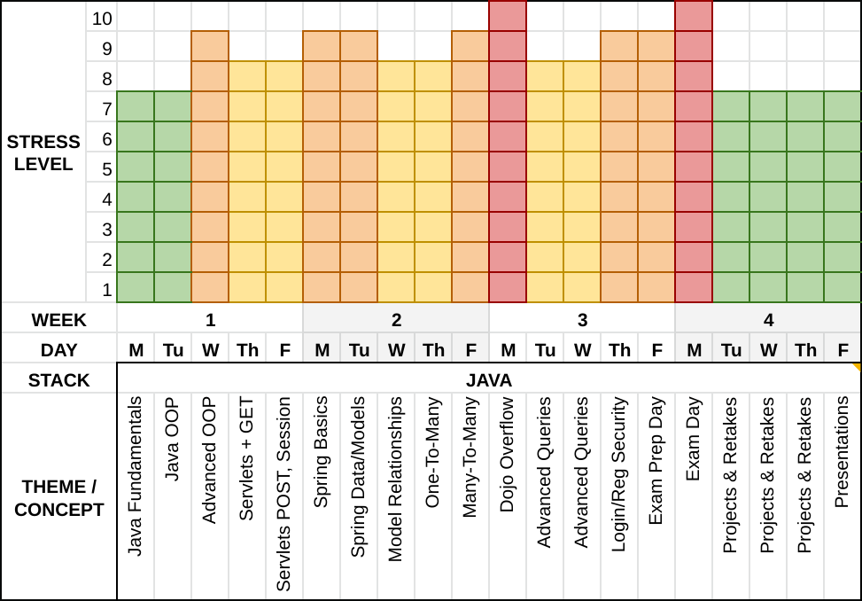

<table width="100%">
<tr>
    <th><a href="../Index.md">Back</a></th>
    <th><a href="../Index.md">Index</a></th>
    <th><a href="./002_Set_Up.md">Next</a></th>
</tr>
</table>

# 

# Overview

Welcome to the Java and Spring Track. This track will take you from the basics of the Java programming language to building full-scale web applications ready for deployment. The track is separated into several courses:

- Java Fundamentals
- Object Oriented Programming with Java
- Java on the Web (Servlets & JSP)
- Java Spring I
- Java Spring II
- Java Spring Deployment

Throughout the track, you will learn about the Java programming language and Spring, a framework for developing Java applications. Through these, you will get a deeper understanding of programming and web development, making you a more rounded full-stack developer.

## **Why Learn Java?**

Java is one of the most widely used programming languages and is estimated to have over 9,000,000 developers worldwide. Given that there are around 18,000,000 software developers worldwide - it is a sizeable chunk.

Aside from its popularity, the fact that it can run on almost every computer without changing behavior, as well as its huge selection of libraries and tools, makes it the first choice of languages for many developers. It has also long been a mainstay of educational institutions due to the concepts it teaches and its interoperability between systems.

## **Useful Links:**

- [StackOverflow Trends](https://insights.stackoverflow.com/trends?tags=java%2Cpython%2Cc%23%2Cjavascript%2Cruby%2Cswift)
- [Google Trends](https://trends.google.com/trends/explore?q=%2Fm%2F07sbkfb,%2Fm%2F06ff5,Python,%2Fm%2F02p97,%2Fm%2F010sd4y3)
- [Tiobe Index](https://www.tiobe.com/tiobe-index/)
- [Java](http://docs.oracle.com/javase/8/)
- [Spring](https://spring.io/)

Before you get started here is a quick note on how this curriculum has been laid out as well as a subjective gauge of how stressful each day is relative to the Belt Exam.

As you can see we will be spending the first few days getting acquainted with the Java programming language and delving deeper into Object Oriented Programming. Next we start learning how to make Web applications using Java Servlets. Initially we will start without a full MVC structure and by week two we will begin using Spring Boot (the server side web framework for this stack). We will then introduce Spring Data so that we can work with databases using JPA. Next, we will be learning how to make One-to-Many and Many-to-Many relationships. We will then cover how to make more advanced queries and spend some time talking about Spring Security in order to implement our own User Login and Registration. At this point we will be ready to prepare for the Belt exam. The belt exam is undeniably a stressful day, but if you have used your time well, you can and will be successful.

### **Disclaimer:**

This information above is all subject to change, delays, or possible rearrangement. Please check with your instructor if you want a more exact timeline. Also please don't interpret a lower stress day as being "better" to miss. Every day is critical for your understanding of Java and preparation for the Belt Exam.

# 

<table width="100%">
<tr>
    <th><a href="../Index.md">Back</a></th>
    <th><a href="../Index.md">Index</a></th>
    <th><a href="./002_Set_Up.md">Next</a></th>
</tr>
</table>