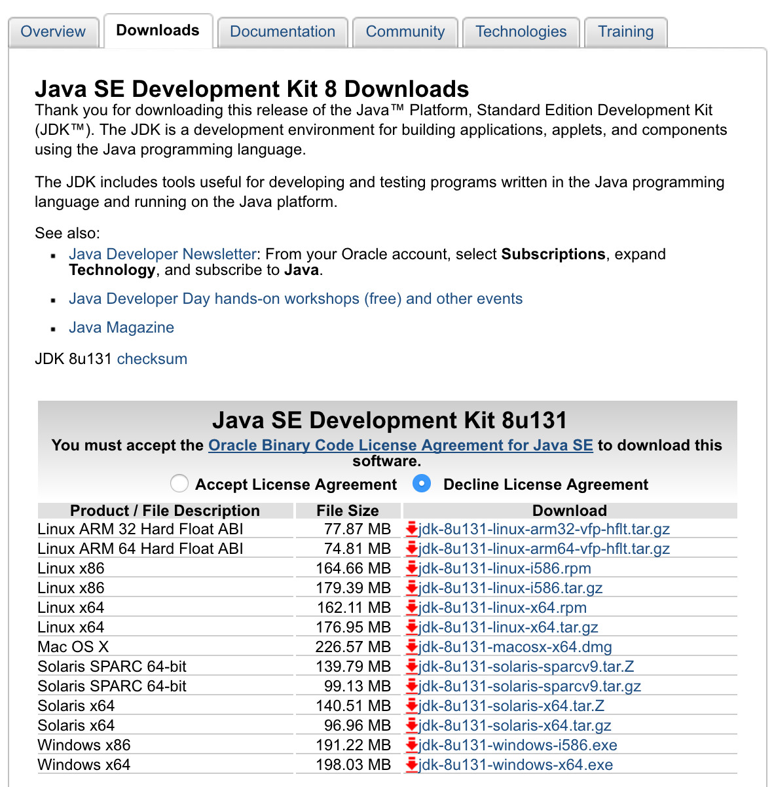
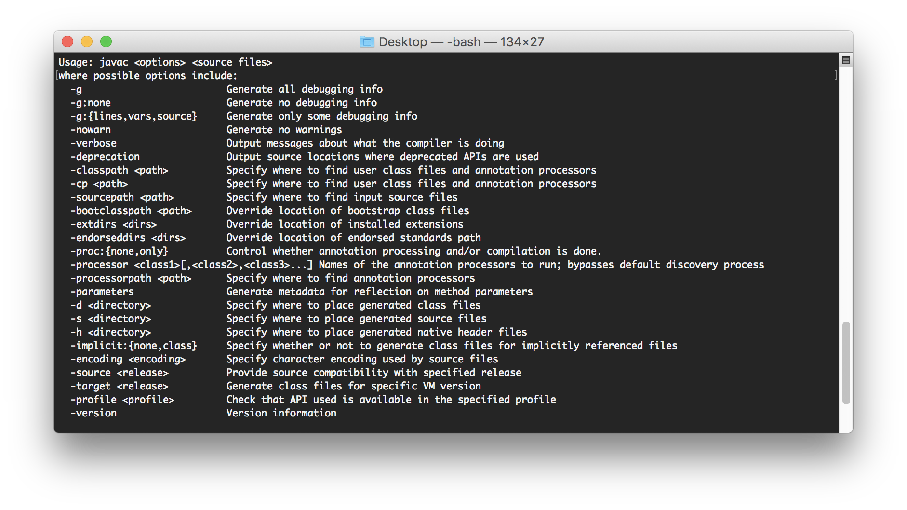
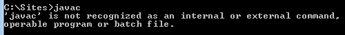
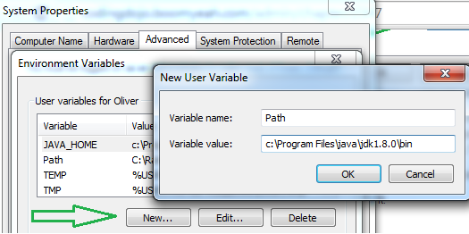
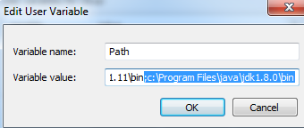
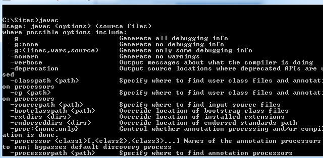

<table width="100%">
<tr>
    <th><a href="./001_Overview.md">Back</a></th>
    <th><a href="../Index.md">Index</a></th>
    <th><a href="./003_Java_Overview.md">Next</a></th>
</tr>
</table>

#
# JDK 8
In the Overview, we mentioned that Java could run on almost every operating system. This is due to what is called the Java Virtual Machine (JVM). We are installing another operating system as a virtual machine that is dedicated to interpreting Java bytecode. What is Java bytecode? Bytecode is what the Java code you write will turn into and allows a vast array of systems to run your Java app in the same way. You will generate the Java bytecode from your Java code using the java compiler (javac) in the Java Development Kit (JDK). The JDK includes the Java Runtime Environment (JRE), which contains our JVM and allows us to run our Java programs.

What you need to know, right now, is that you need the JDK and that you will compile your java code into `.class` or `.jar` files. After compiling, we can run the bytecode with tools that are included in the JDK.

## __Installation__
1.  We are using the JDK for Java SE (Standard Edition) 8. To download the JDK, visit the following link and select the appropriate package according to your operating system. Don't forget to Accept the License Agreement.
    *   [JDK 8 Download](http://www.oracle.com/technetwork/java/javase/downloads/jdk8-downloads-2133151.html)

2.  After you download, run the file and follow the instructions of the installer. You should be able to click "Next" until you reach the end of the installation.

To check if the installation has been successful, open your terminal and type `javac`. If you see a list of options for using the `javac` command, you have successfully installed the JDK.

## __Path Error__

If you see the error above, it means that the installer did not put `javac` into your PATH variable automatically. This error is most common for Windows users.

### __Setting Path Variables (Windows 10)__
1.  From the Desktop, right-click the very bottom left corner of the screen to get the Power User Task Menu.
2.  From the Power User Task Menu, click System.
3.  Click the Advanced System Settings link in the left column.
4.  In the System Properties window, click on the Advanced tab, then click the Environment Variables button near the bottom of that tab.
5.  In the Environment Variables window (pictured below), highlight the Path variable in the "User variables" section and click the Edit button. Add or modify the path lines with the paths you want the computer to access. Each different directory is separated with a semicolon as shown below.
    *   If the Path variable does not exist yet, add it. Click on __New__ and fill in the fields with this information:
  
  
    Note: The variable value is where the JDK's bin is located. Please check where you have installed your JDK.

    *   If the Path variable already exists, click on edit and add the location of JDK's bin folder. Make sure that you append to the current value with a preceding semicolon.
  
        

    6.  Open your terminal and run `javac` once again.

        

## __SE VS EE__
A common point of confusion is Java Standard Edition vs. Java Enterprise edition. What you need to know about this is that Java EE is just a standard set of libraries that allow developers to create web applications in a particular way. We are mainly developing SpringBoot applications in this course, but we will explore some of the Java EE technologies that are common to both stacks.

### __Useful Links:__
*   [Java SE JDK](http://www.oracle.com/technetwork/java/javase/downloads/index.html)
*   [Java SE](http://www.oracle.com/technetwork/java/javase/downloads/index.html)
#

<table width="100%">
<tr>
    <th><a href="./001_Overview.md">Back</a></th>
    <th><a href="../Index.md">Index</a></th>
    <th><a href="./003_Java_Overview.md">Next</a></th>
</tr>
</table>