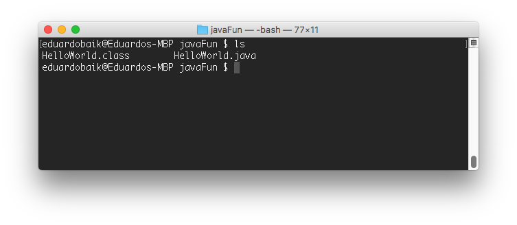

<table width="100%">
    <tr>
        <td><a href="./003_Java_Overview.md">Back</a></td>
        <td><a href="../Index.md">Index</a></td>
        <td><a href="./005_OOP_Preview.md">Next</a></td>
    </tr>
</table>


#

#   Hello World
## __Objectives:__
*   Write your first java program

Let's write our very first Java program. In this lesson, we will create a HelloWorld application and go over the life cycle of a Java program.

1.  Open up your terminal and create a new folder called javaFun. Inside of that folder, create a file named HelloWorld.java. Copy and paste the code below. Our HelloWorld.java file is called the source file and the content inside is called the source code. ___javaFun/HelloWorld.java___
```java
public class HelloWorld {
    public static void main(String[] args) {
        System.out.println("Hello World");
    }
}
```
2.  In your terminal, navigate to the javaFun directory and compile our HelloWorld.java file.If you don't see any errors, that means the javac compiler successfully compiled your Java code!
```shell
javac HelloWorld.java
```
3.  Upon success, the Java compiler automatically generates a __.class__ file. This file contains __bytecode__.



__Bytecode__ is computer-independent but partially compiled. You can try opening it in your text editor and you will see that it's composed of code we did not write. The Java compiler automatically translates your source code and converts it into what you see in your ___.class___ file.

4.  We finally have some code that our machine can understand. In your terminal, run the following:
```shell
java HelloWorld
```
__Congratulations! You just created your first Java Program!__


#

<table width="100%">
    <tr>
        <td><a href="./003_Java_Overview.md">Back</a></td>
        <td><a href="../Index.md">Index</a></td>
        <td><a href="./005_OOP_Preview.md">Next</a></td>
    </tr>
</table>