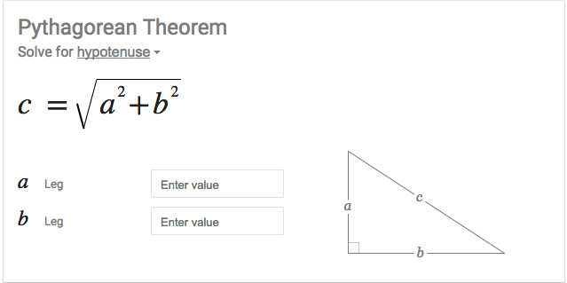

<table width="100%">
    <tr>
        <td><a href="./007_Type_Casting.md">Back</a></td>
        <td><a href="../Index.md">Index</a></td>
        <td><a href="./009_Strings.md">Next</a></td>
    </tr>
</table>

#

#   Importing
##  __Objectives:__
*   Import different java classes into your project
*   Use a test file to run your java classes

#

Java has many built in classes and methods that are readily available to developers. To tell Java that we want to use a special class for our program, all we have to do is use an import statement before our class definition. Let's say that we want to display the current date in our java program. All we have to do is import the Date class.

__javaFun/ImportDemo.java__
```java
// importing the Date class
import java.util.Date;
public class ImportDemo {
    public String getCurrentDate() {
        Date date = new Date();
        return "Current date is: " + date;
    }
}
```
__javaFun/ImportDemoTest.java__
```java
public class ImportDemoTest {
    public static void main(String[] args) {
        ImportDemo iD = new ImportDemo();
        String currentDate = iD.getCurrentDate();
        System.out.println(currentDate);
    }
}
```
Output:
```java
Current date is: Wed May 31 15:39:05 PDT 2017
```
Java programs are heavily dependent on importing code that already has been created. It is uncommon to have Java programs that are completely standalone without any imports. Although reusing given classes and methods is common, you should always be checking the documentation for best practices and deprecations.

### __Test File__
From this point forward, we will be creating a test file that runs our Java classes. Our `ImportDemo` class contained only the information that belongs to the class itself, the functionality of our class. On the other hand, our `ImportDemoTest` class contained the `main` entry method and tested our `ImportDemo` class for functionality. We want to separate class information from testing/running information; this will allow us to modularize our code and reuse the same code across multiple programs. See the explanation of the `ImportDemoTest` code below.
```java
public class ImportDemoTest {
    public static void main(String[] args) {
        ImportDemo iD = new ImportDemo(); // 1
        String currentDate = iD.getCurrentDate(); // 2
        System.out.println(currentDate); // 3
    }
} 
```            
1.  We are instantiating a new `ImportDemo` object. Now, all public methods of the `ImportDemo` class are available to the object
2.  Calling the `getCurrentDate()` method on the object.
3.  Printing the `currentDate` string

As long as both `ImportDemo` and `ImportDemoTest` files are in the same directory, you do not have to explicitly import one into another. Also, you can just run the `javac` compiler on `ImportDemoTest`, and it will compile both files for us.

### __Useful links:__
*   [java.util](https://docs.oracle.com/javase/8/docs/api/java/util/package-summary.html)

#

#   Pythagorean Theorem

In this assignment, you will create a Java program to implement the Pythagorean Theorem.



To complete this assignment, you will need the Math class from the java.lang package. This package provides fundamentals classes to the Java programming language such as Object, Boolean, String, Integer, Math, etc. Therefore, the java.lang package is automatically imported and ready to use in every Java program.

### Objectives:
*   Learn how to import a class into your project.

*   Practice object instantiation.

*   Practice method invocation.

*   Use the java.lang package.

### Tasks:
*  [ ] Create a Pythagorean class in javaFun.

__javaFun/Pythagorean.java__
```java
public class Pythagorean {
    public double calculateHypotenuse(int legA, int legB) {
        // the hypotenuse is the side across from the right angle. 
        // calculate the value of c given legA and legB
    }
}
```
* [ ]  Use a method from the Math class to calculate the hypotenuse of a right triangle given the values of the two legs. HINT: Use the static sqrt method. Static means that the method belongs to the class instead of the object. Here is some sample code:
```java
double four = 4.0;
// calling the sqrt static method of the Math class
double squareRoot = Math.sqrt(four); // 2.0
```
* [ ]  Create a PythagoreanTest file that will instantiate a new Pythagorean object and call the calculateHypotenuse method.

### __Useful Links__
*   [java.lang](https://docs.oracle.com/javase/8/docs/api/java/lang/package-summary.html)

#

[]()
<table width="100%">
    <tr>
        <td><a href="./007_Type_Casting.md">Back</a></td>
        <td><a href="../Index.md">Index</a></td>
        <td><a href="./009_Strings.md">Next</a></td>
    </tr>
</table>
