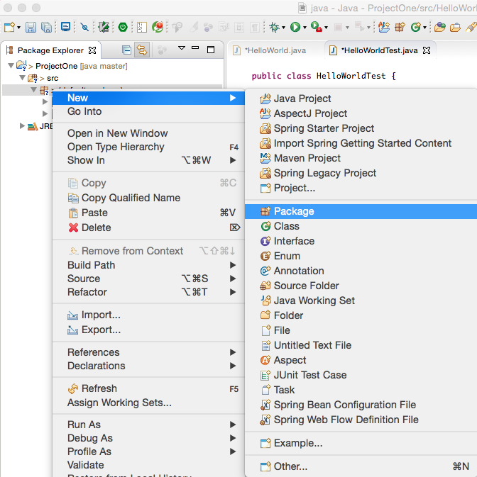
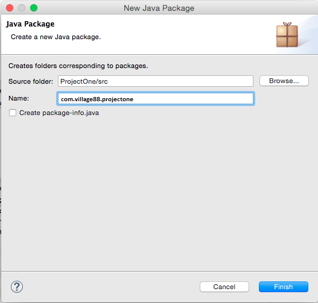
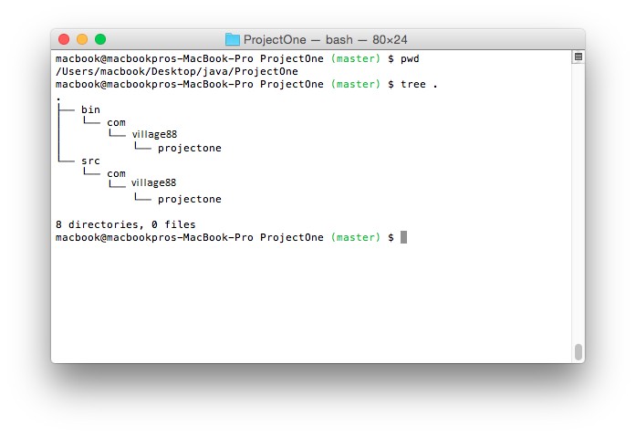

<table width="100%">
    <tr>
        <td><a href="./009_Inheritance.md">Back</a></td>
        <td><a href="../Index.md">Index</a></td>
        <td><a href="./011_Zoo_Keeper_1.md">Next</a></td>
    </tr>
</table>

#

#   Packages
##  __Objectives:__
*   Introduction to packages
#
In Java, a package is a namespace that contains a set of related classes. It is a grouping of related types that helps to organize our code and prevent collision of class names - surely you don't think that was the first `Human` class ever written, did you?

You can think of a package as being similar to folders on your computer. In fact, you should make sure your packages are represented in physical folders in your Java project. This is one of Java’s ways of organizing things. Instead of us having to save our Java classes into a single project folder, we can use sub folders (packages) to separate our classes. Imagine a large project where every single class file was in the same folder - well, maybe don't.

Packages are used in Java in order to prevent naming conflicts and to allow for a standard organization of code; it is the standard for every java class to be part of package - in fact, you have been using packages this whole time whenever you `import` something into your projects - these are all packages that you are importing!

## __Naming__
The convention is that you name your package using a reverse domain name. So for our `Human` class above, written here at Coding Dojo, the package would be `com.codingdojo`. Now, what if two people here at coding dojo were to write two different `Human` classes. That is why it is also good practice to include the project name after the reverse domain name, in this case, our package would become `com.codingdojo.oopfundamentals`. What if there are still collisions after the project name? Then you can get more specific, such as` com.codingdojo.oopfundamentals`.codesamples, or for a more realistic package name `com.codingdojo.attendanceapp.models`. As you may have noticed, the package name must also be all lowercase.

For smaller projects, like those we are working on right now, there may not be any need for anything beyond the project name as the package. Once you have decided on the name, create the directory structure, which should look something like this for example `ProjectOne`:

    ├── ProjectOne
    │     └── src
    │         └── com
    │             └── codingdojo
    │                 └── projectone
In each source file, all you would have to do is add a 'package' statement as the first line, followed by the correct package name, e.g. 'com.codingdojo.projectone'; in general the package name should terminate in the folder that your class file is in.

Of course, all this directory management is not what we want to do as developers, so we use an IDE to take care of that for us! To make new packages is easy, you just create a new one off of our `src` file:



Then you name it appropriately:



This will create the directory structure automatically for us, but leave the viewport as though we are looking at only one directory (because we don't need to add anything into `src`, `com`, or `codingdojo` beyond the structure):



To create a new class off a specific package, right click on the package name and select "New" -> "Class". This will automatically add the correct package heading to our files, e.g.:
```java
package com.codingdojo.projectone;
public class HelloWorld {
}
```
Note: You can now import the classes into other classes as you have been importing projects; if you use the classes without importing first, the IDE can help you to import them automatically.

### __Naming Conventions__
*   All lowercase
*   No spaces, dashes, slashes, or any special characters
*   Reverse domain name followed by organization specific namespaces

### __What about the CLI?__
Now that we have moved to our IDE, we will not be using the CLI very much, but you can do all of this without an IDE, of course. Look into the javac reference docs and see how you might do this.

### __Useful links:__
*   [Java Packages](https://docs.oracle.com/javase/tutorial/java/package/packages.html)
*   [Java compiler reference](http://docs.oracle.com/javase/8/docs/technotes/tools/windows/javac.html)

#

[]()
<table width="100%">
    <tr>
        <td><a href="./009_Inheritance.md">Back</a></td>
        <td><a href="../Index.md">Index</a></td>
        <td><a href="./011_Zoo_Keeper_1.md">Next</a></td>
    </tr>
</table>