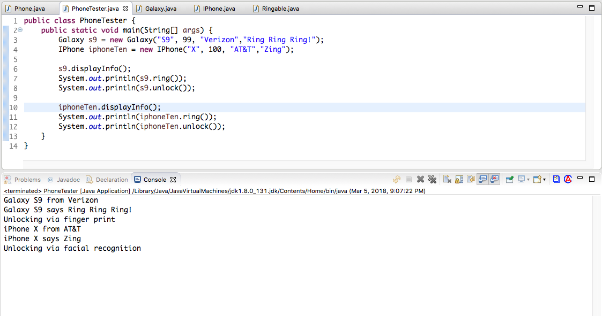

<table width="100%">
    <tr>
        <td><a href="./005_Pokemon.md">Back</a></td>
        <td><a href="../Index.md">Index</a></td>
        <td><a href="./007_Annotations.md">Next</a></td>
    </tr>
</table>

#

#   Phone Assignment
In this assignment, we are going to use `Abstract` classes and `Interfaces` to create 2 types of phones: iPhone and Galaxy.

### __Objectives:__
*   Define classes.

*   Define Interfaces.

*   Implement classes that use abstract classes and interfaces.

### __Tasks:__
*   Create a `Phone` abstract class.

    ### __Phone.java__
    ```java
    public abstract class Phone {
        private String versionNumber;
        private int batteryPercentage;
        private String carrier;
        private String ringTone;
        public Phone(String versionNumber, int batteryPercentage, String carrier, String ringTone){
            this.versionNumber = versionNumber;
            this.batteryPercentage = batteryPercentage;
            this.carrier = carrier;
            this.ringTone = ringTone;
        }
        // abstract method. This method will be implemented by the subclasses
        public abstract void displayInfo();
        // getters and setters removed for brevity. Please implement them yourself
    }
    ```
*   Create a Ringable interface that contains the following methods:

    *   ring(): This method returns a String.
    *   unlock(): This method returns a String.
    ### __Ringable.java__
    ```java
    public interface Ringable {
        // your code here
    }
    ```
*   Create an `IPhone` and `Galaxy` classes. Both classes should extend from the `Phone` abstract class and implement the Ringable interface.

    ### __IPhone.java__
    ```java
    public class IPhone extends Phone implements Ringable {
        public IPhone(String versionNumber, int batteryPercentage, String carrier, String ringTone) {
            super(versionNumber, batteryPercentage, carrier, ringTone);
        }
        @Override
        public String ring() {
            // your code here
        }
        @Override
        public String unlock() {
            // your code here
        }
        @Override
        public void displayInfo() {
            // your code here            
        }
    }
    ```
    ### __Galaxy.java__
    ```java
    public class Galaxy extends Phone implements Ringable {
        public Galaxy(String versionNumber, int batteryPercentage, String carrier, String ringTone) {
            super(versionNumber, batteryPercentage, carrier, ringTone);
        }
        @Override
        public String ring() {
            // your code here
        }
        @Override
        public String unlock() {
            // your code here
        }
        @Override
        public void displayInfo() {
            // your code here            
        }
    }
    ```
Implement the overriden methods (`ring`, `unlock`, `displayInfo`) from the `IPhone` and `Galaxy` classes according to the `PhoneTester` file below:



#

[]()
<table width="100%">
    <tr>
        <td><a href="./005_Pokemon.md">Back</a></td>
        <td><a href="../Index.md">Index</a></td>
        <td><a href="./007_Annotations.md">Next</a></td>
    </tr>
</table>