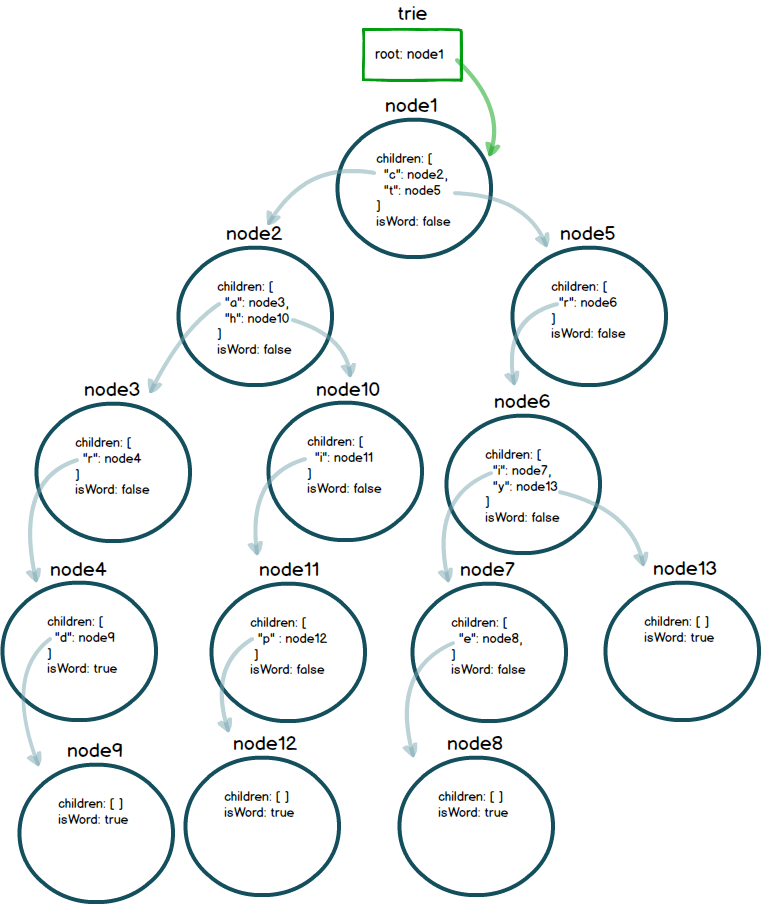

<table width="100%">
    <tr>
        <td><a href="./002_DLL.md">Back</a></td>
        <td><a href="../Index.md">Index</a></td>
        <td><a href="./004_Tries_Assignment.md">Next</a></td>
    </tr>
</table>

#

#   Tries
##  __Objectives:__
*   Introduction to Tries
*   Construct a Trie using OOP
#
Tries are tree-like data structures that are efficient in reTrieving information. Usually, Tries are used to store sequences of characters or words. A perfect example of a trie data structure is google's auto complete feature in their search bar. Every time you type a letter, google searches possible suggestions for what you are looking for. It's great! 

Here is a visual representation of our data structure from the video:



Below, is the code samples from the video:

### __com.codingdojo.tries.Node__
```java
package com.codingdojo.tries;
import java.util.HashMap;
public class Node {
    public HashMap<Character, Node> children;
    public boolean isCompleteWord;
    
    public Node() {
        this.children = new HashMap<Character, Node>();
        this.isCompleteWord = false;
    }
}
```
### __com.codingdojo.tries.Trie__
```java
package com.codingdojo.tries;
public class Trie {
    public Node root;
    
    public Trie() {
        this.root = new Node();
    }
    
    public void insertWord(String word) {
        // gets the root node;
        Node currentNode = this.root;
        
        // iterates over every character in the word
        for(int i = 0; i < word.length(); i++) {
            // currentLetter is just the character / letter at the iteration
            Character currentLetter = word.charAt(i);
            // ask if the current letter is in the map of the current node
            Node child = currentNode.children.get(currentLetter);
            if(child == null) {
                child = new Node();
                currentNode.children.put(currentLetter, child); 
            } 
            
            currentNode = child;
        }
        currentNode.isCompleteWord = true;
    }
}
```
### __com.codingdojo.tries.TrieTest__
```java
package com.codingdojo.tries;
public class TrieTest {
    public static void main(String[] args) {
        Trie trie = new Trie();
        trie.insertWord("car");
        trie.insertWord("card");
        trie.insertWord("chip");
        trie.insertWord("trie");
        trie.insertWord("try");
        
    }
}
```
#

[]()
<table width="100%">
    <tr>
        <td><a href="./002_DLL.md">Back</a></td>
        <td><a href="../Index.md">Index</a></td>
        <td><a href="./004_Tries_Assignment.md">Next</a></td>
    </tr>
</table>