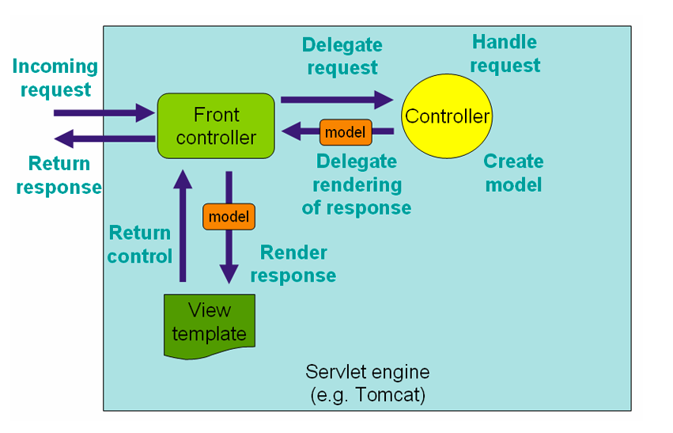

<table width="100%">
    <tr>
        <td><a href="./../../005_Java_on_the_web/018_Calculator.md">Back</a></td>
        <td><a href="../../Index.md">Index</a></td>
        <td><a href="./002_Mac_Install.md">Next</a></td>
    </tr>
</table>

#

#   Overview

Welcome to Spring Boot. So far, we built small web applications with Servlets and Java Servlet Pages (JSP). With Spring Boot, we will be building full applications that will still follow the MVC paradigm that you have learned previously. Before we get any further into Spring Boot, we want to clarify the differences between Spring, Spring MVC, and Spring Boot.

The Spring Framework is a large open source framework that consists of several modules. One of these modules is the Spring MVC framework, which allows us to build web applications using Java. We won't go into the other components and modules of Spring because it is out of the scope of this course but here is a sample list:

*   Inversion of Control component
*   Aspect-oriented programming framework
*   Data access framework
*   Transaction management framework
*   MVC framework
*   Remote access framework
*   Batch Framework
*   Integration Framework

Spring Boot is a framework used to configure and set up Spring applications very easily. Usually, a Spring project needs several dependencies installed and configured to work, but with Spring Boot, everything comes pre-configured so that developers only have to worry about writing code (and not XML). Spring Boot is a configuration framework that uses the Spring framework. For web applications, our primary Spring module will be the Spring MVC framework.

Note: Across the web, you will commonly see Spring Boot and Spring MVC used interchangeably - this is likely due to the popularity of the Spring Boot framework and the tight coupling it has with Spring MVC when used for web applications. If you find yourself configuring heavily, check to see if you are on Spring Boot or Spring MVC documentation.

## __Request and Response Cycle__
Like most web frameworks, Spring's web module functions on a request basis. This means that each request will have a life cycle within our framework where our models, views, and controllers have to work together to send an appropriate response to the client. The following picture represents the HTTP request and response cycle in Spring MVC. By the end of this course, you will learn how all these components work together to serve responses correctly.

##  __Spring MVC Features__
As you can see from the image above, there are many parts working concurrently in Spring MVC. This adds complexity in building our applications but also gives developers many benefits. One major benefit is the concept of separation of concerns. Spring MVC prides itself on having a clear separation of roles for each letter in MVC. Each role will be its own specialized object, and we will use dependency injection to have them work together. In the next lesson, we will go over how to install Spring MVC using STS and a build tool called Maven.

#

<table width="100%">
    <tr>
        <td><a href="./../../005_Java_on_the_web/018_Calculator.md">Back</a></td>
        <td><a href="../../Index.md">Index</a></td>
        <td><a href="./002_Mac_Install.md">Next</a></td>
    </tr>
</table>