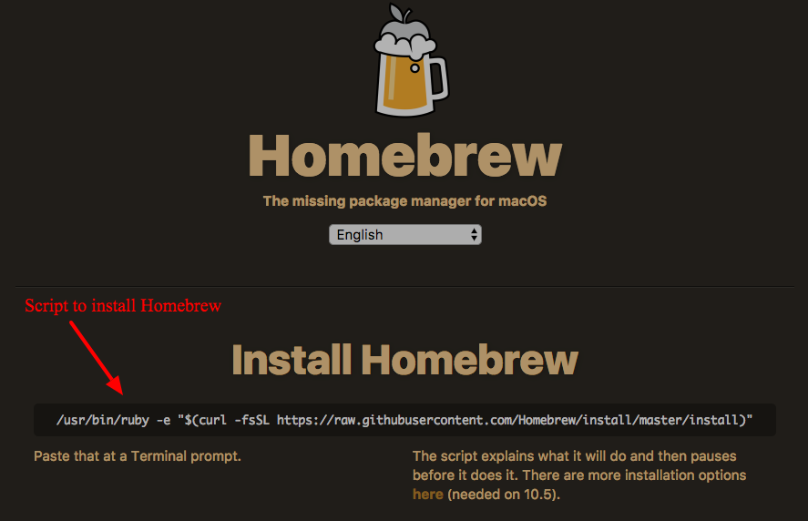
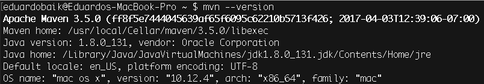

<table width="100%">
    <tr>
        <td><a href="./001_Overview.md">Back</a></td>
        <td><a href="../../Index.md">Index</a></td>
        <td><a href="./003_Windows_Install.md">Next</a></td>
    </tr>
</table>

#

#   Apache Maven Installation for Mac
In this tab, we will cover how to install Maven for Macs. Maven is a software project management and comprehension tool. With the help of Maven, Spring Boot will be able to configure and install dependencies, compile our Java code and run our class files.

##  __Homebrew__
We are going to install Maven via Homebrew. If you do not have Homebrew installed on your machine, you can easily download it at https://brew.sh/. All you need to do is paste the command into your terminal and run it.



##  __Brew Maven__
Now that we have the Homebrew package manager, we are going to download and install Maven. Open your terminal and type:

    brew install maven
This command downloads maven and installs it on your computer. To check if you have it installed correctly, we will check the maven version that it has installed. In your terminal, type:

    mvn --version
Now, you should get a screen similar to this:



### __*Note__
If you get a message similar to this:

    You should change the ownership of these directories to your user.  
        sudo chown -R $(whoami) /usr/local/share/zsh /usr/local/share/zsh/site-functions
    And make sure that your user has write permission.
        chmod u+w /usr/local/share/zsh /usr/local/share/zsh/site-functions
Follow the suggested instructions:
```
sudo chown -R $(whoami) /usr/local/share/zsh usr/local/share/zsh/site-functionscopy
```
```
chmod u+w /usr/local/share/zsh /usr/local/share/zsh/site-functions
```
And then attempt to install Maven again.

#

[]()
<table width="100%">
    <tr>
        <td><a href="./001_Overview.md">Back</a></td>
        <td><a href="../../Index.md">Index</a></td>
        <td><a href="./003_Windows_Install.md">Next</a></td>
    </tr>
</table>