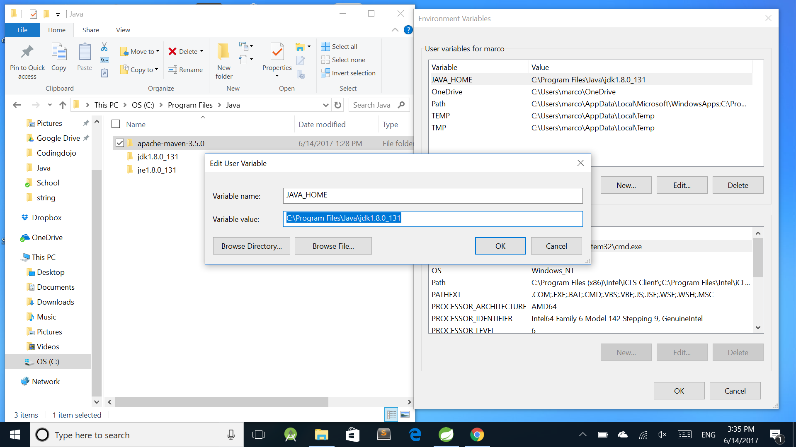
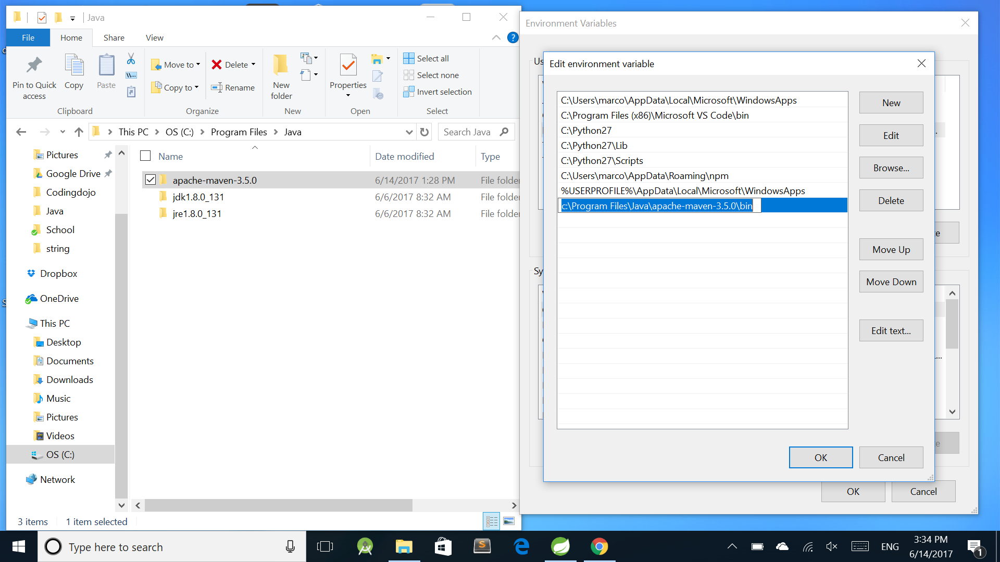
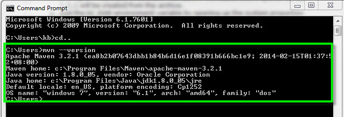

<table width="100%">
    <tr>
        <td><a href="./002_Mac_Install.md">Back</a></td>
        <td><a href="../../Index.md">Index</a></td>
        <td><a href="./004_New_Spring_Boot.md">Next</a></td>
    </tr>
</table>

#

#   Apache Maven Installation for Windows
In this tab, we will cover how to install Maven for Windows. Maven is a software project management and comprehension tool. With the help of Maven, Spring Boot will be able to configure and install dependencies, compile our Java code and run our class files.

##  __Installation__
1.  Download the latest version of Maven from this link: http://maven.apache.org/download.cgi. It is better and easier to just grab the .zip file for easy extraction.

2.  Follow the download instructions depending on your laptop/computer's operating system. For windows, download from the `Binary zip archive`

3.  The installation of Apache Maven is a simple process of extracting the archive and adding the bin folder with the mvn command to the PATH.

    *   Make sure that `JAVA_HOME` environment variable is set and points to the JDK installing folder. 
    
    *   Unzip the downloaded maven zip.
    *   Add the bin directory of the created directory apache-maven-3.5.0 to the `PATH` environment variable 
    
    *   Confirm with `mvn --version` in a new shell.
     
    

##  __Windows Tips from Maven Installation Guide__
*   To check your enviroment variables:

    echo %JAVA_HOME% 
    C:\Program Files\Java\jdk1.7.0_51

*   Adding to `PATH`: Add the unpacked distribution’s bin directory to your user `PATH` environment variable by opening up the system properties (WinKey + Pause), selecting the “Advanced” tab, and the “Environment Variables” button, then adding or selecting the `PATH` variable in the user variables with the value `C:\Program Files\apache-maven-3.5.0\bin`. The same dialog can be used to set `JAVA_HOME` to the location of your JDK, e.g. `C:\Program Files\Java\jdk1.7.0_51`

### __Useful Links__
*   [Installing Apache Maven](http://maven.apache.org/install.html)

#

<table width="100%">
    <tr>
        <td><a href="./002_Mac_Install.md">Back</a></td>
        <td><a href="../../Index.md">Index</a></td>
        <td><a href="./004_New_Spring_Boot.md">Next</a></td>
    </tr>
</table>