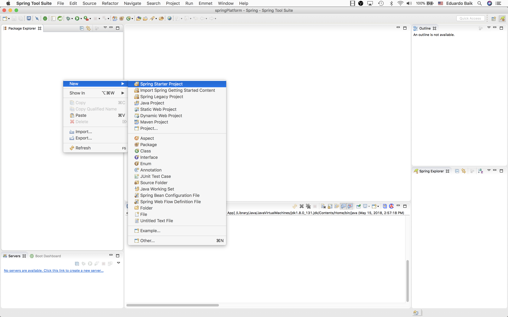
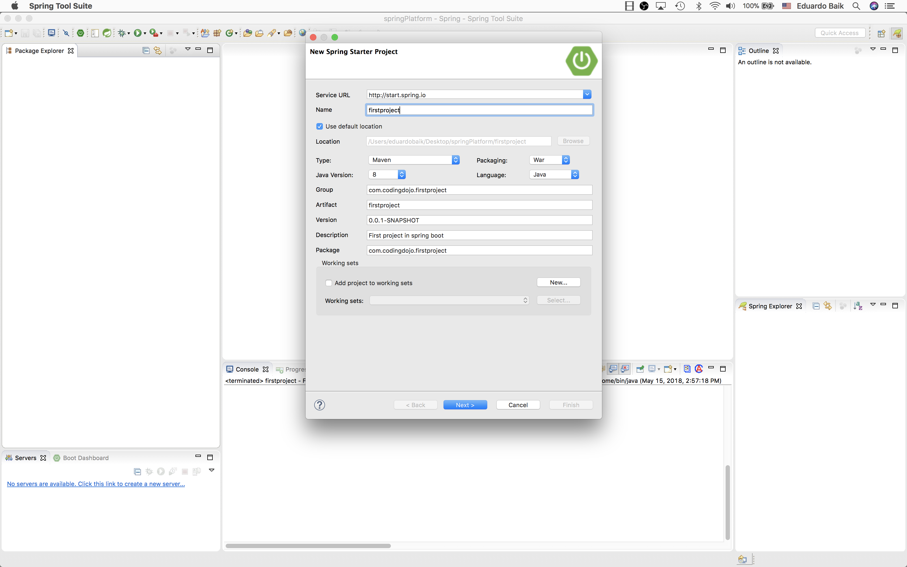
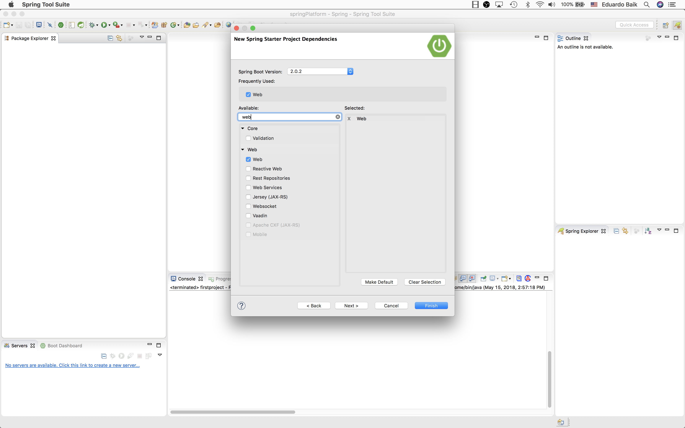
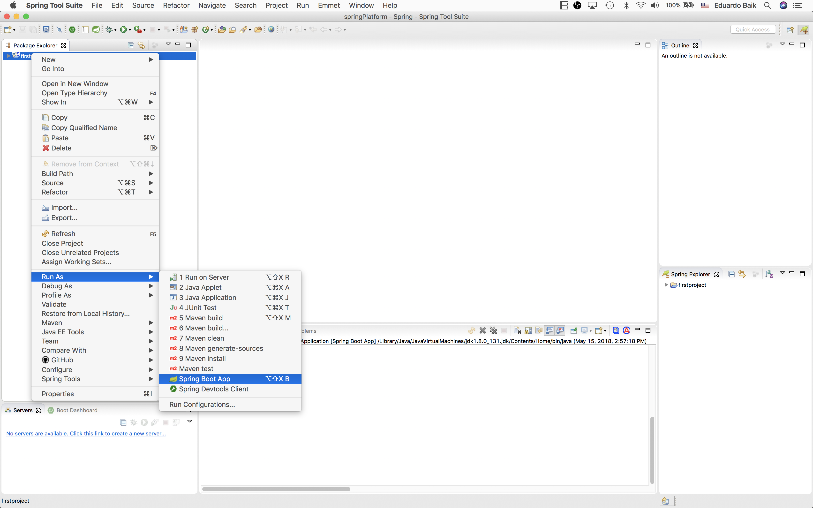
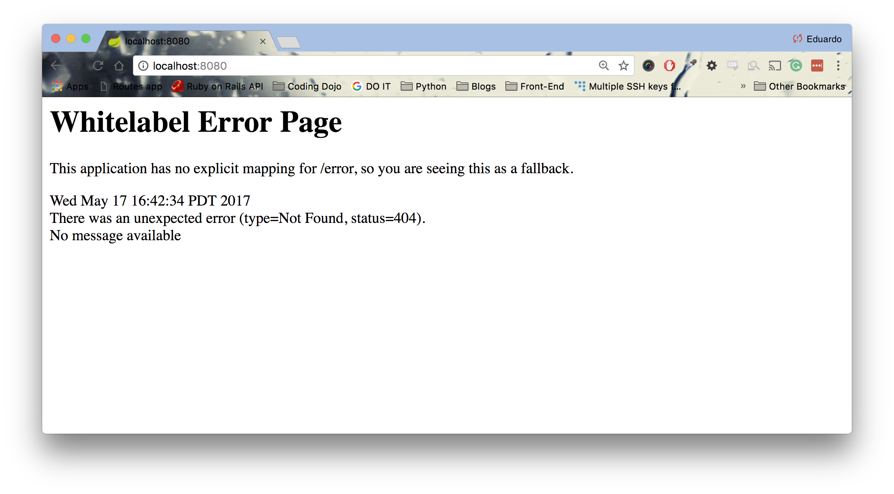

<table width="100%">
    <tr>
        <td><a href="./003_Windows_Install.md">Back</a></td>
        <td><a href="../../Index.md">Index</a></td>
        <td><a href="./005_Hello_World.md">Next</a></td>
    </tr>
</table>

#

#   Start a New Spring Boot Project
In this tab, we will learn how to start a Spring Boot project that includes Spring MVC with STS. Before you start this tab, you require the following:

*   Spring Tool Suite
*   JDK and its environment variables already set up
*   Maven and its environment variables already set up

##   __Creating the Application__

1.  Create an empty folder or directory wherever you want your Spring Boot projects to be located at. For example, you can create a folder in your desktop named "springProjects".
2.  Open STS and choose your workspace. workspace
3.  On the left-hand side in the Package Explorer, right click and hover over "new" and click on 'Spring Starter Project' 

4.  In the 'New Spring Starter Project' window, we must fill out information about our project. 
 
The information that you provide here is crucial for sharing your project. Here are some conventions:

    *   Name Field: <yourprojectname>. This will be your project name all lowercased.
    *   Group Field: com.<company>.<yourprojectname>. This will be a combination of your company and your project. For now, you can put your name in its place.
    *   Artifact Field: <yourprojectname>
    *   Description Field: Short description about your project
    *   Package Field: Same as the group field.
5.  After clicking next, we will see a window to install our dependencies. For now, search for web and select it. This is how Spring Boot uses Spring MVC! 

6.  Click Finish, and once it downloads and configures all dependencies, you will have a Spring Boot app ready to run. At first, this process can take a few minutes; however, subsequent apps will take much less time to finish.

##  __Running the Application__
1.  Right Click on the application (firstproject) -> Click on "Run As" -> Click on "Spring Boot App" 

1.  Once you see the server running in the console, you can visit 'localhost:8080' to see an error page. Don't worry, this is good. It is correctly running. 

In the next tab, we will create our first HelloWorld application!

### __Useful Links:__
*   [Maven Project Naming Conventions](https://maven.apache.org/guides/mini/guide-naming-conventions.html)

#

<table width="100%">
    <tr>
        <td><a href="./003_Windows_Install.md">Back</a></td>
        <td><a href="../../Index.md">Index</a></td>
        <td><a href="./005_Hello_World.md">Next</a></td>
    </tr>
</table>