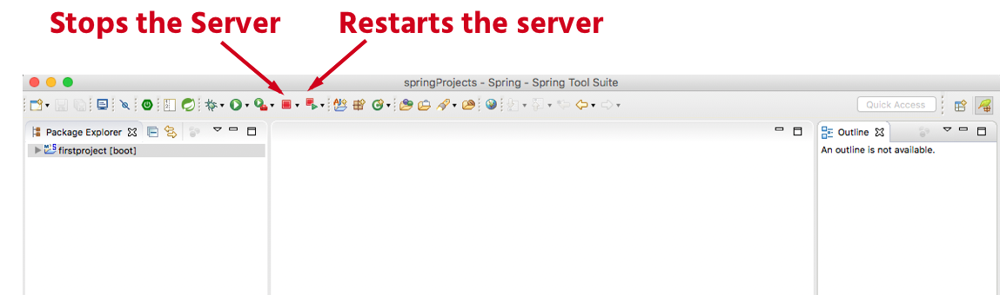
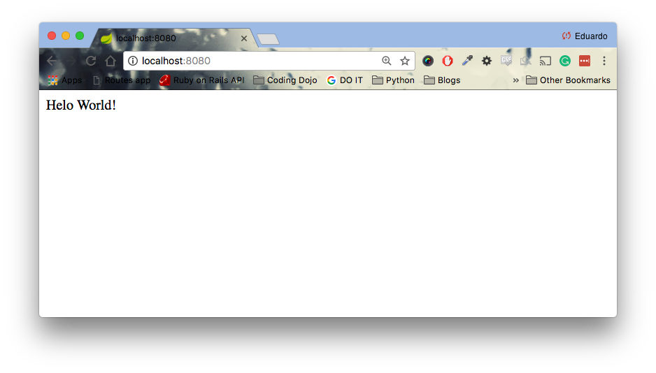

<table width="100%">
    <tr>
        <td><a href="./004_New_Spring_Boot.md">Back</a></td>
        <td><a href="../../Index.md">Index</a></td>
        <td><a href="./006_Strings.md">Next</a></td>
    </tr>
</table>

#

#   Hello World

In this tab, we will continue to work on our "firstproject" application. Instead of showing an error message to the client, we are going to respond with "Hello World!". But first, we need to learn how to stop and restart our application. Everytime we make a change to our code, we must restart our server so that changes are applied. We do that by clicking on the following:



##  __Folder Structure__
The src directory is the main location where we will be writing our code in. Inside src, we have the main and test directories. Below is the tree structure of the src folder.

    ├── src
    │   ├── main (where MVC, templates, and static resources will go)
    │   │   ├── java 
    │   │   │   └── com
    │   │   │       └── codingdojo
    │   │   │           └── firstproject
    │   │   │               └── FirstprojectApplication.java
    │   │   └── resources
    │   │       ├── application.properties
    │   │       ├── static
    │   │       └── templates
    │   └── test (where test code will go)
    │       └── java
    │           └── com
    │               └── codingdojo
    │                   └── firstproject
    │                       └── FirstprojectApplicationTests.java
In STS, the folder structure of our application is broken down into smaller parts in the Package Explorer. In __src/main/java__, we have its packages and files and in __src/main/resources__, we have a couple of folders for static files and templates.

## __Code__
Open the FirstprojectApplication.java file inside the firstproject package in __src/main/java__. To make our app work, we need to add the following to this file:

1.  @RestController and @RequestMapping("/") annotations.
2.  Import the dependencies for the annotations to work.
3.  The method that will respond to the request of the root route.

Before adding our code, take a look at your current code in the file. Now, compare it to the code below. By the way, we have commented all the new lines that you will be adding yourself.

### __FirstprojectApplication.java__
```java
package com.codingdojo.firstproject;
import org.springframework.boot.SpringApplication;
import org.springframework.boot.autoconfigure.SpringBootApplication;
// 2. Importing dependencies
import org.springframework.web.bind.annotation.RequestMapping;
import org.springframework.web.bind.annotation.RestController;
@SpringBootApplication
// 1. Annotation
@RestController
public class FirstprojectApplication {
        public static void main(String[] args) {
                SpringApplication.run(FirstprojectApplication.class, args);
        }
        
        // 1. Annotation
        @RequestMapping("/")
        // 3. Method that maps to the request route above
        public String hello() { // 3
                return "Hello World!";
        }
}
```
Restart your server and navigate to localhost:8080 in your browser. You should see the message "Hello World!" on you screen. 

 We will be going over all the things that we added and more in the next lesson tab (@RestController and Annotations), but first, we want you to get to coding. Go ahead and give it a shot at completing the next assignment.

#

[]()
<table width="100%">
    <tr>
        <td><a href="./004_New_Spring_Boot.md">Back</a></td>
        <td><a href="../../Index.md">Index</a></td>
        <td><a href="./006_Strings.md">Next</a></td>
    </tr>
</table>