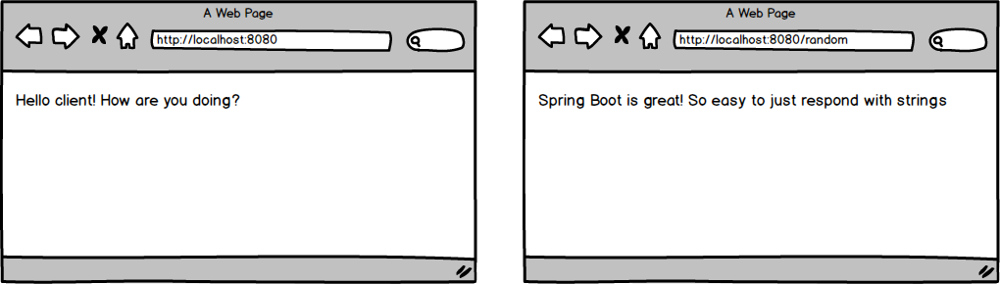

<table width="100%">
    <tr>
        <td><a href="./005_Hello_World.md">Back</a></td>
        <td><a href="../../Index.md">Index</a></td>
        <td><a href="./007_RestController.md">Next</a></td>
    </tr>
</table>

#

#   Strings Assignment
In this assignment, you will create a Spring Boot application that will respond with some hard coded text for two routes.

### __Topics:__
● New Spring Boot project

● Annotations

● Dependencies

● Methods

### __Tasks:__
● Create a brand new Spring Boot application

● When a user visits the root route, have a nice message appear for the client.

● When a user visits the '/random' route, have a nice message about Spring Boot appear for the client.

#

<table width="100%">
    <tr>
        <td><a href="./005_Hello_World.md">Back</a></td>
        <td><a href="../../Index.md">Index</a></td>
        <td><a href="./007_RestController.md">Next</a></td>
    </tr>
</table>