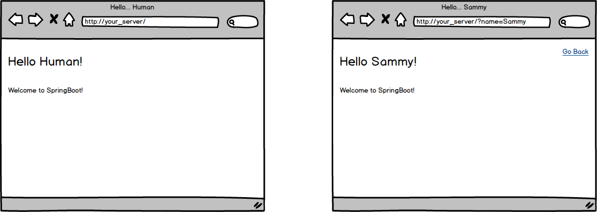

<table width="100%">
    <tr>
        <td><a href="./008_Routing.md">Back</a></td>
        <td><a href="../../Index.md">Index</a></td>
        <td><a href="./012_Templating.md">Next</a></td>
    </tr>
</table>

#

#   Assignment: Hello "Human"
You are tasked to build a page that will greet whoever visits your page. If they don't tell you their name, then greet them as "human".

### __Topics:__
● Query Parameters

### __Tasks:__
● Create an app that will render a page with either a default value of "human" or with the name provided in the URL query string.

### __Optional Challenges:__
● Can you include a "last_name" as a parameter and print out both the first and last names?

#

<table width="100%">
    <tr>
        <td><a href="./008_Routing.md">Back</a></td>
        <td><a href="../../Index.md">Index</a></td>
        <td><a href="./012_Templating.md">Next</a></td>
    </tr>
</table>