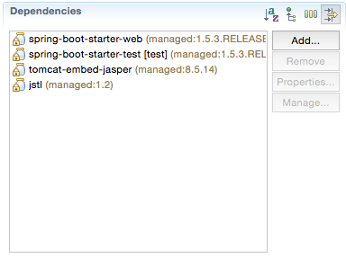

<table width="100%">
    <tr>
        <td><a href="./011_Hello_Human.md">Back</a></td>
        <td><a href="../../Index.md">Index</a></td>
        <td><a href="./013_Controllers_View.md">Next</a></td>
    </tr>
</table>

#

#   Spring Boot Templating

### __Set-up__
In this section we will be going over how to hook JSP up to Spring Boot; you will need to do this for each project that utilizes JSP to render pages, which will be most of them.

### __Dependencies__
You will need to set `tomcat-embed-jasper` and `jstl` as dependencies (`jstl` from `javax.servlet`. This will allow for us to use the JSTL library and an embedded tomcat server to render our JSP pages). To add dependencies, click on pom.xml in your project explorer. Then, select the 'Dependencies' tab and click on 'Add...'. From then, you should be able to add `tomcat-embed-jasper` and `jstl`.



If you prefer to do your dependencies via XML:
```xml
<!-- ... -->
        <dependency>
                <groupId>org.apache.tomcat.embed</groupId>
                <artifactId>tomcat-embed-jasper</artifactId>
        </dependency>
        <dependency>
                <groupId>javax.servlet</groupId>
                <artifactId>jstl</artifactId>
        </dependency>
<!-- ... -->
```
### __Configuration__
Once you have set your dependencies, there are three minor configuration steps:

1.  Create the `src/main/webapp` folder if it does not exist
2.  Create the `src/main/webapp/WEB-INF` folder
3.  Edit the `src/main/resources/applications.properties` file to contain the following code:
    ```
    spring.mvc.view.prefix=/WEB-INF/
    ```
Steps 1 and 2 create a `webapp` folder that the embedded Tomcat server will use to serve up your jsp files. Step 3 will tell it to look in the `/WEB-INF/` folder we just created to serve up our view files.

### __Verify that JSP pages can be rendered with JSTL and served to client requests.__
Once this is done, we can verify that everything is working by placing a `.jsp` file in our `/WEB-INF/` folder and verify that we can serve it up. So first place an `index.jsp` into the `/WEB-INF/` folder containing the following code:

### __/src/main/webapp/WEB-INF/index.jsp__
```xml
<%@ taglib prefix = "c" uri = "http://java.sun.com/jsp/jstl/core" %>
<c:out value="${2+2}"/>
```
This is very simple and will only be processed if our JSPs are hooked up correctly to use the JSTL library.

Now that you have a `.jsp` file, we need to render it!

To do so we will be using the `@Controller` annotation for our class (this will tell Spring Boot that we intend to use this to serve up views and not just raw data). For the methods, we will still use the `@RequestMapping` annotation to direct our requests. More information about `@Controller` annotation in the next lesson!

### __Useful Links:__
*   [JSP limitations](https://docs.spring.io/spring-boot/docs/current/reference/html/boot-features-developing-web-applications.html#boot-features-jsp-limitations)


#

[]()
<table width="100%">
    <tr>
        <td><a href="./011_Hello_Human.md">Back</a></td>
        <td><a href="../../Index.md">Index</a></td>
        <td><a href="./013_Controllers_View.md">Next</a></td>
    </tr>
</table>