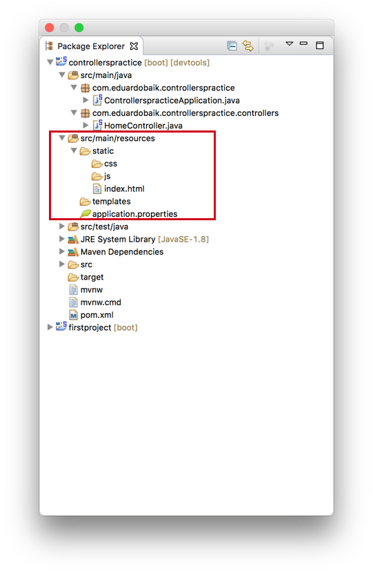
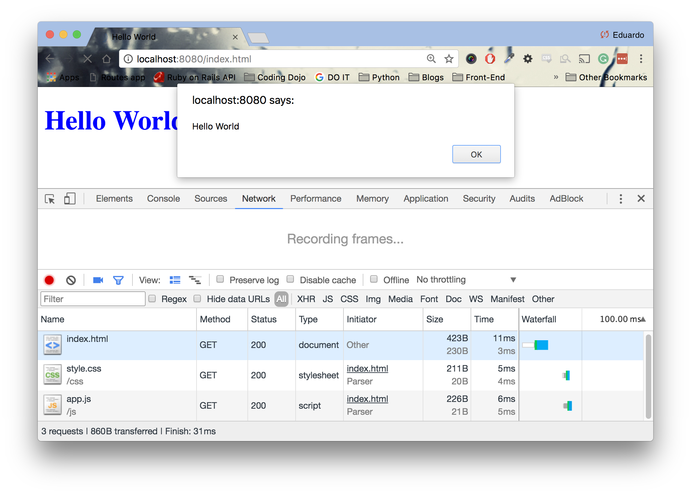

<table width="100%">
    <tr>
        <td><a href="./013_Controllers_View.md">Back</a></td>
        <td><a href="../../Index.md">Index</a></td>
        <td><a href="./015_Display_Date.md">Next</a></td>
    </tr>
</table>

#

#   Static Content
Adding static content in Spring Boot is quite simple. Spring Boot automatically looks inside the static folder located at __src/main/resources__. In this folder, we will put our HTML, CSS and JavaScript files. For file organization, we will create a css folder, a js folder and have our html files at the root of the static folder.



### __src/main/resources/static/index.html__
```html
<!DOCTYPE html>
<html>
<head>
        <title></title>
        <link rel="stylesheet" type="text/css" href="css/style.css">
        <script type="text/javascript" src="js/app.js"></script>
</head>
<body>
        <h1>Hello World</h1>
</body>
</html>
```
### __src/main/resources/static/css/style.css__
```css
h1 {
        color: blue;
}
```
### __src/main/resources/static/js/app.js__
```js
alert("Hello World");
```
Now, we can request our static html file directly from the server. Navigate to http://localhost:8080/index.html to see our file.




#

[]()
<table width="100%">
    <tr>
        <td><a href="./013_Controllers_View.md">Back</a></td>
        <td><a href="../../Index.md">Index</a></td>
        <td><a href="./015_Display_Date.md">Next</a></td>
    </tr>
</table>