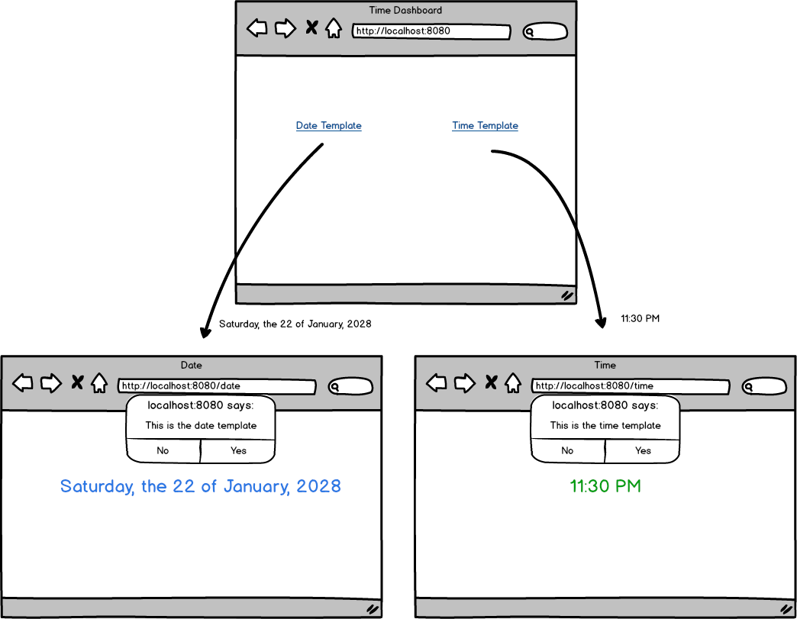

<table width="100%">
    <tr>
        <td><a href="./014_Static_COntent.md">Back</a></td>
        <td><a href="../../Index.md">Index</a></td>
        <td><a href="./016_Sessions.md">Next</a></td>
    </tr>
</table>

#

#   Assignment: Display Date
Your project manager needs you to make two templates for her front-end team: one to display the current date, and one to display the current time. Use the JSTL library to format the date so the front end developers can edit easily!

### __Topics:__
● Passing Data

● Routing

● Time formatting

### __Tasks:__
● Use new `java.util.Date()` in your controller to get the date.

● Create an app that will render three pages.

● Render one home page as the dashboard with links to the two others.

● Render one page at `/date` with the current date formatted as `Saturday, the 22 of January, 2028`

● Link an __external javascript__ file to the `/date` template that __alerts__ "This is the date template".

● Link an __external css__ file to the `/date` template that __colors__ the date in blue.

● Render one page at `/time` with the current time formatted as `11:30 PM`

● Link a __external javascript__ file to the `/time` template that __alerts__ "This is the time template".

● Link a __external css__ file to the `/time` template that that __colors__ the time in green.

#

<table width="100%">
    <tr>
        <td><a href="./014_Static_COntent.md">Back</a></td>
        <td><a href="../../Index.md">Index</a></td>
        <td><a href="./016_Sessions.md">Next</a></td>
    </tr>
</table>