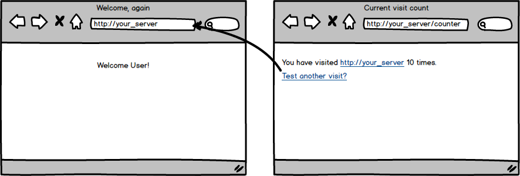

<table width="100%">
    <tr>
        <td><a href="./016_Sessions.md">Back</a></td>
        <td><a href="../../Index.md">Index</a></td>
        <td><a href="./018_POST_Flash_Data.md">Next</a></td>
    </tr>
</table>

#

#      Assignment: Counter
You need to keep track of how many times the same visitor visits a certain page. To do this, you will first need to write a basic counter. Create two pages, one that will show you how many times someone has visited the other.

### __Topics:__
● Session

### __Tasks:__
● Create and display a counter on `http://your_server/counter`

● Increment the counter on each visit to `http://your_server/`

● Counter must start at zero

● No errors regardless of which page is visited first

### __Optional Challenges:__
● Create a third page that will increment the counter by 2

● Create a reset button to set the counter back to zero

#

<table width="100%">
    <tr>
        <td><a href="./016_Sessions.md">Back</a></td>
        <td><a href="../../Index.md">Index</a></td>
        <td><a href="./018_POST_Flash_Data.md">Next</a></td>
    </tr>
</table>