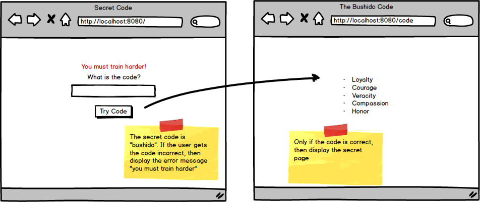

<table width="100%">
    <tr>
        <td><a href="./018_POST_Flash_Data.md">Back</a></td>
        <td><a href="../../Index.md">Index</a></td>
        <td><a href="./020_Dojo_Servey.md">Next</a></td>
    </tr>
</table>

#

#   Assignment: The Code
Sam Samurai wants you to make a page for him that is only accessible to people who know the code. If they don't know the code, then he wants to tell them to train harder. Those that do know the code should be able to view the code he has provided you in the wireframe below.

### __Topics:__
● Error Messages

### __Tasks:__
● Create a page where a user can submit a code

● Check the code against the word "bushido"

● If it's valid, give access to the `code` route

● otherwise redirect to root and display a flash error message.

#

<table width="100%">
    <tr>
        <td><a href="./018_POST_Flash_Data.md">Back</a></td>
        <td><a href="../../Index.md">Index</a></td>
        <td><a href="./020_Dojo_Servey.md">Next</a></td>
    </tr>
</table>