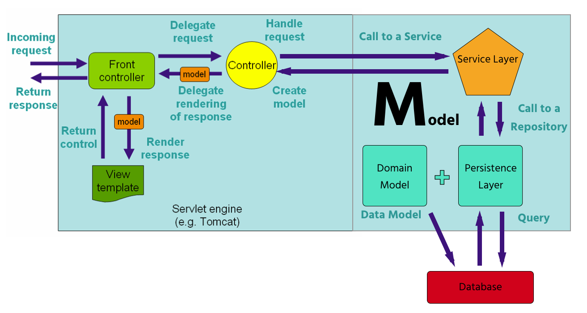

<table width="100%">
    <tr>
        <td><a href="./../001_Spring_Fundamentals/023_Thymeleaf.md">Back</a></td>
        <td><a href="../../Index.md">Index</a></td>
        <td><a href="./002_JPA.md">Next</a></td>
    </tr>
</table>

#

#       MVC - Model Lesson

We have used the word "model" in few different contexts so far in this course.

*   Model in the MVC design pattern for web applications.
*   Model object, which is available in Spring MVC's controllers.
*   __New__: Domain model, a java bean that contains annotation to represent the application's data.

Both in Spring MVC and in the current definition of the MVC design pattern, the Model is responsible for managing the application's business logic and data. However, in Spring MVC, the business logic is handled by the Service Layer (SL) and the data is handled by the Persistence Layer (PL). The SL and PL together make up for what is known as the M in MVC in today's web applications.

*   Persistence Layer: This layer is in charge of managing the application's data. PL is made up of Domain models and Repositories. We will use Repositories to access our database via an object relational mapper (ORM).
*   Service Layer: It is made up of classes that implement the business logic of our application. It will call on the repositories to execute some sort of transaction according to the request from the user.
### __Useful Links__
*   [DispatcherServlet - Spring MVC's Front Controller](https://docs.spring.io/spring/docs/current/spring-framework-reference/html/mvc.html#mvc-servlet)
*   [Front Controller Pattern](http://www.oracle.com/technetwork/java/frontcontroller-135648.html)
*   [Repositories](https://docs.spring.io/spring-data/data-commons/docs/1.6.1.RELEASE/reference/html/repositories.html)

#

<table width="100%">
    <tr>
        <td><a href="./../001_Spring_Fundamentals/023_Thymeleaf.md">Back</a></td>
        <td><a href="../../Index.md">Index</a></td>
        <td><a href="./002_JPA.md">Next</a></td>
    </tr>
</table>