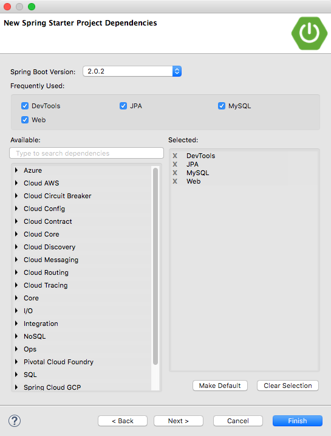
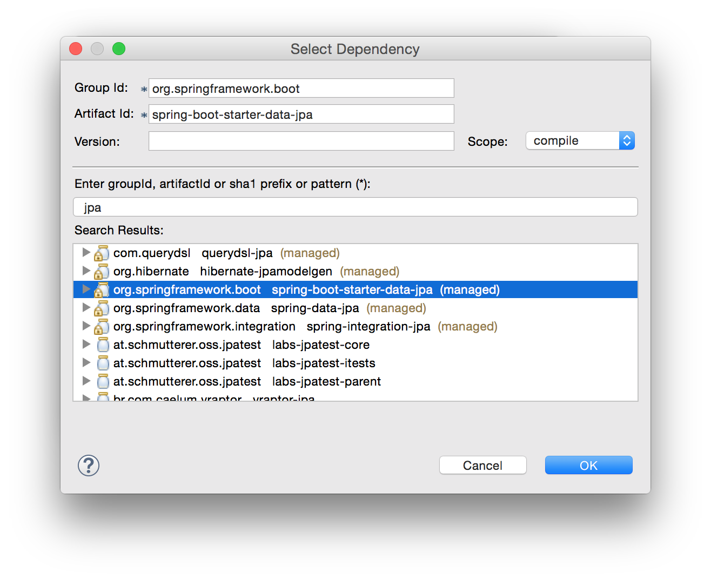
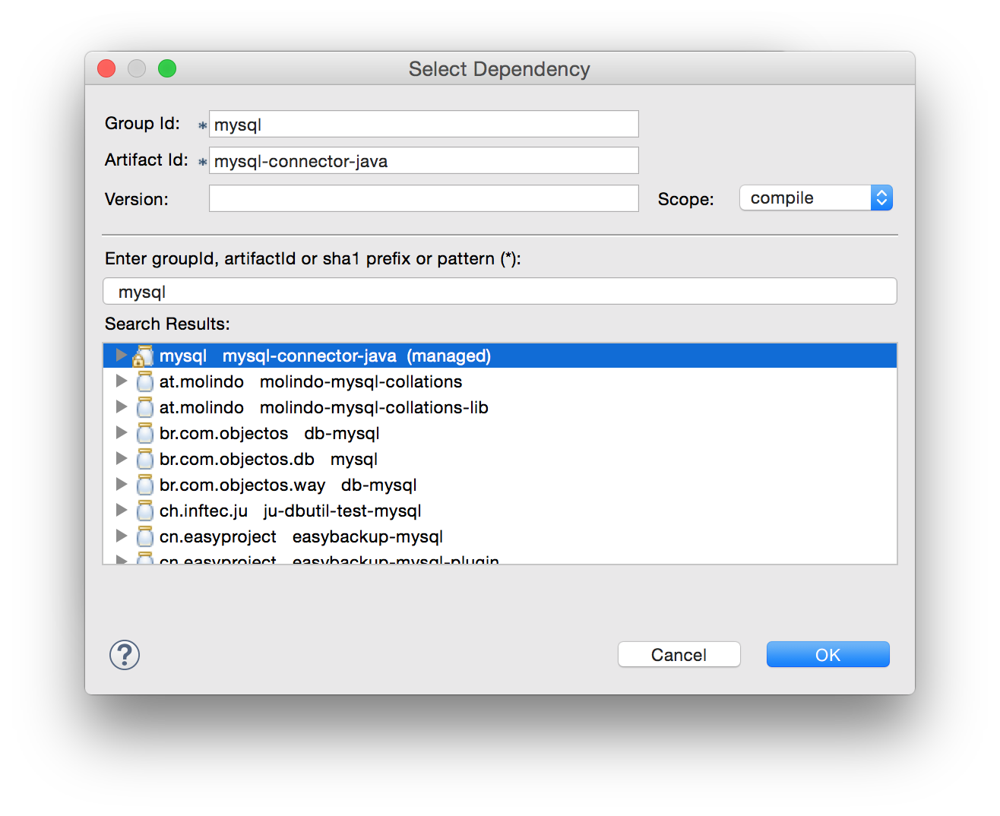

<table width="100%">
    <tr>
        <td><a href="./001_Models.md">Back</a></td>
        <td><a href="../../Index.md">Index</a></td>
        <td><a href="./003_MySQL.md">Next</a></td>
    </tr>
</table>

#

#   JPA

We need to learn how to persist data - in short: how to store data in a database. To do this we will be making use of the Java Persistence API (JPA). To start, create a new Spring Boot project and call it mvc and follow the dependencies directions below.

## __Spring Data JPA__
The Spring Data project's mission: to provide a familiar and consistent, Spring-based programming model for data access while still retaining the special traits of the underlying data store.

To this end there is a module called "Spring Data JPA." This module is built to use the JPA as the persistence driver. Of course since JPA is just a specification and not an implementation, we will need something to actually implement the Java Persistence API.

### __Dependencies and Set up:__
We will be using MySQL as our datastore with JPA, so you only need to add two new dependencies for this:

*   Spring Boot Spring Data JPA starter (JPA)
*   Java Mysql Connector (MySQL)

The `spring-boot-starter-data-jpa` actually pulls in a few other dependencies, including Hibernate, so you only need to make sure that you have those two.

There are three ways of adding the dependencies:

### __Option A) New Projects:__
You can add them in the "New Spring Project" wizard as indicated below:



### __Option B) In the pom.xml dependencies tab:__




### __Option C) Manually in the pom.xml__
```
<dependency>
    <groupId>mysql</groupId>
    <artifactId>mysql-connector-java</artifactId>
    <scope>runtime</scope>
</dependency>
<dependency>
    <groupId>org.springframework.boot</groupId>
    <artifactId>spring-boot-starter-data-jpa</artifactId>
</dependency>
```
Once you have the dependencies, you are ready to hook up your project to a MySQL database and start persisting data!

### __Useful Links:__
*   [Spring JPA Project Page](http://projects.spring.io/spring-data-jpa/)
*   [Spring JPA Key Words](http://docs.spring.io/spring-data/data-jpa/docs/current/reference/html/#repository-query-keywords)
*   [Spring Boot Persistence Features](https://docs.spring.io/spring-boot/docs/current/reference/html/boot-features-sql.html#boot-features-jpa-and-spring-data)


#

[]()
<table width="100%">
    <tr>
        <td><a href="./001_Models.md">Back</a></td>
        <td><a href="../../Index.md">Index</a></td>
        <td><a href="./003_MySQL.md">Next</a></td>
    </tr>
</table>