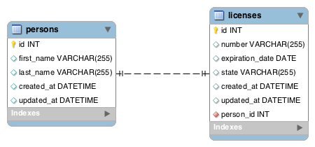

<table width="100%">
    <tr>
        <td><a href="./../002_Spring_Data_I/014_Lookify.md">Back</a></td>
        <td><a href="../../Index.md">Index</a></td>
        <td><a href="./002_Drivers_License.md">Next</a></td>
    </tr>
</table>

#

#   Relationships
In the next three lessons, we will learn how to create 1:1 (One-to-One), 1:n (One-to-Many) and n:m (Many-to-Many) relationships. In STS, create a new Spring Boot Project named "relationships" with the following dependencies: Web, JPA, MySQL, and DevTools. Also, create a schema named "relationships" in MySQL.

Let's connect our application to our MySQL schema. This exact schema should be used for all the relationship assignments in this chapter.

### __relationships/src/main/resources/application.properties__
```java
spring.datasource.url=jdbc:mysql://localhost:3306/relationships
spring.datasource.username=root
spring.datasource.password=root
spring.datasource.driver-class-name=com.mysql.jdbc.Driver
spring.jpa.hibernate.ddl-auto=update
```
Next, create a package for your model in the __src/main/java__ folder.

## __1:1__
We are going to create a 1:1 relationship between a person and a driver's license.



### __models/Person.java__
```java
// ...
@Entity
@Table(name="persons")
public class Person {
    
    @Id
    @GeneratedValue(strategy = GenerationType.IDENTITY)
    private Long id;
    private String firstName;
    private String lastName;
    @Column(updatable=false)
    private Date createdAt;
    private Date updatedAt;
    @OneToOne(mappedBy="person", cascade=CascadeType.ALL, fetch=FetchType.LAZY)
    private License license;
    
    public Person() {
        
    }
    // ...
    // getters and setters removed for brevity
    // ...
}
```
### __models/License.java__
```java
// ...
@Entity
@Table(name="licenses")
public class License {
    
    @Id
    @GeneratedValue(strategy = GenerationType.IDENTITY)
    private Long id;
    private String number;
    private Date expirationDate;
    private String state;
    @Column(updatable=false)
    private Date createdAt;
    private Date updatedAt;
    @OneToOne(fetch=FetchType.LAZY)
    @JoinColumn(name="person_id")
    private Person person;
    public License() {
        
    }
    
    // ...
    // getters and setters removed for brevity
    // ...
}
```
##  __Annotations Used__
*   `@OneToOne`: Defines the 1:1 relationship with another entity. There are different options that you can have in the annotation and it is extremely important that you use the correct one depending on which side of the relationship your entity is.
    *   `@OneToOne(mappedBy="person")`: This will map the license attribute in the Person class to the person attribute in the License class. It represents the field that owns the relationship. This element is only specified on the inverse (non-owning) side of the association.
    *   `@OneToOne(cascade=CascadeType.ALL)`: The operations that must be cascaded to the target of the association. This will make sure referential integrity is preserved in ALL actions.
    *   `@OneToOne(fetch=FetchType.LAZY)`: Whether the association should be lazily loaded or must be eagerly fetched.
        *   LAZY: The association is fetched when needed
        *   EAGER: The association is fetched immediately.
    *   There are a few other options that you can have. We encourage you to visit the useful link for the 1:1 relationship.
*   `@JoinColumn(name="person_id")`: Defines mapping for composite foreign keys. It indicates that the corresponding table to this entity has a foreign_key to the referenced table.
### __Useful Links__
*   [__1:1__](http://www.objectdb.com/api/java/jpa/OneToOne)

#

[]()
<table width="100%">
    <tr>
        <td><a href="./../002_Spring_Data_I/014_Lookify.md">Back</a></td>
        <td><a href="../../Index.md">Index</a></td>
        <td><a href="./002_Drivers_License.md">Next</a></td>
    </tr>
</table>