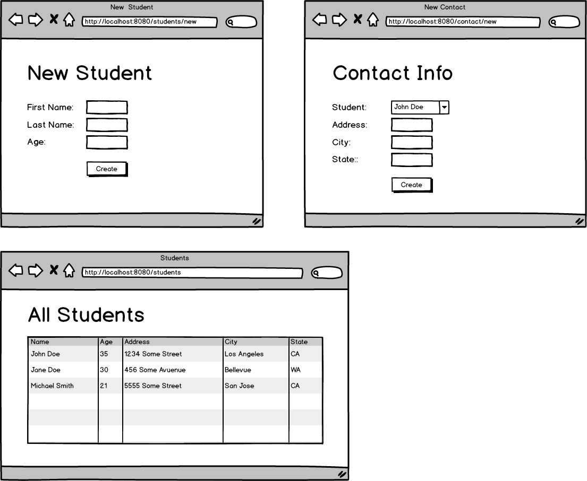

<table width="100%">
    <tr>
        <td><a href="./002_Drivers_License.md">Back</a></td>
        <td><a href="../Index.md">Index</a></td>
        <td><a href="./004_One_to_Many.md">Next</a></td>
    </tr>
</table>

#

#   Student Roster I
In this assignment, you will practice one-to-one relationships by creating a student roster application. Analyze the wireframe below and create the appropriate domain models with the correct relationships.

### __Wireframe__

### __Set Up__
Creating the web view for this assignment will be optional (only if you are behind schedule). First, create one controller and one service called `ApiService`. This service will have all the repository dependencies that you need. Complete each task below.

### __Tasks:__
● Have a method handler in the controller for the following example url: /students/create?firstName=John&lastName=Doe&age=35. Create 4 students with this method.

● Have a method handler in the controller for the following example url: `/contacts/create?student=1&address=1234%20Some%20Street&city=Los%20Angeles&state=CA`. The `student` query parameter should be the id of the student in the database. Create the contact info for the students from the previous task. (`%20` is the encoding for SPACE in query parameters)

● Have a method handler in the controller for the following example url: `/students`. Print all the students information along with their contact information in the console.

### __Optional (Only if behind):__
● Create the web view for this assignment.

● Create a web page to create students

● Create a web page to create contacts of existing students

● Create a web page that displays the information of each student.

### __Topics:__
● 1:1 relationships

● JPA methods

#

<table width="100%">
    <tr>
        <td><a href="./002_Drivers_License.md">Back</a></td>
        <td><a href="../Index.md">Index</a></td>
        <td><a href="./004_One_to_Many.md">Next</a></td>
    </tr>
</table>