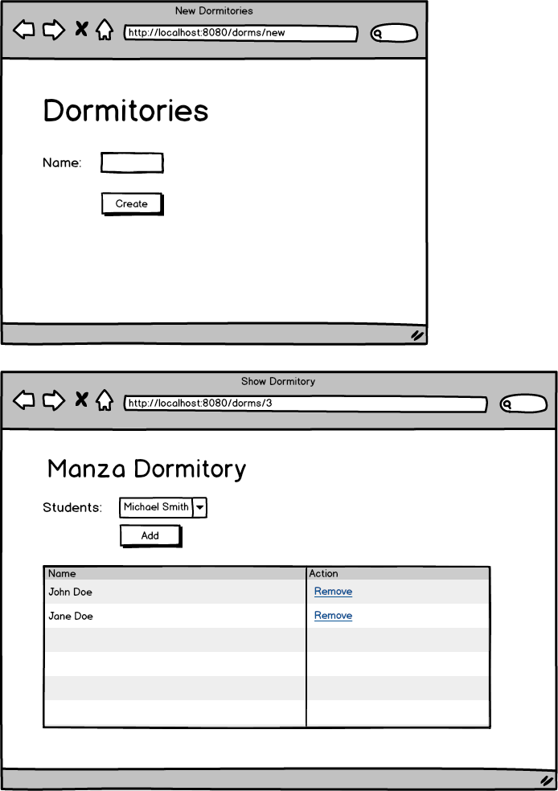

<table width="100%">
    <tr>
        <td><a href="">Back</a></td>
        <td><a href="../Index.md">Index</a></td>
        <td><a href="">Next</a></td>
    </tr>
</table>

#

#   Student Roster II
In this assignment, you will practice one-to-many relationships by building upon the Student Roster I assignment. In addition to what we already have, we will have a way to create dorm and place students in various dorms. Analyze the wireframe below and create the appropriate domain models with the correct relationships.

### __Wireframe__

### __Set Up__
Creating the web view for this assignment will be optional (only if you are behind schedule). We will continue using the `ApiService` from the previous Student Roster assignment. Complete each task below.

### __Tasks:__
● Have a method handler in the controller for the following example url: `/dorms/create?name=Manza`. Create 4 dorms with this method.

● Have a method handler in the controller for the following example url: `/dorms/3/add?student=1`. This method should add student with id 1 to the dorm with id 3. Add multiple student to different dormitories.

● Have a method handler in the controller for the following example url: `/dorms/3/remove?student=1`. This method should remove student with id 1 from the dorm with id 3. Remove multiple students from a single dormitory.

● Have a method handler in the controller for the following example url: `/dorms/1`. Display all the students that belong to the dorm with id 1. This method should work with any dorm as well.

### __Optional (Only if behind):__
● Create the web view for this assignment.

● Create a page where you can create dormitories

● In the dormitory show page, allow the ability to add students to each dorm. Once added, update the student table for each dorm.

● If a student already belongs to a dorm, remove the option add them to any other dorm.

● Allow the ability to remove a student from a specific dorm.

### __Topics:__
● 1:n relationships

● JPA methods

#

<table width="100%">
    <tr>
        <td><a href="">Back</a></td>
        <td><a href="../Index.md">Index</a></td>
        <td><a href="">Next</a></td>
    </tr>
</table>