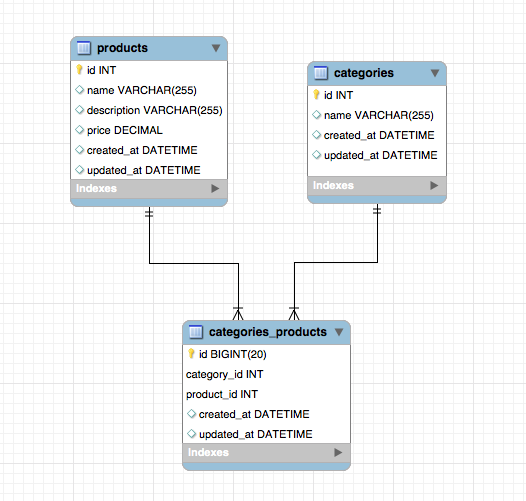

<table width="100%">
    <tr>
        <td><a href="./006_Student_Roster_II.md">Back</a></td>
        <td><a href="../../Index.md">Index</a></td>
        <td><a href="./008_Products.md">Next</a></td>
    </tr>
</table>

#

#   Relationships Continued
In this tab, we will learn how to create Many-to-Many relationships

##  __n:m__
We are going to create a n:m relationship between products and categories. A product can be in many categories and a category can have many products. If we deconstruct a `many-to-many` relationship, we can define it as two `one-to-many` relationships with an `entity` (Model) for the middle table.



### __models/Product.java__
```java
// ...
@Entity
@Table(name="products")
public class Product {
    @Id
    @GeneratedValue(strategy = GenerationType.IDENTITY)
    private Long id;
    private String name;
    private String description;
    private double price;
    @Column(updatable=false)
    private Date createdAt;
    private Date updatedAt;
    @ManyToMany(fetch = FetchType.LAZY)
    @JoinTable(
        name = "categories_products", 
        joinColumns = @JoinColumn(name = "product_id"), 
        inverseJoinColumns = @JoinColumn(name = "category_id")
    )
    private List<Category> categories;
    
    public Product() {
        
    }
    // ...
    // getters and setters removed for brevity
    // ...
}
```
### ___models/CategoryProduct.java (Middle Table)__
```java
// ...
@Entity
@Table(name="categories_products")
public class CategoryProduct {
    @Id
    @GeneratedValue(strategy = GenerationType.IDENTITY)
    private Long id;
    @Column(updatable=false)
    private Date createdAt;
    private Date updatedAt;
    @ManyToOne(fetch = FetchType.LAZY)
    @JoinColumn(name="product_id")
    private Product product;
    
    @ManyToOne(fetch = FetchType.LAZY)
    @JoinColumn(name="category_id")
    private Category category;
    
    public CategoryProduct() {
        
    }
    // ...
    // getters and setters removed for brevity
    // ...
}
```
### __models/Category.java__
```java
// ..
@Entity
@Table(name="categories")
public class Category {
    @Id
    @GeneratedValue(strategy = GenerationType.IDENTITY)
    private Long id;
    private String name;
    @Column(updatable=false)
    private Date createdAt;
    private Date updatedAt;
    @ManyToMany(fetch = FetchType.LAZY)
    @JoinTable(
        name = "categories_products", 
        joinColumns = @JoinColumn(name = "category_id"), 
        inverseJoinColumns = @JoinColumn(name = "product_id")
    )     
    private List<Product> products;
    
    public Category() {
        
    }
    
    // ...
    // getters and setters removed for brevity
    // ...
}
```
##  __n:m without extra columns__
Now, if you want to create a `many-to-many` relationship without an `entity` or extra columns, we can set it up by using the `@ManyToMany` annotation.


```java
models/Product.java
// ...
@Entity
@Table(name="products")
public class Product {
    @Id
    @GeneratedValue(strategy = GenerationType.IDENTITY)
    private Long id;
    private String name;
    private String description;
    private float price;
    @Column(updatable=false)
    private Date createdAt;
    private Date updatedAt;
    @ManyToMany(fetch = FetchType.LAZY)
    @JoinTable(
        name = "categories_products", 
        joinColumns = @JoinColumn(name = "product_id"), 
        inverseJoinColumns = @JoinColumn(name = "category_id")
    )
    private List<Category> categories;
    
    public Product() {
        
    }
    // ...
    // getters and setters removed for brevity
    // ...
}
```
### __models/Category.java__
```java
// ..
@Entity
@Table(name="categories")
public class Category {
    @Id
    @GeneratedValue(strategy = GenerationType.IDENTITY)
    private Long id;
    private String name;
    @Column(updatable=false)
    private Date createdAt;
    private Date updatedAt;
    @ManyToMany(fetch = FetchType.LAZY)
    @JoinTable(
        name = "categories_products", 
        joinColumns = @JoinColumn(name = "category_id"), 
        inverseJoinColumns = @JoinColumn(name = "product_id")
    )
    private List<Product> products;
    
    public Category() {
        
    }
    
    // ...
    // getters and setters removed for brevity
    // ...
}
```
Setting up your models like the above, will automatically create the joining table for us. If you have trouble seeing the changes, drop the tables in your schema and restart your Spring Boot server.

### __New Annotations Used__
*   `@ManyToMany`: Defines a many-valued association with many-to-many multiplicity. You will have to use this annotation on both entities.

*   `@JsonIgnore`: We are using this annotation to solve an infinite recursion issue with Jackson and JPA. Therefore, we ignore that attribute when it's being serialized into `json`.

*   `@JoinTable`: Defines the middle table the our entities will be mapped to.
    *   `@JoinTable(name="categories_products")`: The name of the middle table.
    *   `joinColumns`: The foreign key that matches the primary key of the embedded class when the tables are joined.
    *   `inverseJoinColumns`: The foreign key that matched the foreign key of the opposite class when the tables are joined.
### __Useful Links__
*   [Many-to-Many](http://www.objectdb.com/api/java/jpa/ManyToMany)


#

[]()
<table width="100%">
    <tr>
        <td><a href="./006_Student_Roster_II.md">Back</a></td>
        <td><a href="../../Index.md">Index</a></td>
        <td><a href="./008_Products.md">Next</a></td>
    </tr>
</table>