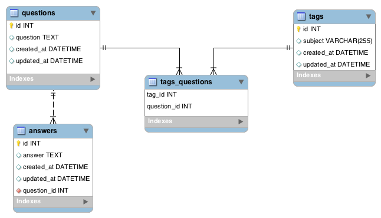

<table width="100%">
    <tr>
        <td><a href="./010_Full_MVC.md">Back</a></td>
        <td><a href="../Index.md">Index</a></td>
        <td><a href="./../004_Advance_Queries/001_Advance.md">Next</a></td>
    </tr>
</table>

#

#   DojoOverflow Assignment
In this tab, you will be creating a StackOverflow / Quora clone. Users will be able to create questions, answers, and add tag subjects for the questions.

### __ERD and Wireframe__

###   __Topics:__
● Relationships

● Validations

● Domain Models

● JPA methods

###   __Tasks:__
● Have the question dashboard display each question and their tags.

● Allow users to create questions with tags and implement validation errors.

● Allow users to answer questions and implement validation errors.

● Have the question show page display all the answers for that specific questions.

#

<table width="100%">
    <tr>
        <td><a href="./010_Full_MVC.md">Back</a></td>
        <td><a href="../Index.md">Index</a></td>
        <td><a href="./../004_Advance_Queries/001_Advance.md">Next</a></td>
    </tr>
</table>