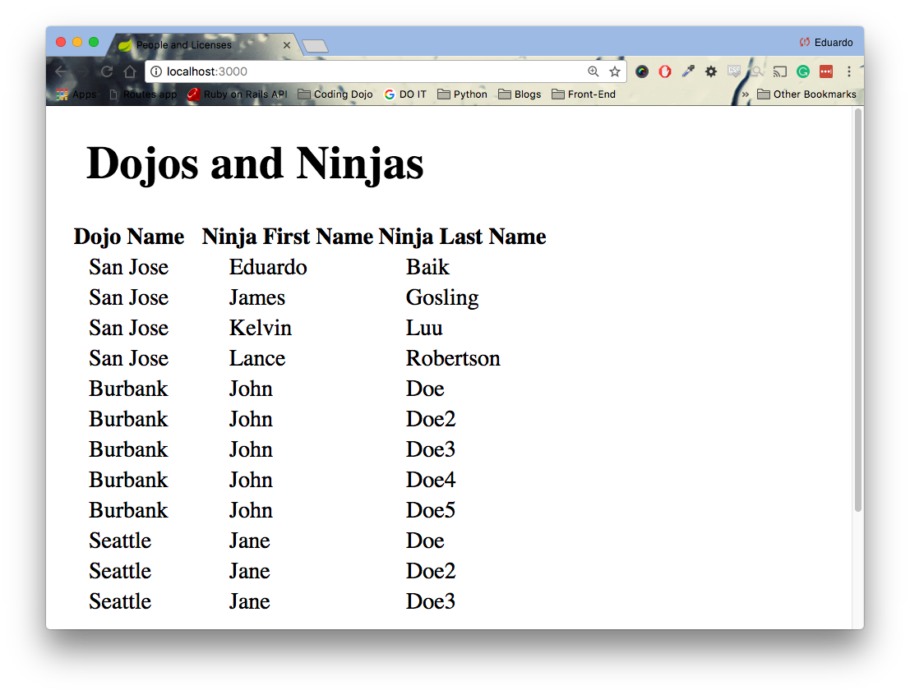

<table width="100%">
    <tr>
        <td><a href="./001_Advance.md">Back</a></td>
        <td><a href="../Index.md">Index</a></td>
        <td><a href="./003_Queries_Joins.md">Next</a></td>
    </tr>
</table>

#

#   Joins
More often than not, queries on one table are not efficient or sufficient enough. It is extremely common for applications to require information of multiple tables. JPA allows us to set our relationships on our Domain models; but sometimes, we want all the data in one join query.

Let's execute an inner join using JPQL.
```java
public interface DojoRepository extends CrudRepository<Dojo, Long>{
    List<Dojo> findAll()
    
    //...
    // previous methods removed for brevity
    //...
    
    // inner join retrieving only the dojos
    @Query("SELECT d FROM Dojo d JOIN d.ninjas n")
    List<Dojo> joinDojosAndNinjas();
    
    // inner join retrieving dojos and ninjas
    @Query("SELECT d, n FROM Dojo d JOIN d.ninjas n")
    List<Object[]> joinDojosAndNinjas2();
}
```
Let's go over the differences between the two queries above:

1.  The first query retrieves all the dojos using a named method. It will retrieve all the dojos without joining the ninjas table. To retrieve the ninjas of each dojo, we must call the .getNinjas() method that we set in our Domain model. For N dojos that we have, we are going to perform N+1 queries to get information about the ninjas. 1 query to get all the dojos + N queries to the ninjas for each dojo.

2.  The second query is very similar to the first one. This time we are retrieving all the dojos that are connected with a ninja through the inner join. In this case, we can possibly have multiple instances of the dojo because with have a One-to-Many relationship with the ninjas. Let's say we have 15 ninjas, divided equally between 3 dojos. This query will return 15 rows with repeating dojos. Furthermore, because of the nature of our query, we have no idea about the ninja information for each dojo.

3.  The third query efficiently retrieves the information about all the dojos that have a relationship with a ninja. We avoid doing N+1 queries by getting all the dojo and ninja information all at once (1 query).

In the last example, notice that the "n" variable is set to the relationship dojo.ninjas. To unpack the data, you can cast each index of the array of objects to the expecting class.
```java
List<Object[]> table = dojoRepo.joinDojosAndNinjas2();
for(Object[] row : table) {
    Dojo dojo = (Dojo) row[0];
    Ninja ninja = (Ninja) row[1];
    System.out.println(dojo.getName());
    System.out.println(ninja.getFirstName());
}
```
If you want to use this query in your view, JSP will automatically cast the type for you.
```html
<table class="table">
    <thead>
        <th>Dojo Name</th>
        <th>Ninja First Name</th>
        <th>Ninja Last Name</th>
    </thead>
    <tbody>
        <c:forEach var="row" items="${table}">                
        <tr>
            <td>${row[0].name}</td>
            <td>${row[1].firstName}</td>
            <td>${row[1].lastName}</td>
        </tr>
        </c:forEach>
    </tbody>
</table>
```
This JSP code will output this:



### __Useful Links__
*   [JPQL Select](http://www.objectdb.com/java/jpa/query/jpql/select)
*   [JPQL Join](http://www.objectdb.com/java/jpa/query/jpql/from)

#

[]()
<table width="100%">
    <tr>
        <td><a href="./001_Advance.md">Back</a></td>
        <td><a href="../Index.md">Index</a></td>
        <td><a href="./003_Queries_Joins.md">Next</a></td>
    </tr>
</table>