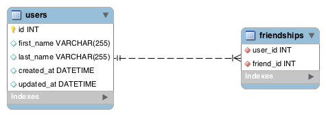

<table width="100%">
    <tr>
        <td><a href="./003_Queries_Joins.md">Back</a></td>
        <td><a href="../../Index.md">Index</a></td>
        <td><a href="./005_Employee_Managers.md">Next</a></td>
    </tr>
</table>

#

#   Self-Join
Self-join is a technique to have self-referential tables. In this tab, you will learn how to implement self-joins in Spring Boot. Consider the following ERD:



In this example, one user can have many friends, and a friend can have many users. This turns into a Many-to-Many, in which the friendships table will keep track of who is friends with whom. Let's set up our domain model to reflect the ERD.
```java
// ...
@Entity
@Table(name="users")
public class User {
    @Id
    @GeneratedValue(strategy = GenerationType.IDENTITY)
    private Long id;
    private String firstName;
    private String lastName;
    private Date createdAt;
    private Date updatedAt;
    
    @ManyToMany(fetch = FetchType.LAZY)
    @JoinTable(
        name = "friendships", 
        joinColumns = @JoinColumn(name = "user_id"), 
        inverseJoinColumns = @JoinColumn(name = "friend_id")
    )
    private List<User> friends;
    
    @ManyToMany(fetch = FetchType.LAZY)
    @JoinTable(
        name = "friendships", 
        joinColumns = @JoinColumn(name = "friend_id"), 
        inverseJoinColumns = @JoinColumn(name = "user_id")
    )
    private List<User> userFriends;
    //...
    // getter and setters removed for brevity
    //...
    
    public List<User> getFriends() {
        return friends;
    }
    public void setFriends(List<User> friends) {
        this.friends = friends;
    }
    public List<User> getUserFriends() {
        return userFriends;
    }
    public void setUserFriends(List<User> userFriends) {
        this.userFriends = userFriends;
    }     
}
```
Here, we use the @ManyToMany annotation twice to reflect the self-reference. The first is to fetch all the friends that one specific user has. The second to fetch all users that have friended a specific user. For example, let's say that our friendships table looks like this:

user_id | friend_id
-  | -
1  | 2
1  | 3
2  | 1
Now, we can call our getter methods to get the list of users that we need respectively.
```java
public void friends() {
    User user = userRepo.findOne(Long.valueOf(1));
    System.out.println(user.getFriends());
    
    // This will print out the first name of users 2 and 3. All the users that are user's friends
    for(User u : user.getFriends()) {
        System.out.println(u.getFirstName());
    }
    
    // This will only print out the first name of user 2.
    for(User u : user.getUserFriends()) {
        System.out.println(u.getFirstName());
    }
}
```
#

[]()
<table width="100%">
    <tr>
        <td><a href="./003_Queries_Joins.md">Back</a></td>
        <td><a href="../../Index.md">Index</a></td>
        <td><a href="./005_Employee_Managers.md">Next</a></td>
    </tr>
</table>