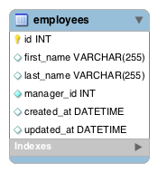

<table width="100%">
    <tr>
        <td><a href="./004_Self_Join.md">Back</a></td>
        <td><a href="../Index.md">Index</a></td>
        <td><a href="./006_Pagination.md">Next</a></td>
    </tr>
</table>

#

#   Employee and Managers
In this assignment, you will create the domain models for a system to track employees and managers. In this case, you will not need a middle table to track the relationships because only a manager can have many employees. How would you change your domain model to reflect that? (Hint: @ManyToOne and @OneToMany)

### __ERD__

### __Topics:__
● Self Join

### __Tasks:__
● Implement the domain model for the self join to work.

● Implement a getter method that will allow a manager to get all their employees.

● Implement a getter method that will allow an employee to get their manager.

#

<table width="100%">
    <tr>
        <td><a href="./004_Self_Join.md">Back</a></td>
        <td><a href="../Index.md">Index</a></td>
        <td><a href="./006_Pagination.md">Next</a></td>
    </tr>
</table>