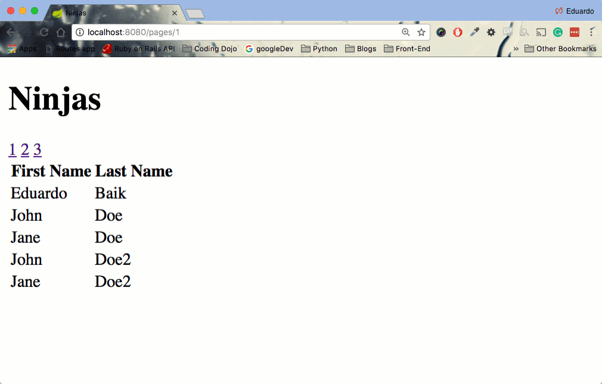
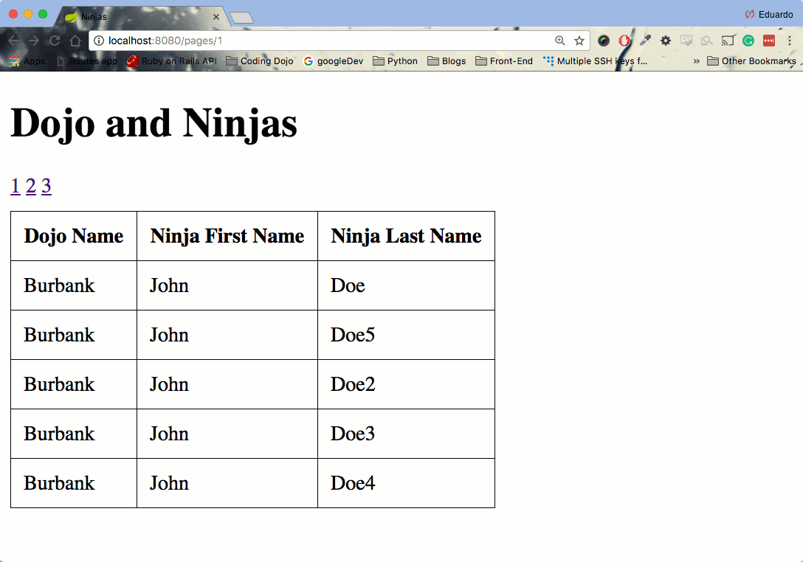

<table width="100%">
    <tr>
        <td><a href="./005_Employee_Managers.md">Back</a></td>
        <td><a href="../../Index.md">Index</a></td>
        <td><a href="./../005_Login_Registration/001_Overview.md">Next</a></td>
    </tr>
</table>

#

#   Optional - Pagination And Sorting
Whenever we see a list on modern websites, a good user interface will have small breadcrumbs for pagination and if you are lucky, the data will be somewhat sorted. If you want to implement this feature into your application, we can use an extension of the CrudRepository, the PagingAndSortingRepository. In this lesson, we will be using the same ninjas table from the One-To-Many relationships lesson.

##  __Implementation__
We would like our list of ninjas to only show 5 at a time, sorted by the last name.



The first thing we have to do is extend our NinjaRepository with PagingAndSortingRepository.
```java
//...
public interface NinjaRepository extends PagingAndSortingRepository<Ninja, Long>{
}
```
Next, create a NinjaService that will use the NinjaRepository. All of our pagination logic will be in this service.
```java
//...
@Service
@Transactional
public class NinjaService {
    @Autowired 
    NinjaRepository ninjaRepo;
    // static variable to set the number of ninjas that we want per page
    private static final int PAGE_SIZE = 5;
    public Page<Ninja> ninjasPerPage(int pageNumber) {
        // get all the ninjas page and sort them in ascending order the last name property
        PageRequest pageRequest = new PageRequest(pageNumber, PAGE_SIZE, Sort.Direction.ASC, "lastName");
        Page<Ninja> ninjas = ninjaRepo.findAll(pageRequest);
        return ninjaRepo.findAll(pageRequest);
    }
}
```
As you can see, our ninjasPerPage method takes a pageNumber argument and returns a Page iterable filled with ninjas objects. In the PagingAndSortingRepository documentation, the findAll() method has the following definition:

*   Page<T> findAll(Pageable pageable): Returns a Page of entities meeting the paging restriction provided in the Pageable object.

The findAll method accepts a Pageable type but Pageable is an interface itself. Therefore, we are using the PageRequest class, which implements the Pageable interface. When we create a new instance of the PageRequest, we are passing the page number, how many we want per page, the sorting order, and what we want to sort by.

### __Controller__
```java
@RequestMapping("/pages/{pageNumber}")
public String getNinjasPerPage(Model model, @PathVariable("pageNumber") int pageNumber) {
    // we have to subtract 1 because the Pages iterable is 0 indexed. This is for our links to be able to show from 1...pageMax, instead of 0...pageMax class="keyword operator from-rainbow">- 1.
    Page<Ninja> ninjas = ninjaService.ninjasPerPage(pageNumber - 1);
    // total number of pages that we have
    int totalPages = ninjas.getTotalPages();
    model.addAttribute("totalPages", totalPages);
    model.addAttribute("ninjas", ninjas);
    return "ninjas.jsp";
}
```
Now, having this information, we can have our JSP file render all the ninjas according to the page number that the user clicks.
```js
<div id="ninjas">
    <h1>Ninjas</h1>
    
    // for loop to create all the links
    <c:forEach begin="1" end="${totalPages}" var="index">
        <a href="/pages/${index}">${index}</a>
    </c:forEach>
    <table class="table">
        <thead>
            <th>First Name</th>
            <th>Last Name</th>
        </thead>
        <tbody>
            // we have to call the .content method to actually get the ninjas inside the Page iterable.
            <c:forEach var="ninja" items="${ninjas.content}">                 
            <tr>
                <td><c:out value="${ninja.firstName}"></c:out></td>
                <td><c:out value="${ninja.lastName}"></c:out></td>
            </tr>
            </c:forEach>
        </tbody>
    </table>
</div>
```
### __Useful links__
*   [PagingAndSortingRepository](https://docs.spring.io/spring-data/commons/docs/current/api/org/springframework/data/repository/PagingAndSortingRepository.html)
*   [Pageable](https://docs.spring.io/spring-data/commons/docs/current/api/org/springframework/data/domain/Pageable.html)
*   [Page](https://docs.spring.io/spring-data/commons/docs/current/api/org/springframework/data/domain/Page.html)
*   [PageRequest](https://docs.spring.io/spring-data/commons/docs/current/api/org/springframework/data/domain/PageRequest.html)
*   [Sort](https://docs.spring.io/spring-data/commons/docs/current/api/org/springframework/data/domain/Sort.html)


#   Pagination and Sorting
In this assignment, you will build upon the JOINS lessons. You will be creating a pagination system on a query that joins two tables. The goal for you is to build the following:



### __Topics:__
● Pagination

● Sorting

### __Tasks:__
● Implement pagination on the query that joins the dojos tables and ninjas tables. WARNING: Pagination and Sorting does not work on native queries. You must use JPQL.

● Have the list be sorted by name of the dojo.


#

[]()
<table width="100%">
    <tr>
        <td><a href="./005_Employee_Managers.md">Back</a></td>
        <td><a href="../../Index.md">Index</a></td>
        <td><a href="./../005_Login_Registration/001_Overview.md">Next</a></td>
    </tr>
</table>