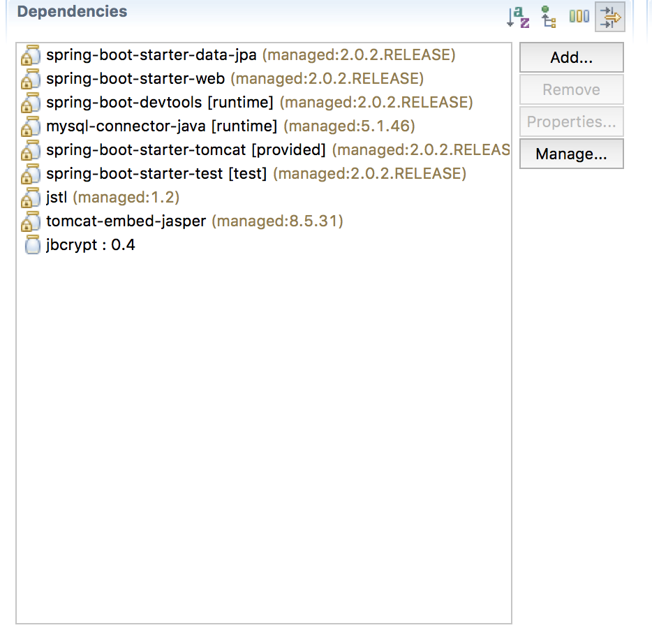

<table width="100%">
    <tr>
        <td><a href="./001_Overview.md">Back</a></td>
        <td><a href="../../Index.md">Index</a></td>
        <td><a href="./003_Domain_Modles.md">Next</a></td>
    </tr>
</table>

#

#   Project Set Up
Create a brand new project named `authentication` and add the following dependencies:

*   spring-boot-starter-jpa
*   spring-boot-starter-web
*   devtools (optional)
*   mysql-connector-java (runtime)
*   tomcat-embed-jasper
*   jstl
*   __NEW__: jbcrypt
The jbcrypt dependency is the Java BCrypt implementation. This is how your pom.xml file should look like:



```xml
<?xml version="1.0" encoding="UTF-8"?>
<project xmlns="http://maven.apache.org/POM/4.0.0" xmlns:xsi="http://www.w3.org/2001/XMLSchema-instance"
    xsi:schemaLocation="http://maven.apache.org/POM/4.0.0 http://maven.apache.org/xsd/maven-4.0.0.xsd">
    <modelVersion>4.0.0</modelVersion>
    <groupId>com.codingdojo.authentication</groupId>
    <artifactId>Authentication</artifactId>
    <version>0.0.1-SNAPSHOT</version>
    <packaging>war</packaging>
    <name>Authentication</name>
    <description>Authentication Project</description>
    <parent>
        <groupId>org.springframework.boot</groupId>
        <artifactId>spring-boot-starter-parent</artifactId>
        <version>2.0.2.RELEASE</version>
        <relativePath/> <!-- lookup parent from repository -->
    </parent>
    <properties>
        <project.build.sourceEncoding>UTF-8</project.build.sourceEncoding>
        <project.reporting.outputEncoding>UTF-8</project.reporting.outputEncoding>
        <java.version>1.8</java.version>
    </properties>
    <dependencies>
        <dependency>
            <groupId>org.springframework.boot</groupId>
            <artifactId>spring-boot-starter-data-jpa</artifactId>
        </dependency>
        <dependency>
            <groupId>org.springframework.boot</groupId>
            <artifactId>spring-boot-starter-web</artifactId>
        </dependency>
        <dependency>
            <groupId>org.springframework.boot</groupId>
            <artifactId>spring-boot-devtools</artifactId>
            <scope>runtime</scope>
        </dependency>
        <dependency>
            <groupId>mysql</groupId>
            <artifactId>mysql-connector-java</artifactId>
            <scope>runtime</scope>
        </dependency>
        <dependency>
            <groupId>org.springframework.boot</groupId>
            <artifactId>spring-boot-starter-tomcat</artifactId>
            <scope>provided</scope>
        </dependency>
        <dependency>
            <groupId>org.springframework.boot</groupId>
            <artifactId>spring-boot-starter-test</artifactId>
            <scope>test</scope>
        </dependency>
        <dependency>
            <groupId>javax.servlet</groupId>
            <artifactId>jstl</artifactId>
        </dependency>
        <dependency>
            <groupId>org.apache.tomcat.embed</groupId>
            <artifactId>tomcat-embed-jasper</artifactId>
        </dependency>
        <dependency>
            <groupId>org.mindrot</groupId>
            <artifactId>jbcrypt</artifactId>
            <version>0.4</version>
        </dependency>
    </dependencies>
    <build>
        <plugins>
            <plugin>
                <groupId>org.springframework.boot</groupId>
                <artifactId>spring-boot-maven-plugin</artifactId>
            </plugin>
        </plugins>
    </build>
</project>
```
#

[]()
<table width="100%">
    <tr>
        <td><a href="./001_Overview.md">Back</a></td>
        <td><a href="../../Index.md">Index</a></td>
        <td><a href="./003_Domain_Modles.md">Next</a></td>
    </tr>
</table>