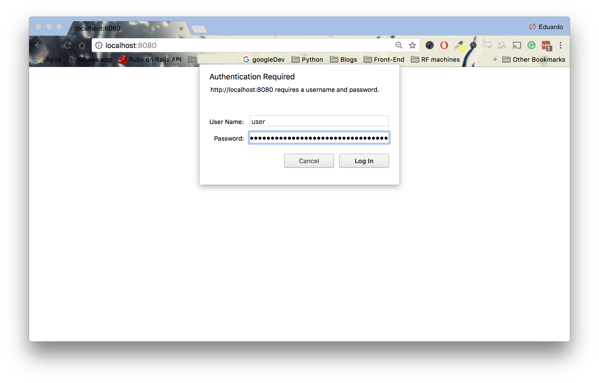
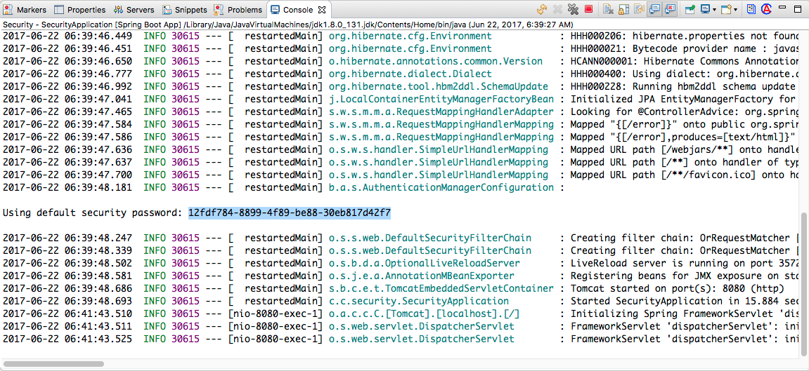

<table width="100%">
    <tr>
        <td><a href="./002_Overview.md">Back</a></td>
        <td><a href="../../Index.md">Index</a></td>
        <td><a href="./004_WebSecurity.md">Next</a></td>
    </tr>
</table>

#

#   Data Models and Repositories
For this application, we are going to create two data models: `User` and `Role`. The `User` model is going to represent our registered users and the `Role` model will be used to authenticate and authorize existing users. Create a schema named `auth` in MySQL and update the `application.properties` file accordingly.

###__application.properties__
```
spring.datasource.url=jdbc:mysql://localhost:3306/auth
spring.datasource.username=<<dbuser>>
spring.datasource.password=<<dbpassword>>
spring.datasource.driver-class-name=com.mysql.jdbc.Driver
spring.jpa.hibernate.ddl-auto=update
spring.mvc.view.prefix=/WEB-INF/
```
Once we have a database connection, we can check if Spring Security is working correctly. Start your application and navigate to the root route. If you have installed all dependencies, you should see a prompt for a username and password without even writing any code!



By default, Spring Security protects any route in your application. If you would like to log in, the default username is `user` and the password can be found in your console. Note, this password will be different on every server restart.



##  __Domain Models__
### __User Model__
In our application, our users will have a username, password and passwordConfirmation attributes. Note that we have the `@Transient` attribute for the passwordConfirmation member variable. This attribute allows us to have attributes that are not directly tied to columns in the database. Also, we are adding a Many-to-Many relationship with our Role Model.

### __src/main/java/com/codingdojo/auth/models/User.java__
```java
package com.codingdojo.auth.models;
// imports removed for brevity
@Entity
@Table(name="users")
public class User {
    
    @Id
    @GeneratedValue
    private Long id;
    private String username;
    private String password;
    @Transient
    private String passwordConfirmation;
    @Column(updatable=false)
    private Date createdAt;
    private Date updatedAt;
    @ManyToMany(fetch = FetchType.EAGER)
    @JoinTable(
        name = "users_roles", 
        joinColumns = @JoinColumn(name = "user_id"), 
        inverseJoinColumns = @JoinColumn(name = "role_id"))
    private List<Role> roles;
    
    public User() {
    }
    public Long getId() {
        return id;
    }
    public void setId(Long id) {
        this.id = id;
    }
    public String getUsername() {
        return username;
    }
    public void setUsername(String username) {
        this.username = username;
    }
    public String getPassword() {
        return password;
    }
    public void setPassword(String password) {
        this.password = password;
    }
    public String getPasswordConfirmation() {
        return passwordConfirmation;
    }
    public void setPasswordConfirmation(String passwordConfirmation) {
        this.passwordConfirmation = passwordConfirmation;
    }
    public Date getCreatedAt() {
        return createdAt;
    }
    public void setCreatedAt(Date createdAt) {
        this.createdAt = createdAt;
    }
    public Date getUpdatedAt() {
        return updatedAt;
    }
    public void setUpdatedAt(Date updatedAt) {
        this.updatedAt = updatedAt;
    }
    public List<Role> getRoles() {
        return roles;
    }
    public void setRoles(List<Role> roles) {
        this.roles = roles;
    }
    
    @PrePersist
    protected void onCreate(){
        this.createdAt = new Date();
    }
    @PreUpdate
    protected void onUpdate(){
        this.updatedAt = new Date();
    }
}
```

## __Role Model__
For the Role Model, we are going to have a single `name` attribute.

### __src/main/java/com/codingdojo/auth/models/Role.java__
```java
package com.codingdojo.auth.models;
// imports removed for brevity
@Entity
@Table(name="roles")
public class Role {
    @Id
    @GeneratedValue
    private Long id;
    private String name;
    @ManyToMany(mappedBy = "roles")
    private List<User> users;
    
    public Role() {
    }
    
    public Long getId() {
        return id;
    }
    public void setId(Long id) {
        this.id = id;
    }
    public String getName() {
        return name;
    }
    public void setName(String name) {
        this.name = name;
    }
    public List<User> getUsers() {
        return users;
    }
    public void setUsers(List<User> users) {
        this.users = users;
    }
}
```
Restart your application to create the tables in our database. Then, in your `roles` table, insert two rows: the first row with the value of `user` for the name column and the second with `admin`.
```sql
INSERT INTO `roles` (name) VALUES ('ROLE_USER');
INSERT INTO `roles` (name) VALUES ('ROLE_ADMIN')
```
Our `roles` table will be used to grant users permission to certain actions in our application. It is important to have the `ROLE_` prefix. This is how Spring Security will authorize clients in the application.

##  __Repositories__
Create a repository for each one of our Data Models. In the `UserRepository`, create a method that retrieves a specific user by their username.

### __src/main/java/com/codingdojo/auth/repositories/UserRepository.java__
```java
package com.codingdojo.auth.repositories;
// imports removed for brevity
@Repository
public interface UserRepository extends CrudRepository<User, Long> {
    User findByUsername(String username);
}
```

### __src/main/java/com/codingdojo/auth/repositories/RoleRepository.java__
```java
package com.codingdojo.auth.repositories;
// imports removed for brevity
@Repository
public interface RoleRepository extends CrudRepository<Role, Long> {
}
```
In the next lesson, we will learn how to configure our application with Spring Security.

### __Useful Links__
*   [Getting Started with Spring Security](https://spring.io/guides/gs/securing-web/)
*   [Security Docs](https://docs.spring.io/spring-boot/docs/current/reference/html/boot-features-security.html)
*   [SpringBoot Demo Security App](https://github.com/spring-projects/spring-boot/tree/v1.5.4.RELEASE/spring-boot-samples/spring-boot-sample-web-secure)

#

[]()
<table width="100%">
    <tr>
        <td><a href="./002_Overview.md">Back</a></td>
        <td><a href="../../Index.md">Index</a></td>
        <td><a href="./004_WebSecurity.md">Next</a></td>
    </tr>
</table>