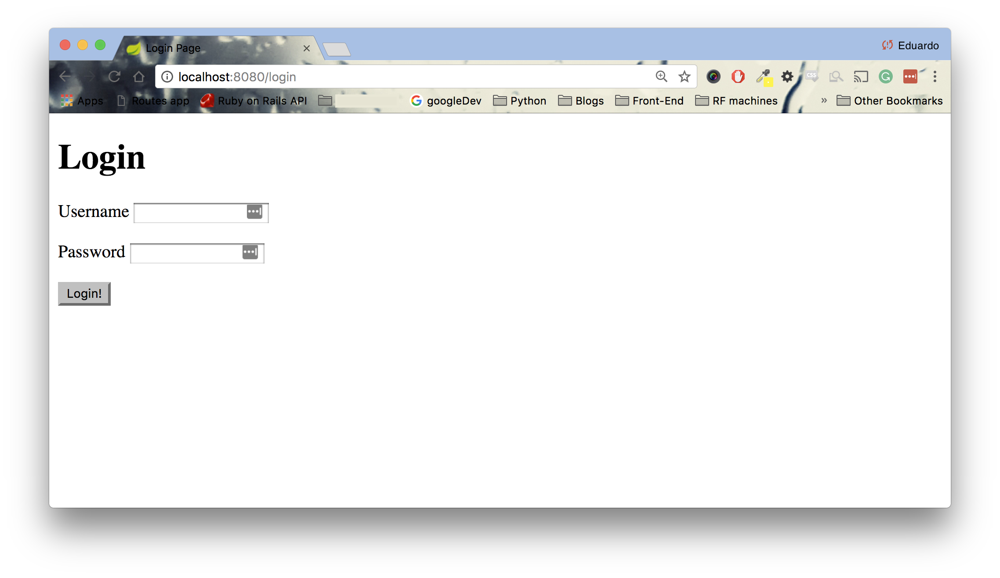
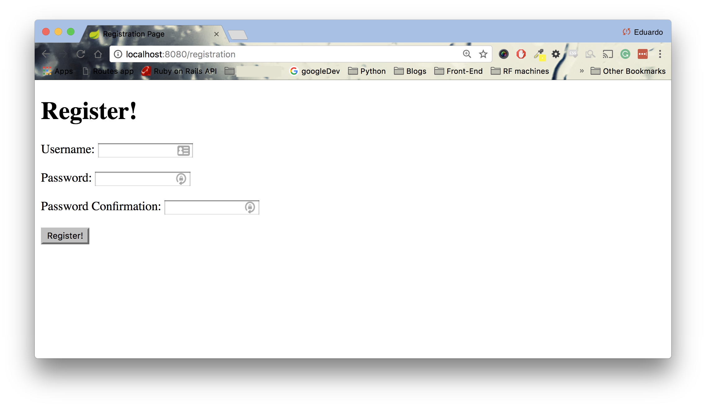
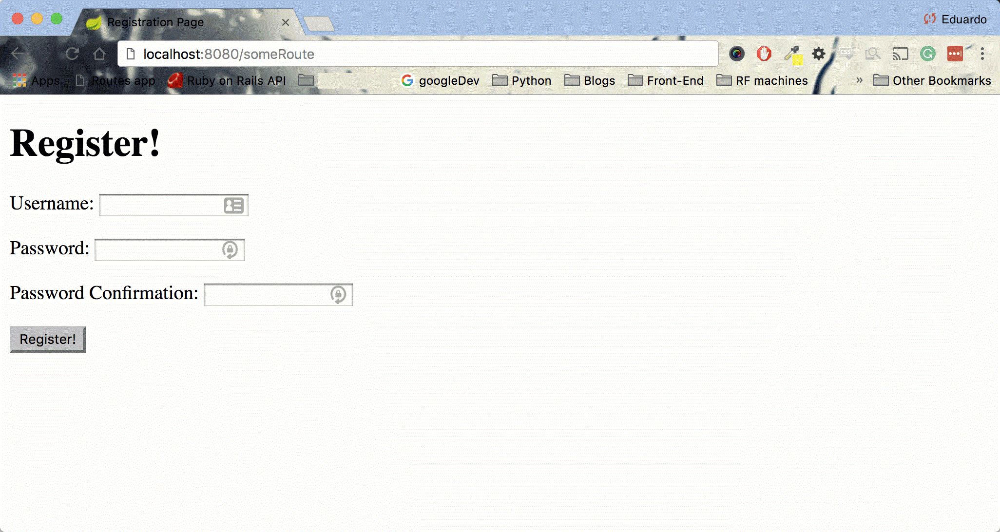

<table width="100%">
    <tr>
        <td><a href="./003_Data_Models.md">Back</a></td>
        <td><a href="../Index.md">Index</a></td>
        <td><a href="./005_BCrypt.md">Next</a></td>
    </tr>
</table>

#

#   WebSecurityConfigurerAdapter
Currently, our application has a pop up that prevents access to anyone. Instead, we are going to add configuration for __FORM__ authentication.

##  __Web Security Configuration__
We are going to create a class that `extends` Spring Security's WebSecurityConfigurerAdapter class.

### __src/main/java/com/codingdojo/auth/config/WebSecurityConfig.java__
```java
package com.codingdojo.auth.config;
// imports removed for brevity
@Configuration
@EnableWebSecurity
public class WebSecurityConfig extends WebSecurityConfigurerAdapter {
    
    @Override
    protected void configure(HttpSecurity http) throws Exception {
        http.
            authorizeRequests()
                .antMatchers("/css/**", "/js/**", "/registration").permitAll()
                .anyRequest().authenticated()
                .and()
            .formLogin()
                .loginPage("/login")
                .permitAll()
                .and()
            .logout()
                .permitAll();
    }
}
```
*   .authorizeRequests(): Allows restricting access based upon the HttpServletRequest
*   .antMatchers("/css/**", "/js/**, "/registration"): PathMatcher implementation for Ant-style path patterns.

    The mapping matches URLs using the following rules:
    -   `?` matches one character
    -   `*` matches zero or more characters
    -   `**` matches zero or more directories in a path
    -   {spring:[a-z]+} matches the regexp [a-z]+ as a path variable named "spring"

    Examples:

    -   com/t?st.jsp — matches com/test.jsp but also com/tast.jsp or com/txst.jsp
    -   com/*.jsp — matches all .jsp files in the com directory
    -   com/**/test.jsp — matches all test.jsp files underneath the com path
    -   org/springframework/**/*.jsp — matches all .jsp files underneath the org/springframework path
    -   org/**/servlet/bla.jsp — matches org/springframework/servlet/bla.jsp but also org/springframework/-    testing/servlet/bla.jsp and org/servlet/bla.jsp
    -   com/{filename:\w+}.jsp will match com/test.jsp and assign the value test to the filename variable
  
    In our example, we are allowing the everything in that matches __"/static"__ and __"/registration"__ to be permitted to everyone. __"/static"__ is for our assets and __"/registration"__ is for the GET and POST request for registration.
-   .anyRequest(): Maps any request
-   .authenticated(): Specify URLs that are allowed by authenticated users only
-   .formLogin(): Specifies to support form based authentication. Now, our users are going to be authenticated via a __FORM__
-   .loginPage("/login"): Specifies the URL to send users to if login is required
-   logout(): Provides logout support. The default is that accessing the URL "/logout" will log the user out by invalidating the HTTP Session,cleaning up any rememberMe() authentication that was configured, clearing the SecurityContextHolder, and then redirect to "/login?success".

##  __Controller__

Now, let's create the `GET` routes for the `/registration` and `/login` requests.

### __src/main/java/com/codingdojo/auth/controllers/Users.java__

```java
package com.codingdojo.auth.controllers;
// imports removed for brevity
@Controller
public class Users {
    
    @RequestMapping("/registration")
    public String registerForm(@Valid @ModelAttribute("user") User user) {
        return "registrationPage.jsp";
    }
    
    @RequestMapping("/login")
    public String login() {
        return "loginPage.jsp";
    }
}
```
### __src/main/java/webapp/WEB-INF/registrationPage.jsp__
```html
<%@ page language="java" contentType="text/html; charset=UTF-8"
    pageEncoding="UTF-8"%>
<%@ taglib prefix="c" uri="http://java.sun.com/jsp/jstl/core" %>
<%@ taglib prefix="form" uri="http://www.springframework.org/tags/form" %>
<!DOCTYPE html PUBLIC "-//W3C//DTD HTML 4.01 Transitional//EN" "http://www.w3.org/TR/html4/loose.dtd">
<html>
<head>
<meta http-equiv="Content-Type" content="text/html; charset=UTF-8">
<title>Registration Page</title>
</head>
<body>
    <h1>Register!</h1>
    
    <p><form:errors path="user.*"/></p>
    
    <form:form method="POST" action="/registration" modelAttribute="user">
        <p>
            <form:label path="username">Username:</form:label>
            <form:input path="username"/>
        </p>
        <p>
            <form:label path="password">Password:</form:label>
            <form:password path="password"/>
        </p>
        <p>
            <form:label path="passwordConfirmation">Password Confirmation:</form:label>
            <form:password path="passwordConfirmation"/>
        </p>
        <input type="submit" value="Register!"/>
    </form:form>
</body>
</html>
```
### __src/main/java/webapp/WEB-INF/loginPage.jsp__
```html
<%@ page language="java" contentType="text/html; charset=UTF-8"
    pageEncoding="UTF-8"%>
<!DOCTYPE html PUBLIC "-//W3C//DTD HTML 4.01 Transitional//EN" "http://www.w3.org/TR/html4/loose.dtd">
<html>
<head>
<meta http-equiv="Content-Type" content="text/html; charset=UTF-8">
<title>Login Page</title>
</head>
<body>
    <h1>Login</h1>
    <form method="POST" action="/login">
        <p>
            <label for="username">Username</label>
            <input type="text" id="username" name="username"/>
        </p>
        <p>
            <label for="password">Password</label>
            <input type="password" id="password" name="password"/>
        </p>
        <input type="hidden" name="${_csrf.parameterName}" value="${_csrf.token}"/>
        <input type="submit" value="Login!"/>
    </form>
</body>
</html>
```
##  __Cross-Site Request Forgery (CSRF)__
Notice that in our `loginPage.jsp`, we have a hidden input with a value of csrf.token. One feature of Spring Security is the easy implementation of CSRF prevention. When we include a token in our HTML forms, a random matching token is stored in the server as well. Whenever a request is made to your application, Spring will check the received token with the token in the server. If they don't match, the request is not processed. This prevents clients from submitting information to a Spring application without properly using the forms from the app itself.

But, where is the token for our `registrationPage.jsp`? Since in this view we are using jstl form tags, it will automatically add the token for us. We only need to explicitly add csrf tokens on custom forms that don't use jstl's form tags. If you would like to read more on CSRF, we have included two links at the bottom.

State of our Application
Restart your application. At the moment, we should only have two routes available to the public: `/login` and `/registration`. If you navigate to any other route, let's say `/someRoute`, you will be redirected back to the login page.

__localhost:8080/login__


__localhost:8080/registration__


__localhost:8080/someRoute__


### __Useful Links__
*   [HttpSecurity Object](https://docs.spring.io/spring-security/site/docs/current/apidocs/org/springframework/security/config/annotation/web/builders/HttpSecurity.html)
*   [AntPathMatcher](http://docs.spring.io/spring/docs/current/javadoc-api/org/springframework/util/AntPathMatcher.html)
*   [Abstract Request Matcher](http://docs.spring.io/spring-security/site/docs/current/apidocs/org/springframework/security/config/annotation/web/AbstractRequestMatcherRegistry.html)
*   [FormLoginConfigurer](https://docs.spring.io/spring-security/site/docs/current/apidocs/org/springframework/security/config/annotation/web/configurers/FormLoginConfigurer.html#loginPage-java.lang.String-)
*   [Cross Site Request Forgery (CSRF)](https://docs.spring.io/spring-security/site/docs/current/reference/html/csrf.html)
*   [OWASP CSRF](https://www.owasp.org/index.php/Cross-Site_Request_Forgery_(CSRF))

#

[]()
<table width="100%">
    <tr>
        <td><a href="./003_Data_Models.md">Back</a></td>
        <td><a href="../Index.md">Index</a></td>
        <td><a href="./005_BCrypt.md">Next</a></td>
    </tr>
</table>