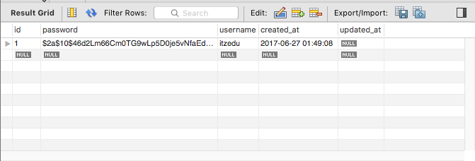

<table width="100%">
    <tr>
        <td><a href="./004_WebSecurity.md">Back</a></td>
        <td><a href="../Index.md">Index</a></td>
        <td><a href="./006_User_Details_Service.md">Next</a></td>
    </tr>
</table>

#

#   Registering Users with Bcrypt
Services are the logic of our application; therefore, the logic to hash our passwords will be in a Service. In this lesson, we will be creating a service that will register users with a hashed Bcrypt password.

##  __UserService__
### __src/main/java/com/codingdojo/auth/services/UserService.java__
```java
package com.codingdojo.auth.services;
import org.springframework.security.crypto.bcrypt.BCryptPasswordEncoder;
import org.springframework.stereotype.Service;
import com.codingdojo.security.models.User;
import com.codingdojo.security.repositories.RoleRepository;
import com.codingdojo.security.repositories.UserRepository;
 
@Service
public class UserService {
    private UserRepository userRepository;
    private RoleRepository roleRepository;
    private BCryptPasswordEncoder bCryptPasswordEncoder;
    
    public UserService(UserRepository userRepository, RoleRepository roleRepository, BCryptPasswordEncoder bCryptPasswordEncoder)     {
        this.userRepository = userRepository;
        this.roleRepository = roleRepository;
        this.bCryptPasswordEncoder = bCryptPasswordEncoder;
    }
    
    
    // 1
    public void saveWithUserRole(User user) {
        user.setPassword(bCryptPasswordEncoder.encode(user.getPassword()));
        user.setRoles(roleRepository.findByName("ROLE_USER"));
        userRepository.save(user);
    }
     
     // 2 
    public void saveUserWithAdminRole(User user) {
        user.setPassword(bCryptPasswordEncoder.encode(user.getPassword()));
        user.setRoles(roleRepository.findByName("ROLE_ADMIN"));
        userRepository.save(user);
    }    
    
    // 3
    public User findByUsername(String username) {
        return userRepository.findByUsername(username);
    }
}
```
Our UserService has 3 methods:

*   Saves a client with only the `user` role.
*   Saves a client with only the `admin` role.
*   Finds a user by their username.
Next, we must update our RoleRepository.

### __src/main/java/com/codingdojo/auth/repositories/RoleRepository.java__
```java
@Repository
public interface RoleRepository extends CrudRepository {
    List<Role> findAll();
    
    List<Role> findByName(String name);
}
```
##  __Adding the Bcrypt Bean__
### __src/main/java/com/codingdojo/auth/config/WebSecurityConfig.java__
```java
package com.codingdojo.auth.config;
import org.springframework.context.annotation.Configuration;
import org.springframework.security.config.annotation.web.builders.HttpSecurity;
import org.springframework.security.config.annotation.web.configuration.EnableWebSecurity;
import org.springframework.security.config.annotation.web.configuration.WebSecurityConfigurerAdapter;
 
@Configuration
@EnableWebSecurity
public class WebSecurityConfig extends WebSecurityConfigurerAdapter {
    
    // add Bcyrpt bean
    @Bean
    public BCryptPasswordEncoder bCryptPasswordEncoder() {
        return new BCryptPasswordEncoder();
    }
    
    @Override
    protected void configure(HttpSecurity http) throws Exception {
        http.
            authorizeRequests()
                .antMatchers("/static/**", "/registration").permitAll()
                .anyRequest().authenticated()
                .and()
            .formLogin()
                .loginPage("/login")
                .permitAll()
                .and()
            .logout()
                .permitAll();
    }
}
```

##  __Our First Registration__
Let's add a method that will handle the `POST` request to register a user.

### __src/main/java/com/codingdojo/auth/controllers/Users.java__
```java
package com.codingdojo.auth.controllers;
// imports removed for brevity
@Controller
public class Users {
    private UserService userService;
    
    public Users(UserService userService) {
        this.userService = userService;
    }
    
    @RequestMapping("/registration")
    public String registerForm(@Valid @ModelAttribute("user") User user) {
        return "registrationPage.jsp";
    }
    
    @PostMapping("/registration")
    public String registration(@Valid @ModelAttribute("user") User user, BindingResult result, Model model, HttpSession session) {
        if (result.hasErrors()) {
            return "registrationPage.jsp";
        }
        userService.saveWithUserRole(user);
        return "redirect:/login";
    }
    
    
    @RequestMapping("/login")
    public String login() {
        return "loginPage.jsp";
    }
}
```
Navigate to `localhost:8080/registration` and register a user. Don't worry about validations for now, we will be adding them in an upcoming lesson.



### __Useful Links__
*   [Bcyrpt wiki](https://en.wikipedia.org/wiki/Bcrypt)

#

[]()
<table width="100%">
    <tr>
        <td><a href="./004_WebSecurity.md">Back</a></td>
        <td><a href="../Index.md">Index</a></td>
        <td><a href="./006_User_Details_Service.md">Next</a></td>
    </tr>
</table>