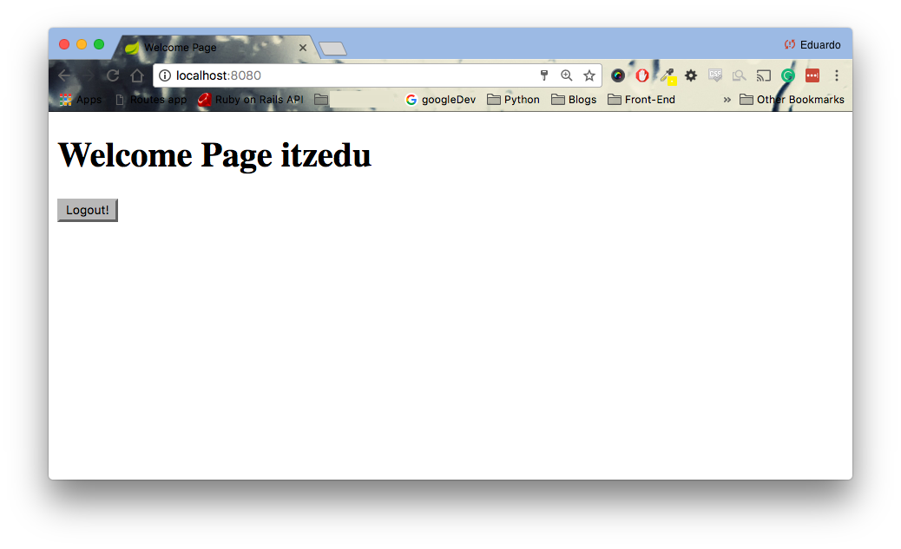
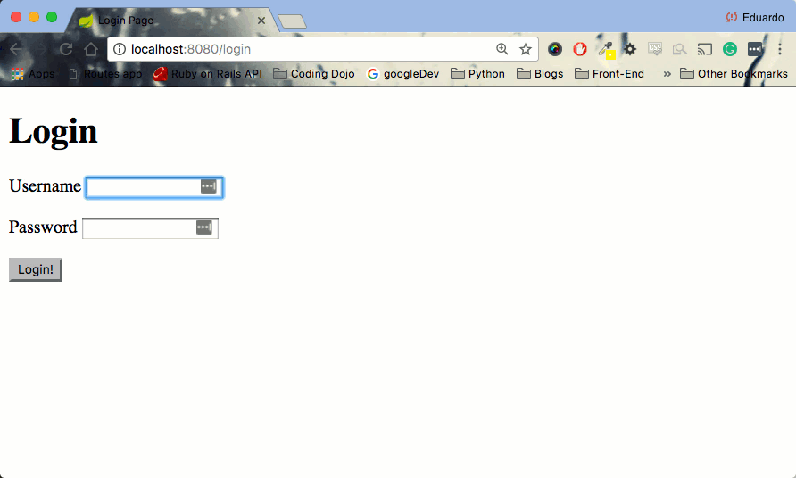

<table width="100%">
    <tr>
        <td><a href="./006_User_Details_Service.md">Back</a></td>
        <td><a href="../../Index.md">Index</a></td>
        <td><a href="./008_Validations.md">Next</a></td>
    </tr>
</table>

#

#   Log Users In & Out
We are almost there! When a user fills out the login form, we have a POST request to the '/login' action.
```html
<h1>Login</h1>
<form method="POST" action="/login">
<p>
    <label for="username">Username</label>
    <input type="text" id="username" name="username"/>
</p>
<p>
    <label for="password">Password</label>
    <input type="password" id="password" name="password"/>
</p>
<input type="hidden" name="${_csrf.parameterName}" value="${_csrf.token}"/>
<input type="submit" value="Login!"/>
</form>
```
One would assume that the next logical step would be to create a method in our controller that handles our `POST` request. However, because we are using Spring Security that process is done for us.

On a login attempt, Spring Security will automatically call the `loadUserByUsername(String)` in `UserDetailsServiceImplementation` class. From there, Spring Security will have two options:

1.  Successful Login: The user is authenticated, saves them in a context, and redirects to "/" (root route). More information on the context below.
2.  Unsuccessful Login: The client is redirected to "/login?error".

__It is important to note that the form must have a `name` field with the `username` value for Spring Security to correctly grab the information in the `loadUserByUsername(String)` method.__
##  __Successful Login__
The most basic object in Spring Security is the `SecurityContextHolder`. This is where Spring Security stores the details of the present security context of the application, such as the principal currently using the application. In our example, the principal is the current user logged in. But where is Spring Security storing all this information? If you guessed in `HttpSession`, you are absolutely correct! Therefore, when using Spring Security, we should NOT access user information directly `HttpSession`, but instead, via the `SecurityContextHolder`.

##  __Implementation__
Let's create a method in our controller that will be accessible to users after proper authentication.

### __src/main/java/com/codingdojo/auth/controllers/Users.java__
```java
package com.codingdojo.auth.controllers;
import java.security.Principal;
// other imports removed for brevity
@Controller
public class Users {
    private UserService userService;
    
    public Users(UserService userService) {
        this.userService = userService;
    }
    
    // other methods removed for brevity
    
    @RequestMapping(value = {"/", "/home"})
    public String home(Principal principal, Model model) {
        // 1
        String username = principal.getName();
        model.addAttribute("currentUser", userService.findByUsername(username));
        return "homePage.jsp";
    }
}
```
1.  Our home method accepts `GET` requests for "/" and "/home" urls. After a successful authentication, we are able to get the name of our principal (current user) via the `.getName()` method. This process of getting the current user has been available since Spring 3+.

NOTE: In older versions of Spring, there is a more verbose way to get the current user. You will see this a lot when searching information about Spring Security.
```java
import org.springframework.security.core.context.SecurityContextHolder;
import org.springframework.security.core.userdetails.User;
// By default, we get type object, so we must cast it into a UserDetails object.
User userPrincipal = (User) SecurityContextHolder.getContext().getAuthentication().getPrincipal();
String name = user.getUsername(); 
```

### __src/main/webapp/WEB-INF/homePage.jsp__
```js
<%@ page language="java" contentType="text/html; charset=UTF-8"
    pageEncoding="UTF-8"%>
<%@ taglib prefix="c" uri="http://java.sun.com/jsp/jstl/core" %>
    
<!DOCTYPE html PUBLIC "-//W3C//DTD HTML 4.01 Transitional//EN" "http://www.w3.org/TR/html4/loose.dtd">
<html>
<head>
<meta http-equiv="Content-Type" content="text/html; charset=UTF-8">
<title>Welcome Page</title>
</head>
<body>
    <h1>Welcome Page <c:out value="${currentUser.username}"></c:out></h1>
    
    <form id="logoutForm" method="POST" action="/logout">
        <input type="hidden" name="${_csrf.parameterName}" value="${_csrf.token}"/>
        <input type="submit" value="Logout!" />
    </form>
</body>
</html>
```
After logging in with successful credentials, you should see a page like the following:



##  __Unsuccessful Log In & Log Out__
On an unsuccessful login, we want to show some sort of error message. Also, when the user logs out, we want to tell them that they have done so correctly. Let's update our controller code.

### __src/main/java/com/codingdojo/auth/controllers/Users.java__
```java
package com.codingdojo.auth.controllers;
import java.security.Principal;
// other imports removed for brevity
@Controller
public class Users {
    private UserService userService;
    
    public Users(UserService userService) {
        this.userService = userService;
    }
    
    // other methods removed for brevity
    
    // 1
    @RequestMapping("/login")
    public String login(@RequestParam(value="error", required=false) String error, @RequestParam(value="logout", required=false) String logout, Model model) {
        if(error != null) {
            model.addAttribute("errorMessage", "Invalid Credentials, Please try again.");
        }
        if(logout != null) {
            model.addAttribute("logoutMessage", "Logout Successful!");
        }
        return "loginPage.jsp";
    }
    @RequestMapping(value = {"/", "/home"})
    public String home(Principal principal, Model model) {
        String username = principal.getName();
        model.addAttribute("currentUser", userService.findByUsername(username));
        return "homePage.jsp";
    }
}
```
1.  Remember, when the credentials are wrong, Spring Security redirect the client to the /login?error url. Furthermore, when a client logs out via the form in our homePage.jsp file, Spring Security redirects them to /login?logout url. Therefore, all we do is set a couple of optional request parameters, check for their existence, and add messages accordingly. Now, we can update our view to display the messages.
```js
<%@ page language="java" contentType="text/html; charset=UTF-8"
    pageEncoding="UTF-8"%>
<%@ taglib prefix="c" uri="http://java.sun.com/jsp/jstl/core" %>
<!DOCTYPE html PUBLIC "-//W3C//DTD HTML 4.01 Transitional//EN" "http://www.w3.org/TR/html4/loose.dtd">
<html>
<head>
<meta http-equiv="Content-Type" content="text/html; charset=UTF-8">
<title>Login Page</title>
</head>
<body>
    <c:if test="${logoutMessage != null}">
        <c:out value="${logoutMessage}"></c:out>
    </c:if>
    <h1>Login</h1>
    <c:if test="${errorMessage != null}">
        <c:out value="${errorMessage}"></c:out>
    </c:if>
    <form method="POST" action="/login">
        <p>
            <label for="username">Username</label>
            <input type="text" id="username" name="username"/>
        </p>
        <p>
            <label for="password">Password</label>
            <input type="password" id="password" name="password"/>
        </p>
        <input type="hidden" name="${_csrf.parameterName}" value="${_csrf.token}"/>
        <input type="submit" value="Login!"/>
    </form>
</body>
</html>
```
Now, your application should work like the following:



### __Useful Links__
*   [SecurityContextHolder](http://docs.spring.io/spring-security/site/docs/4.0.4.RELEASE/apidocs/org/springframework/security/core/context/SecurityContextHolder.html)
*   [Spring Security Technical Overview](https://docs.spring.io/spring-security/site/docs/3.0.x/reference/technical-overview.html)

#

[]()
<table width="100%">
    <tr>
        <td><a href="./006_User_Details_Service.md">Back</a></td>
        <td><a href="../../Index.md">Index</a></td>
        <td><a href="./008_Validations.md">Next</a></td>
    </tr>
</table>