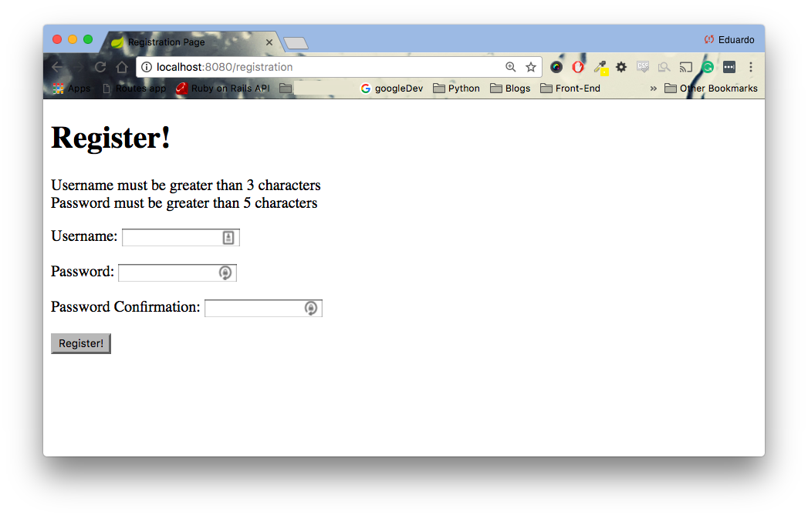
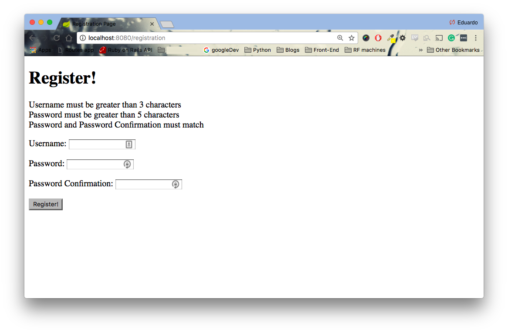

<table width="100%">
    <tr>
        <td><a href="./007_Login_Logout.md">Back</a></td>
        <td><a href="../../Index.md">Index</a></td>
        <td><a href="./009_Authorization.md">Next</a></td>
    </tr>
</table>

#

#   Validations
Validations are extremely important for any web application. By implementing validations, we ensure database integrity and only save valid and important information in our data store. The simplest way to add validations is through persistent models annotations. If you need a reminder, re-visit our lesson back in [Spring Data I - Persistence Model Annotation](./../002_Spring_Data_I/004_Domain_Model.md)

##  __Validations with Annotation__
We are going to add validations for the size of the username and password with custom messages

### __src/main/java/com/codingdojo/auth/models/User.java__
```java
package com.codingdojo.auth.models;
import javax.validation.constraints.Size;
// other imports removed for brevity
@Entity
@Table(name="users")
public class User {
    
    @Id
    @GeneratedValue
    private Long id;
    // NEW
    @Size(min=3, message="Username must be greater than 3 characters")
    private String username;
    // NEW
    @Size(min=5, message="Password must be greater than 5 characters")
    private String password;
    @Transient
    private String passwordConfirmation;
    private Date createdAt;
    private Date updatedAt;
    @ManyToMany(fetch = FetchType.EAGER)
    @JoinTable(
        name = "users_roles", 
        joinColumns = @JoinColumn(name = "user_id"), 
        inverseJoinColumns = @JoinColumn(name = "role_id"))
    private List <Role> roles;
}
```
Now, your controller and view already have the necessary code to display the error messages. Try it out for yourself.



Great! We have some validations but not all. What about making sure that the password and password confirmation fields match? Moreover, what about ensuring that emails are in a correct format? Well, to be able to do that, we have to create custom validations.

##  __Custom Validations__
Spring provides a Validator interface for custom `validations`. Create a new package named validator and create a UserValidator class.

### __src/main/java/com/codingdojo/auth/validator/UserValidator.java__
```java
package com.codingdojo.auth.validator;
import org.springframework.stereotype.Component;
import org.springframework.validation.Errors;
import org.springframework.validation.Validator;
import com.codingdojo.auth.models.User;
@Component
public class UserValidator implements Validator {
    
    //    1
    @Override
    public boolean supports(Class<?> clazz) {
        return User.class.equals(clazz);
    }
    
    // 2
    @Override
    public void validate(Object object, Errors errors) {
        User user = (User) object;
        
        if (!user.getPasswordConfirmation().equals(user.getPassword())) {
            // 3
            errors.rejectValue("passwordConfirmation", "Match");
        }         
    }
}
```
1.  `supports(Class<?>)`: Specifies that a instance of the User Domain Model can be validated with this custom validator
2.  `validate(Object, Errors)`: Creating our custom validation. We can add errors via `.rejectValue(String, String)`.
3.  `.rejectValue(String, String)`: the first argument is the member variable of our Domain model that we are validating. The second argument is a code for us to use to set an error message.
## __Even More Custom Messages__
To set custom errors messages, we must create a `messages.properties` file inside of `src/main/resources`

### __src/main/resources/messages.properties__
```
Match.user.passwordConfirmation=Password and Password Confirmation must match
```
The format of our error messages is __CODE.MethodAttribute.MemberVariable=YOUR CUSTOM ERROR MESSAGE__

Now, in our `POST` request for '/registration', we must use the Validator.

### __src/main/java/com/codingdojo/auth/controllers/Users.java__
```java
@Controller
public class Users {
    private UserService userService;
    
    // NEW
    private UserValidator userValidator;
    
    // NEW
    public Users(UserService userService, UserValidator userValidator) {
        this.userService = userService;
        this.userValidator = userValidator;
    }
    
    // code removed for brevity
    
    @PostMapping("/registration")
    public String registration(@Valid @ModelAttribute("user") User user, BindingResult result, Model model) {
        // NEW
        userValidator.validate(user, result);
        if (result.hasErrors()) {
            return "registrationPage.jsp";
        }
        
        userService.saveWithUserRole(user);
        return "redirect:/login";
    }
    
    // code removed for brevity
}
```
Let's see how this looks in our browser. (you may have to restart STS)



Furthermore, for consistency, we can take out the messages from our Domain model and put them in our messages.properties file.

###  __src/main/java/com/codingdojo/auth/models/User.java__
```java
package com.codingdojo.auth.models;
// imports removed for brevity
@Entity
@Table(name="users")
public class User {
    
    // code removed for brevity
    
    @Size(min=3)
    private String username;
    @Size(min=5)
    private String password;
    
    // code removed for brevity
}
```

### __src/main/resources/messages.properties__
```
Match.user.passwordConfirmation=Password and Password Confirmation must match
Size.user.username=Username must be greater than 3 characters
Size.user.password=Password must be greater than 5 characters
```
If you revisit your browser, the error messages should still look the same!In the next assignment, you will implement a custom validation for the email field.

### __Useful Links__
*   [Validations](http://docs.spring.io/autorepo/docs/spring/3.2.x/spring-framework-reference/html/validation.html)

#

[]()
<table width="100%">
    <tr>
        <td><a href="./007_Login_Logout.md">Back</a></td>
        <td><a href="../../Index.md">Index</a></td>
        <td><a href="./009_Authorization.md">Next</a></td>
    </tr>
</table>