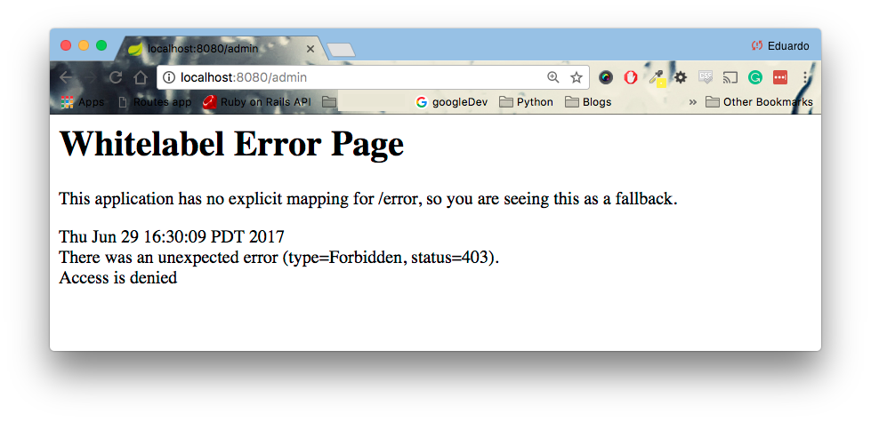
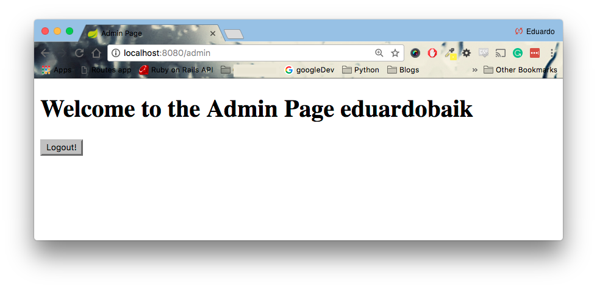

<table width="100%">
    <tr>
        <td><a href="./008_Validations.md">Back</a></td>
        <td><a href="../Index.md">Index</a></td>
        <td><a href="./010_Admin_Dashboard.md">Next</a></td>
    </tr>
</table>

#

#   Authorization
Now that we have a complete authentication system, It is time for us to implement authorization. The first thing we must do is change our `WebSecurityConfig` class.

### __src/main/java/com/codingdojo/auth/config/WebSecurityConfig.java__
```java
package com.codingdojo.auth.config;
// imports removed for brevity
@Configuration
@EnableWebSecurity
public class WebSecurityConfig extends WebSecurityConfigurerAdapter {
    
    // removed for brevity
    
    @Override
    protected void configure(HttpSecurity http) throws Exception {
        http.
            authorizeRequests()
                .antMatchers("/static/**", "/registration").permitAll()
                .antMatchers("/admin/**").access("hasRole('ADMIN')")    // NEW
                .anyRequest().authenticated()
                .and()
            .formLogin()
                .loginPage("/login")
                .permitAll()
                .and()
            .logout()
                .permitAll();
    }
    
    // removed for brevity
}
```
Any URL that starts with "/admin" requires the user to have `ROLE_ADMIN`. Restart your server, login, and visit 'localhost:8080/admin'. You should see a 403 for `Access Denied`. This is the expected output since we have not added any users that have admin privileges.



##  __Modifying the Controller__
In the method handler for registration, instead of calling `saveWithUserRole(User)`, we are going to call `saveWithUserAndAdminRole(User)`. Also, we are adding a handler for the "/admin" route.

### __src/main/java/com/codingdojo/auth/controllers/Users.java__
```java
package com.codingdojo.auth.controllers;
// imports removed for brevity
@Controller
public class Users {
    private UserService userService;
    // code removed for brevity
    
    @PostMapping("/registration")
    public String registration(@Valid @ModelAttribute("user") User user, BindingResult result, Model model) {
        userValidator.validate(user, result);
        if (result.hasErrors()) {
            return "registrationPage.jsp";
        }
        userService.saveUserWithAdminRole(user);
        return "redirect:/login";
    }
     
    // NEW 
    @RequestMapping("/admin")
    public String adminPage(Principal principal, Model model) {
        String username = principal.getName();
        model.addAttribute("currentUser", userService.findByUsername(username));
        return "adminPage.jsp";
    }
    
    // code removed for brevity
}
```
### __src/main/webapp/WEB-INF/adminPage.jsp__
```html
<%@ page language="java" contentType="text/html; charset=UTF-8"
    pageEncoding="UTF-8"%>
<%@ taglib prefix="c" uri="http://java.sun.com/jsp/jstl/core" %>
    
<!DOCTYPE html PUBLIC "-//W3C//DTD HTML 4.01 Transitional//EN" "http://www.w3.org/TR/html4/loose.dtd">
<html>
<head>
<meta http-equiv="Content-Type" content="text/html; charset=UTF-8">
<title>Admin Page</title>
</head>
<body>
    <h1>Welcome to the Admin Page <c:out value="${currentUser.username}"></c:out></h1>
    
    <form id="logoutForm" method="POST" action="/logout">
        <input type="hidden" name="${_csrf.parameterName}" value="${_csrf.token}"/>
        <input type="submit" value="Logout!" />
    </form>
</body>
</html>
```
Now, when you register a user, we will be adding `ROLE_ADMIN`. Once you log in with this admin account, you will be able to visit 'localhost:8080/admin'. However, previous users that do not have this privilege will still be denied access.



### __Useful Links__
*    [Authorize Requests](https://docs.spring.io/spring-security/site/docs/current/reference/html/jc.html#authorize-requests)

#

[]()
<table width="100%">
    <tr>
        <td><a href="./008_Validations.md">Back</a></td>
        <td><a href="../Index.md">Index</a></td>
        <td><a href="./010_Admin_Dashboard.md">Next</a></td>
    </tr>
</table>