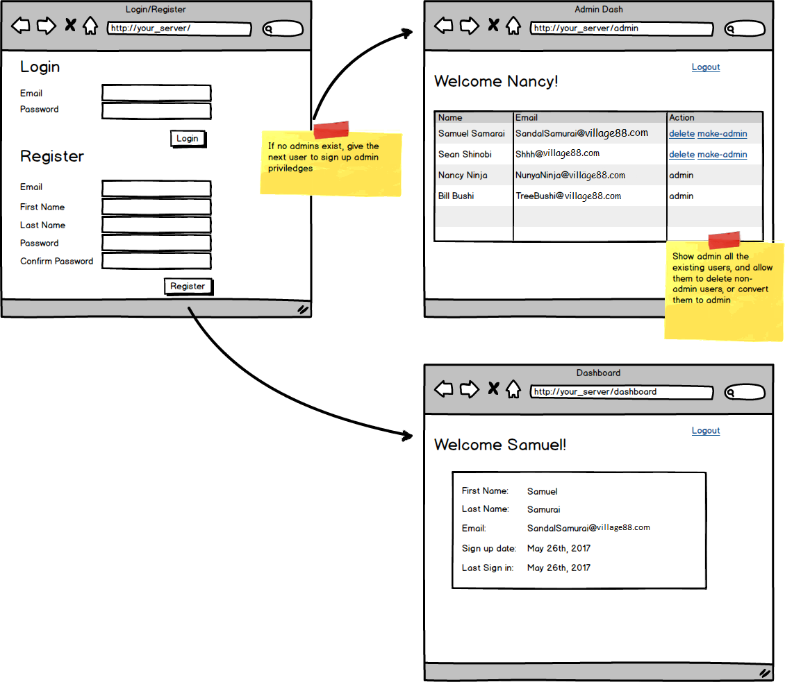

<table width="100%">
    <tr>
        <td><a href="./009_Authorization.md">Back</a></td>
        <td><a href="../../Index.md">Index</a></td>
        <td><a href="./011_WaterBnB.md">Next</a></td>
    </tr>
</table>

#

#   Assignment: Admin Dashboard
Your site was getting out of control, and you needed to allow an admin to moderate it. Extend your previous app so any time someone signs up and there isn't an admin, they become the admin. Admins should be redirect to a special admin dashboard on a separate page where they have the ability to see all users, delete non-admin users, and give users admin status.

### __Goals:__
*   Familiarize with login and registrations.
*   Learn user access levels
### __Tasks:__
*   Create a privilege level flag to indicate user level
*   If no admins exist, then sign up the next user as an admin
*   Create a new admin dashboard page that shows all users
*   Allow admins to delete non-admin accounts
*   Allow admins to escalate non-admins to admin status
*   Only allow admins to see dashboard
### __Optional Challenges:__
*   Create a super admin status for the first user who signed up, allow them to delete even other admins
*   Hide the super admin from other admin dashboards

#

<table width="100%">
    <tr>
        <td><a href="./009_Authorization.md">Back</a></td>
        <td><a href="../../Index.md">Index</a></td>
        <td><a href="./011_WaterBnB.md">Next</a></td>
    </tr>
</table>