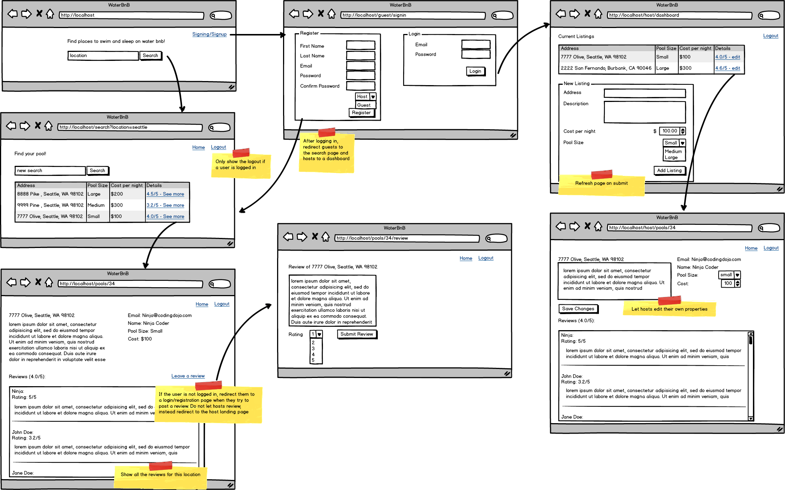

<table width="100%">
    <tr>
        <td><a href="./010_Admin_Dashboard.md">Back</a></td>
        <td><a href="../../Index.md">Index</a></td>
        <td><a href="./../007_Spring_Extras/001_Overview.md">Next</a></td>
    </tr>
</table>

#

#   WaterBnB Belt Reviewer (Optional)

Features

*   Registration and Login with validations

*   Two Types of users: Host and Guest

*   Edit place available only to the host

*   Logout feature

#

<table width="100%">
    <tr>
        <td><a href="./010_Admin_Dashboard.md">Back</a></td>
        <td><a href="../../Index.md">Index</a></td>
        <td><a href="./../007_Spring_Extras/001_Overview.md">Next</a></td>
    </tr>
</table>