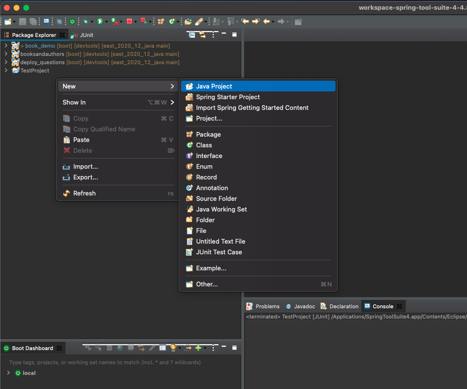
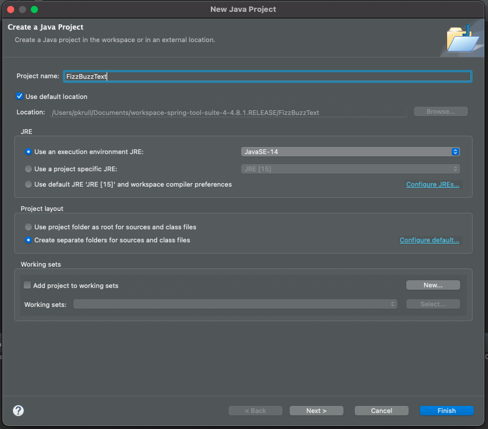
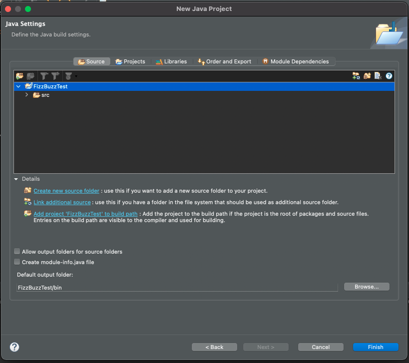
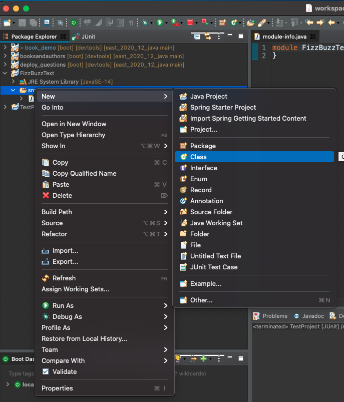
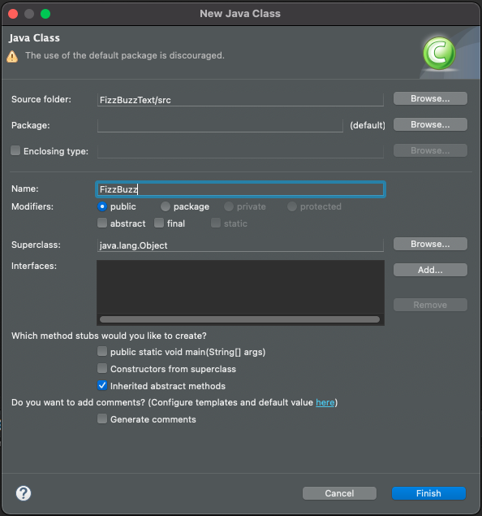

<table width="100%">
    <tr>
        <td><a href="./001_Overview.md">Back</a></td>
        <td><a href="../../Index.md">Index</a></td>
        <td><a href="./003_Testing.md">Next</a></td>
    </tr>
</table>

#

#   JUnit Introduction
JUnit is a testing platform for writing test on the JVM.  Using Spring Tool Suite, there will be very little setup needed to get us started.

##  __Getting started__
We are going to introduce JUnit by changing the way we wrote our test cases for the Java Fundamentals exercises.

##  __New Projects__
For new projects you will just want to create a `Java Project` for now, you can reach this screen by going to the "New wizard":



On the next screen you will name your project and finish the project creation:



Select next, and uncheck the `Create module-info.java` box and select finish.



Once you have done this, you can create a new class by right clicking on the src directory and selecting new -> class:



After this, you will need to give your class a name. Notice the warning about "default packages." We can ignore this for now:



In the class, add the following code.
```java
import java.lang.Integer;
public class FizzBuzz {
    public String fizzBuzz(int number) {
        String rStr = "";
        if(number % 3 == 0) {
            rStr += "fizz";
        }
        if(number % 5 == 0) {
            rStr += "buzz";
        }
        rStr = (rStr == "") ? Integer.toString(number) : rStr;
        return rStr;
    }
}
```

#

[]()
<table width="100%">
    <tr>
        <td><a href="./001_Overview.md">Back</a></td>
        <td><a href="../../Index.md">Index</a></td>
        <td><a href="./003_Testing.md">Next</a></td>
    </tr>
</table>