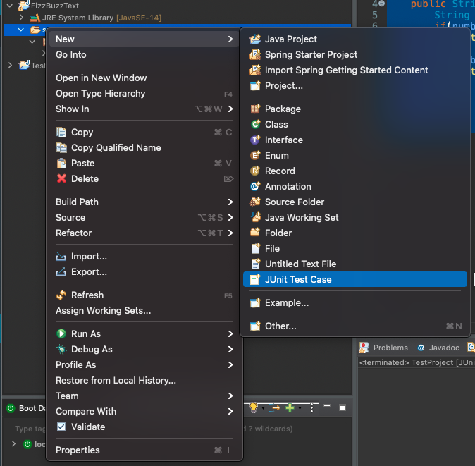
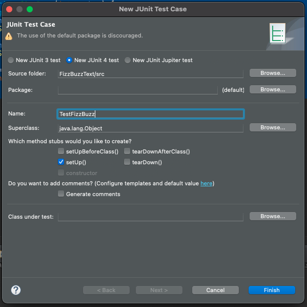
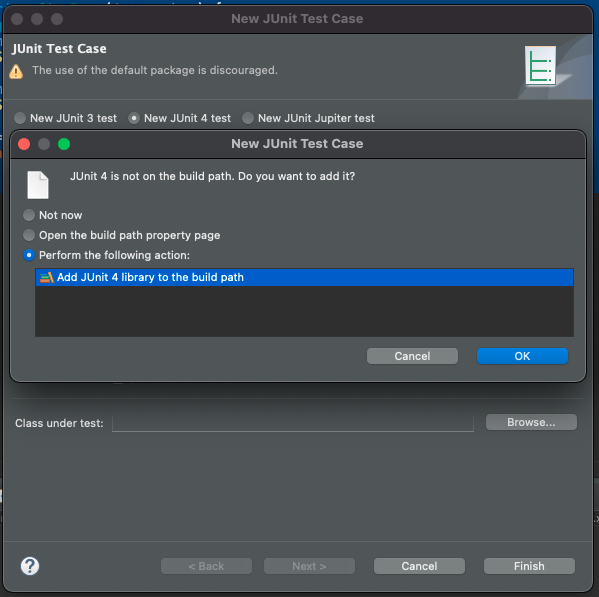
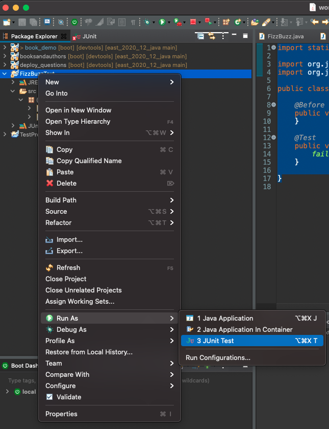
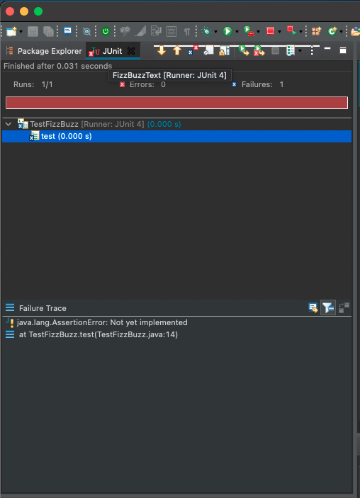

<table width="100%">
    <tr>
        <td><a href="./002_JUnit.md">Back</a></td>
        <td><a href="../Index.md">Index</a></td>
        <td><a href="./004_Assertions.md">Next</a></td>
    </tr>
</table>

#

#   Creating and Running a test
In this module, we will create a simple test using JUnit.

Create a JUnit Test Case file.



Create a name for the file, and check the `setUp()` box under the method stubs add-ons.



Select finish, add JUnit to the build path and select ok.



When we created the JUnit Test Case, STS created a few things for us.  Lets review the following code.
```java
import static org.junit.Assert.*;
import org.junit.Before;
import org.junit.Test;
public class TestFizzBuzz {
    @Before
    public void setUp() throws Exception {
    }
    @Test
    public void test() {
        fail("Not yet implemented");
    }
}
```
`@Before` - Is added for us when we selected the `setUp()` method during the initial step.  This annotation, will trigger the attached method before interpreting the rest of the class.

`@Test` - This annotation tells JUnit to run the method as a test.  `fail()` will fail the test with the supplied method. We will remove this in the next module.

We can now run our test by running our project with JUnit.



Select the JUnit tab, and you should see the following result:



#

[]()
<table width="100%">
    <tr>
        <td><a href="./002_JUnit.md">Back</a></td>
        <td><a href="../Index.md">Index</a></td>
        <td><a href="./004_Assertions.md">Next</a></td>
    </tr>
</table>