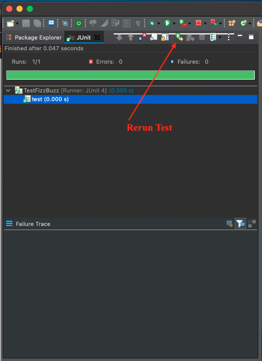

<table width="100%">
    <tr>
        <td><a href="./003_Testing.md">Back</a></td>
        <td><a href="../../Index.md">Index</a></td>
        <td><a href="./005_JUnit_SLL.md">Next</a></td>
    </tr>
</table>

#

#   Assertions
Now that we have been able to run a simple test, let's look into some Assertions methods that are useful for writing test.  Here is a [tutorial](https://www.tutorialspoint.com/junit/junit_api.htm) with some examples of the different types of Assert methods that are available. we will highlight a few as we test our FizzBuzz class.

##  __Setup__
In the `setUp()` method in the `TestFizzBuzz` class, add in an instance of the `FizzBuzz` class and change the code within the `test()` method.
```java
import static org.junit.Assert.*;
import org.junit.Before;
import org.junit.Test;
public class TestFizzBuzz {
    
    public FizzBuzz fb;
    @Before
    public void setUp() throws Exception {
        fb = new FizzBuzz();
    }
    @Test
    public void test() {
        assertNotNull(fb);
    }
}
```
`assertNotNull` is a method that check to see if the given object is not null, if it is not null, the test will pass. Run the JUnit test again and see that the test passed.



Let's look into 2 other useful Assert methods as we test the functionality of our FizzBuzz class.

*   assertTrue - will test the condition supplied, and the test will pass if the condition it true.
*   assertEquals - will compare the supplied arguments, and the test will pass if they are the same.

Add the following test into the FizzBuzzTest class and rerun the JUnit test.
```java
    @Test
    public void testForFizz() {
        String result = fb.fizzBuzz(3);
        assertTrue(result.equals("fizz"));
    }
    
    @Test
    public void testForBuzz() {
        String result = fb.fizzBuzz(5);
        assertTrue(result.equals("buzz"));
    }
    
    @Test
    public void testForFizzBuzz() {
        String expected = "fizzbuzz";
        String actual = fb.fizzBuzz(30);
        assertEquals(expected, actual);
    }
```
#

[]()
<table width="100%">
    <tr>
        <td><a href="./003_Testing.md">Back</a></td>
        <td><a href="../../Index.md">Index</a></td>
        <td><a href="./005_JUnit_SLL.md">Next</a></td>
    </tr>
</table>