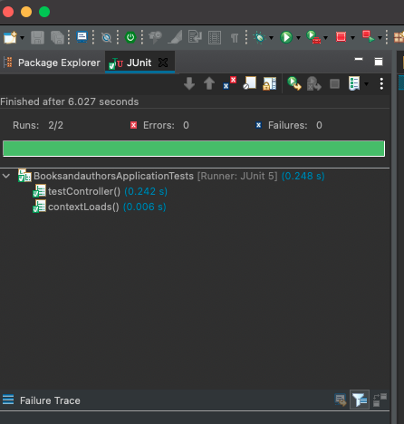

<table width="100%">
    <tr>
        <td><a href="./005_JUnit_SLL.md">Back</a></td>
        <td><a href="../Index.md">Index</a></td>
        <td><a href="./007_Testing_Model.md">Next</a></td>
    </tr>
</table>

#

#   JUnit with Spring
We will be using Jupiter to test our Spring Boot applications.  Jupiter is an extension of JUnit, that provides the same testing support that JUnit has.  Jupiter will allow you to test the entire application, but we will introduce it by only testing the model layer.  Take a look at the Spring docs for a [tutorial](https://spring.io/guides/gs/testing-web/) that will walk you through testing the entire Web Layer.

##  __Getting Started__
All of the needed dependancies are included with the Spring Boot applications we have already built.  We will be testing the Book project we just completed the Spring Data I chapter.   Open the test file within the project `src -> test -> java -> <package-name> -> <project-name>ApplicationTest.java`.

Within the file, the Spring Boot app has imported the needed dependancies needed to start testing the application.  The `@SpringBootTest` annotation tells Spring that this is a test class, and the @Test annotation denotes the attached method as a test case.

To make sure we can correctly run our text, we will inject the controller into the text class and make sure it is not null.  Change the code in the test file to match below.
```java
package com.pkrull;
import static org.assertj.core.api.Assertions.assertThat;
import org.junit.jupiter.api.Test;
import org.springframework.beans.factory.annotation.Autowired;
import org.springframework.boot.test.context.SpringBootTest;
import com.pkrull.Controllers.BookController;
@SpringBootTest
class BooksandauthorsApplicationTests {
    
    @Autowired
    // use the name of the controller you create in your project
    private BookController controller;
    @Test
    void contextLoads() {
    }
    
    @Test
    void testController() {
        assertThat(controller).isNotNull();
    }
}
```
The `@Autowired` annotation will injected the controller into the class without the need to write out the constructor. Note that we are using the `assetThat` method. This will check to make sure the controller was correctly injected into the class.

###  __`***Important***`__

In order to test the application, we need to start the project with the Spring Boot App command.  Once the project is up and running, we can test with JUnit the same way we tested a basic Java project.

1.  Run As -> Spring Boot App
2.  Run As -> JUnit Test

Test the app and you should get the following results.



#

[]()
<table width="100%">
    <tr>
        <td><a href="./005_JUnit_SLL.md">Back</a></td>
        <td><a href="../Index.md">Index</a></td>
        <td><a href="./007_Testing_Model.md">Next</a></td>
    </tr>
</table>