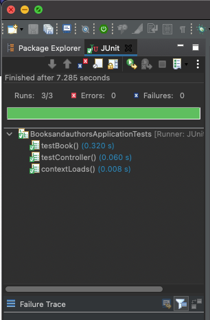

<table width="100%">
    <tr>
        <td><a href="./006_JUnit_Spring.md">Back</a></td>
        <td><a href="../Index.md">Index</a></td>
        <td><a href="./008_Model_Test.md">Next</a></td>
    </tr>
</table>

#

#      Testing Model Validations
As we mentioned in the previous module, we will be testing the models of our Books application.  We will be using the same dependency we used to add the validations in the model, so be sure you have the below dependency in the pom.xml of the project.
```xml
<dependency>
    <groupid>org.springframework.boot</groupid>
    <artifactid>spring-boot-starter-validation</artifactid>
</dependency>
```
##  __Setting up the validator__
In the test class we updated in the previous module, add the following lines.
```java
private static Validator validator;
    
@BeforeAll
static void setUp() {
    ValidatorFactory factory = Validation.buildDefaultValidatorFactory();
    validator = factory.getValidator();
}
```
In order to validate a bean (in this case, our Book model class) we need a Validator object.  This is built by using a `ValidatoryFactory`.  The `@BeforeAll` annotation is applied to this method so that the Validator object is available for any method in the class that needs to use it.  By default, the `setUp()` needs to be a static method in order to use the @BeforeAll annotation.  

## __Using the validator__
Now that we have the validator set up, let's create a method to test the Book model.
```java
@Test
void testBook() {
    Book book = new Book();
    Set<ConstraintViolation<Book>> violations = validator.validate(book);
    for (ConstraintViolation<Book> violation : violations) {
        System.out.println(violation.getMessage()); 
    }
    assertTrue(violations.isEmpty());
}
```
Here we create an empty instance of the book model and pass it the validate method of the validator.  Any violations of the validations we have set on the models will be returned as a Set.  If there are any violations, we can iterate through them and print them to the console.

Finally, we run the test.  This test will fail, because we we have created an empty Book object and did not set any of the fields.  Use the setter methods and defined the values of the fields and run the test again.
```java
@Test
void testBook() {
    Book book = new Book();
    book.setTitle("Harry Potter and the Goblet of Fire");
    book.setDescription("Great book");
    book.setLanguage("English");
    book.setNumberOfPages(734);
    Set<ConstraintViolation<book>> violations = validator.validate(book);
    for (ConstraintViolation<book> violation : violations) {
        System.out.println(violation.getMessage()); 
    }
    assertTrue(violations.isEmpty());
}
```


For a list of the different types of Jupiter annotations and methods, use this link to the [JUnit Jupiter API Documentation](https://junit.org/junit5/docs/5.0.0/api/org/junit/jupiter/api/package-summary.html).

The completed file should look something like this.
```java
package com.pkrull;
import static org.assertj.core.api.Assertions.assertThat;
import static org.junit.jupiter.api.Assertions.assertTrue;
import java.util.Set;
import javax.validation.ConstraintViolation;
import javax.validation.Validation;
import javax.validation.Validator;
import javax.validation.ValidatorFactory;
import org.junit.jupiter.api.BeforeAll;
import org.junit.jupiter.api.Test;
import org.springframework.boot.test.context.SpringBootTest;
import com.pkrull.Models.Book;
@SpringBootTest
public class BookModelTest {
    private static Validator validator;
    
    @BeforeAll
    static void setUp() {
        ValidatorFactory factory = Validation.buildDefaultValidatorFactory();
        validator = factory.getValidator();
    }
    @Test
    void contextLoads() {
    }
    @Test
    void testController() {
        assertThat(controller).isNotNull();
    }
    
    @Test
    void testBook() {
        Book book = new Book();
        book.setTitle("Harry Potter and the Goblet of Fire");
        book.setDescription("Great book");
        book.setLanguage("English");
        book.setNumberOfPages(734);
        Set<ConstraintViolation<book>> violations = validator.validate(book);
        for (ConstraintViolation<book> violation : violations) {
            System.out.println(violation.getMessage()); 
        }
        assertTrue(violations.isEmpty());
    }
    
}
```


#

[]()
<table width="100%">
    <tr>
        <td><a href="./006_JUnit_Spring.md">Back</a></td>
        <td><a href="../Index.md">Index</a></td>
        <td><a href="./008_Model_Test.md">Next</a></td>
    </tr>
</table>