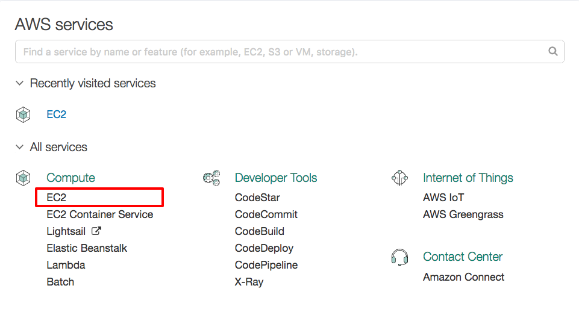
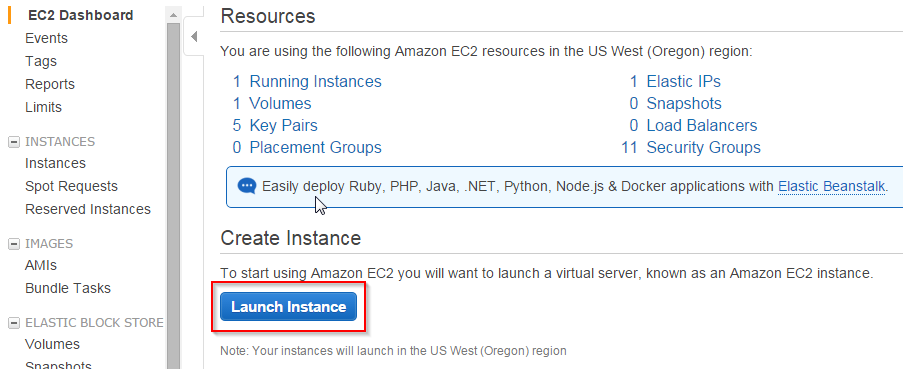
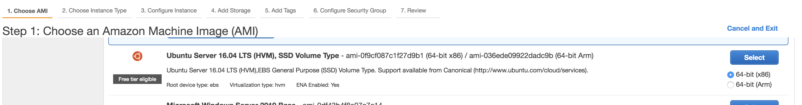
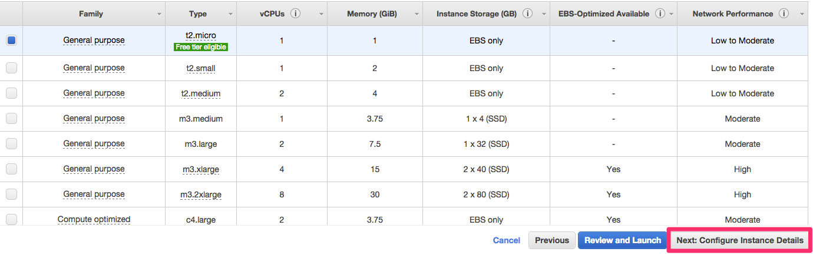
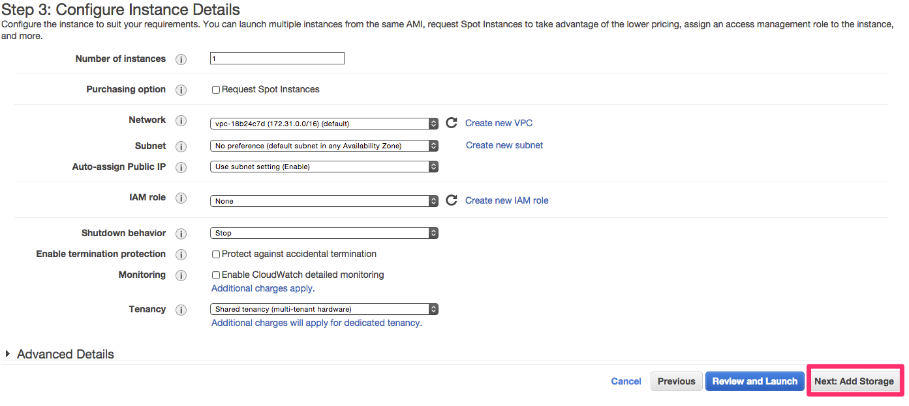
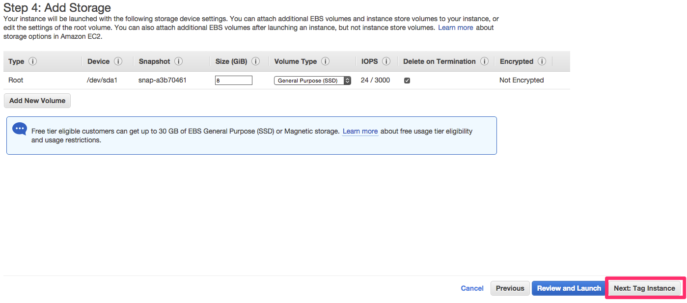
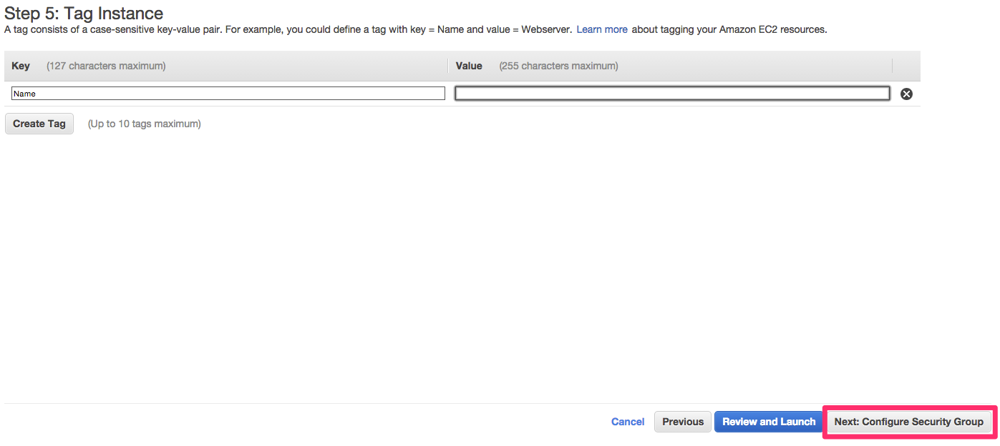
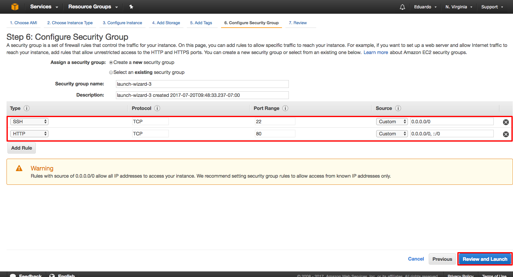
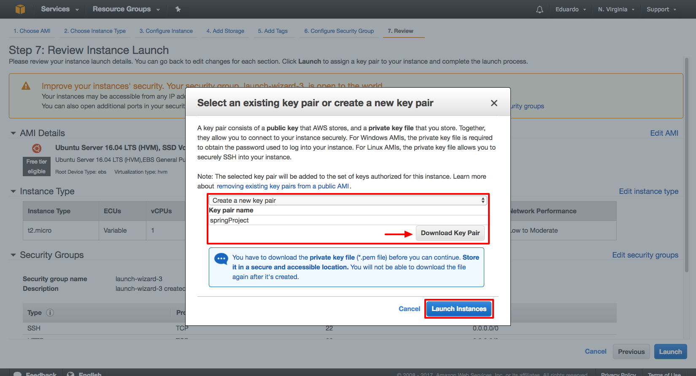

<table width="100%">
    <tr>
        <td><a href="./../006_Spring/007_Spring_Extras/008_Model_Test.md">Back</a></td>
        <td><a href="../Index.md">Index</a></td>
        <td><a href="./002_MySQL.md">Next</a></td>
    </tr>
</table>

#

#   Deploying your Spring Boot to Amazon
##  __Prerequisites:__
*   Basic Terminal knowledge
*   Basic Java and Spring knowledge
*   AWS Free Tier account. You can sign up at: http://aws.amazon.com/free/
##  __Overview:__
To successfully deploy our Spring Boot application, we will need to install the following technologies on our server:

*   Java JDK
*   Apache Web Server
*   MySQL Database
  
##  __Setting Up our EC2 Instance__
1.  Once your AWS account is created, let's log in to the console at aws.amazon.com/console. Choose EC2 under the __Compute Category__.

2.  In the EC2 dashboard, let's click the large blue button that says "__Launch Instance__"

3.  Now, we need to choose an Amazon Machine Image (AMI). The machine that we will be using is __Ubuntu Server 16.04__. This machine should be offered by Amazon for free.

4.  Now, we get to choose how powerful we want this instance to be. Let's go with the t2.micro version, which is free. Go ahead and click on "__Next: Configure Instance Details__".

5.   We will be using mostly default configurations but is good to know what you are able to customize. For our purposes, we won't need to change anything. Go ahead and click "__Next: Add Storage__".

6.  This is where we want to specify how much storage we want. We will only need 8 GB for now. Go ahead and click on "__Next: Tag Instance__".

7.  We can give our instance a name by "tagging" it. It is up to you if you want to name it. Go ahead and click on "__Next: Configure Security Group__".

8.  In the Configure Security Group page, you have the option to create a new security group. A security group is a set of firewall rules that control the traffic for your instance. Under this __Security Group__, the default allowed traffic is SSH with a TCP protocol, this means that we can only access this instance via SSH (PUTTY for windows users) or the Terminal for macs. For web traffic, we also want to add the HTTP protocol. Go ahead and click on "__Review and Launch__".

9.  Go ahead and click __Launch__ to create our configured EC2 instance.

10. Next, need to create and download a new key pair. This is a private KEY that will allow us to connect to our server securely.

    *   Once you have the pem file downloaded, move it to a convenient directory of your choice.

    *   In your terminal, navigate to the directory where the pem file is located and change the permissions by running "__chmod 400 <<theNameOfYourKey>>.pem__".
    *   Using ssh, we will connect to our instance by running "__ssh -i <<theNameOfYourKey>>.pem ubuntu@<<yourPublicIpAddress>>__".
    *   Your system will ask you if you want to continue connecting. Type in __yes__.

Note: You can find both, public and private IPs, in the EC2 dashboard.

11. Once connected to the server, run "__sudo apt-get update__" and "__sudo apt-get -y upgrade__". This will make sure that our system. is up to date. If you see a pink screen to update __menu.lst__, choose the default option to __keep the local version currently installed__.

#

<table width="100%">
    <tr>
        <td><a href="./../006_Spring/007_Spring_Extras/008_Model_Test.md">Back</a></td>
        <td><a href="../Index.md">Index</a></td>
        <td><a href="./002_MySQL.md">Next</a></td>
    </tr>
</table>