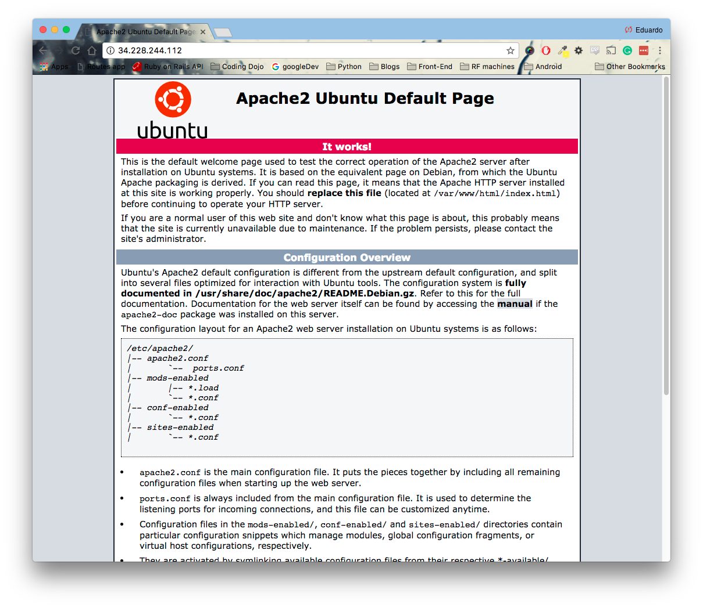

<table width="100%">
    <tr>
        <td><a href="./002_MySQL.md">Back</a></td>
        <td><a href="../Index.md">Index</a></td>
        <td><a href="./004_Spring_Setup.md">Next</a></td>
    </tr>
</table>

#

#   Apache Set Up
Apache is one of the most popular web servers in the world. We are going to use Apache to reverse proxy incoming requests to out Spring Boot application.

1.  Install Apache with the following command:
```
sudo apt-get install apache2
```
2.  In your browser, navigate to your public IP to see the Apache2 Ubuntu Default Page.



#

[]()
<table width="100%">
    <tr>
        <td><a href="./002_MySQL.md">Back</a></td>
        <td><a href="../Index.md">Index</a></td>
        <td><a href="./004_Spring_Setup.md">Next</a></td>
    </tr>
</table>