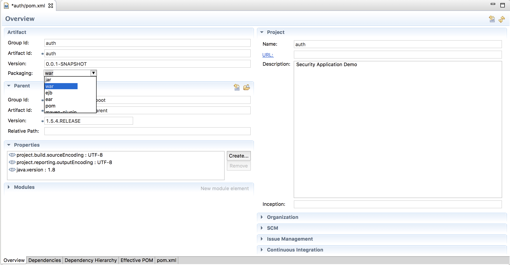
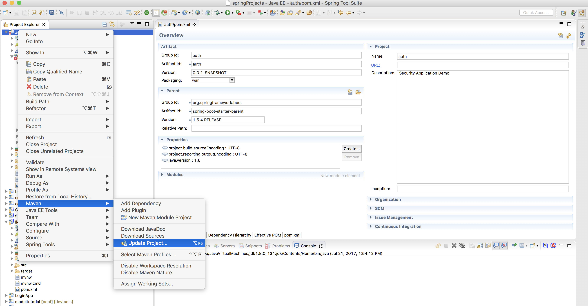
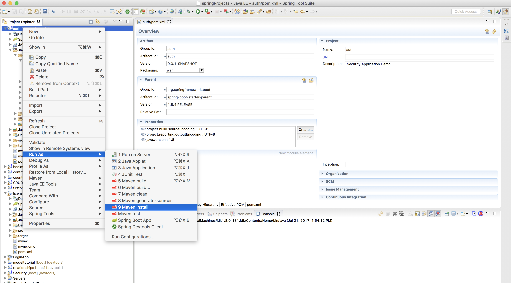
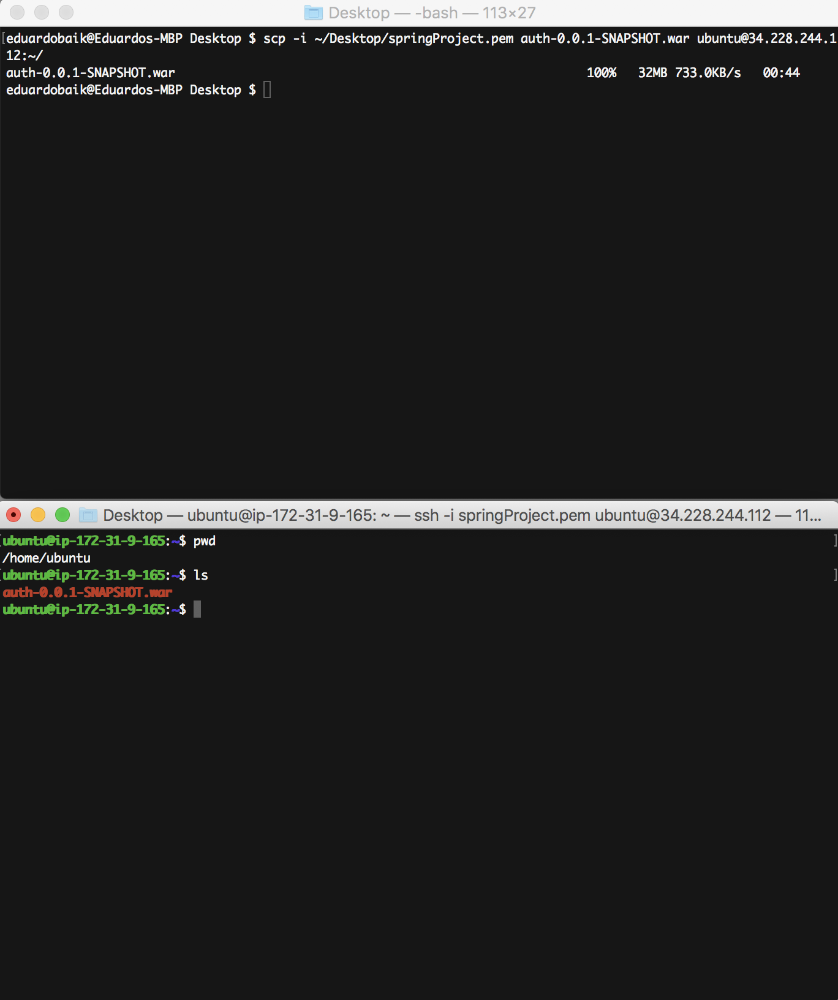
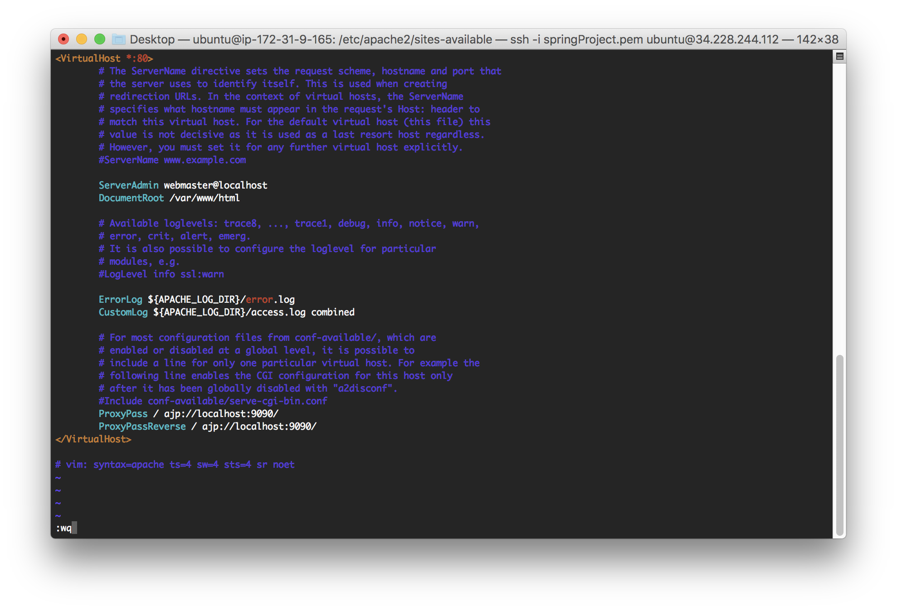

<table width="100%">
    <tr>
        <td><a href="./003_Apache.md">Back</a></td>
        <td><a href="../Index.md">Index</a></td>
        <td><a href="./005_JDK_Systemd.md">Next</a></td>
    </tr>
</table>

#

#   Spring Boot Set Up
When a HTTP request comes into our EC2 server, Apache will receive the request and use reverse proxy to forward it to our Spring Boot application running on port 9090. In this tab, we will secure copy our application into our server, set up the reverse proxy, and use systemd to run our application.

1.  For our reverse proxy to work, we are going to use the Apache JServ Protocol. In your Spring Boot Application File, add the following code:

### __com.codingdojo.auth.AuthApplication.java__
```java
package com.codingdojo.auth;
import org.apache.catalina.connector.Connector;
import org.apache.coyote.ajp.AbstractAjpProtocol;
import org.springframework.boot.SpringApplication;
import org.springframework.boot.autoconfigure.SpringBootApplication;
import org.springframework.boot.web.embedded.tomcat.TomcatServletWebServerFactory;
import org.springframework.context.annotation.Bean;
@SpringBootApplication
public class AuthApplication {
    public static void main(String[] args) {
        SpringApplication.run(AuthApplication.class, args);
    }
    @Bean
    public TomcatServletWebServerFactory servletContainer() {
        TomcatServletWebServerFactory tomcat = new TomcatServletWebServerFactory();
        Connector ajpConnector = new Connector("AJP/1.3");
        ajpConnector.setPort(9090);
        ajpConnector.setSecure(false);
        ajpConnector.setAllowTrace(false);
        ajpConnector.setScheme("http");
        ((AbstractAjpProtocol)ajpConnector.getProtocolHandler()).setSecretRequired(false);
        tomcat.addAdditionalTomcatConnectors(ajpConnector);
        return tomcat;
    }
}
```
2.  Next, we need to package our project into a __war__ file.

    *   Go to your 'pom.xml' file and Overview tab. If your packaging is jar, change it to war.
    

    *   Run Maven -> Update Project
    

    *   Run Run As -> Maven Install (this will create the war file)
    

3. STS will build a war file and save it inside the target directory. In this example, the full directory path is: __/Users/eduardobaik/Desktop/springProjects/auth/target/auth-0.0.1-SNAPSHOT.war__.

    *   Navigate to said directory in your terminal and secure copy the war file into the home directory of your EC2 server. You will need your pem file path and your public ip address. For example:
```cmd
scp -i ~/Desktop/springProject.pem auth-0.0.1-SNAPSHOT.war ubuntu@34.228.244.112:~/
```



4.  Let's create a folder for our application inside of the '/var' directory.
```
sudo mkdir /var/springApp
sudo mv ~/auth-0.0.1-SNAPSHOT.war /var/springApp/
```
5.  Now, we need to tell Apache to proxy requests to our application.

    *   Set up proxy
    ```
    sudo a2enmod proxy
    sudo a2enmod proxy_ajp
    ```

    *   Open our virtual host conf file.
    ```
    cd /etc/apache2/sites-available
    sudo vim 000-default.conf
    ```
    *   Add the proxy configuration at the bottom. Make sure to have it run on port 9090.
    

6.  Restart Apache.
    ```
    sudo service apache2 restart
    ```
#

[]()
<table width="100%">
    <tr>
        <td><a href="./003_Apache.md">Back</a></td>
        <td><a href="../Index.md">Index</a></td>
        <td><a href="./005_JDK_Systemd.md">Next</a></td>
    </tr>
</table>