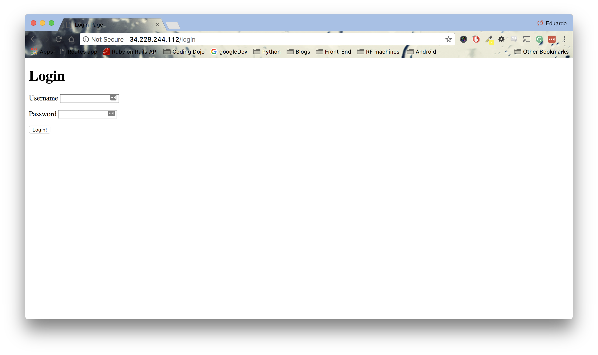
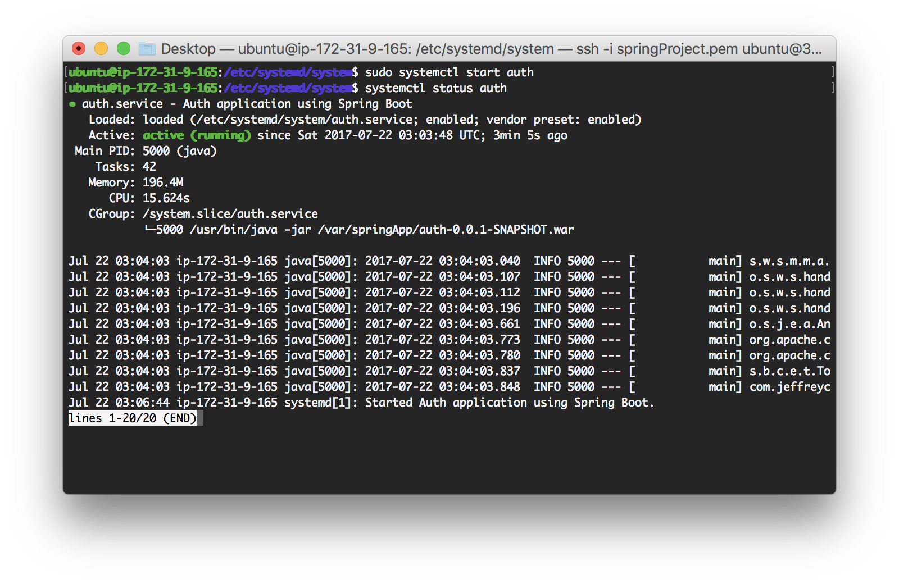

<table width="100%">
    <tr>
        <td><a href="./004_Spring_Setup.md">Back</a></td>
        <td><a href="../Index.md">Index</a></td>
        <td><a href="./006_Events_Belt_Reviewer.md">Next</a></td>
    </tr>
</table>

#

#   JDK and systemd
Lastly, we need to install the JDK to run our jar file and create a systemd script to have our application always running.

1.  Install the JDK
    ```
    sudo apt-get install default-jdk
    ```
2.  Navigate to '/var/springApp' and run your application with the 'java -jar <<warFile>>'. For example:
    ```
    java -jar auth-0.0.1-SNAPSHOT.war
    ```
    This will start your Spring Boot appplication. In your favorite browser, navigate to your public IP address and you should see your application.



##  __systemd__
Currently our app is working fine; however, if we ever close our ssh session, the Spring Boot application will stop running. To solve this issue, Spring Boot recommends that we create a systemd script to run our application.

1.  Create a script named <<yourApp>>.service in '/etc/systemd/system' directory.
    ```
    cd /etc/systemd/system
    sudo touch auth.service
    sudo vim auth.service
    ```
    In the editor, follow this example:
    ```
    [Unit]
    Description=Auth application using Spring Boot
    After=syslog.target
    [Service]
    User=ubuntu
    ExecStart=/usr/bin/java -jar /var/springApp/auth-0.0.1-SNAPSHOT.war
    SuccessExitStatus=143
    [Install]
    WantedBy=multi-user.target
    ```
Note: Change the Description field to match your application.

2.  Let systemd know that we have created a new service:
    ```
    sudo systemctl daemon-reload
    ```
3.  Now that we have created the script, we need to make sure that our applications starts on every system boot:
    ```
    sudo systemctl enable auth.service
    ```
4.  Start our service:
    ```
    sudo systemctl start auth
    ```
5.  We can also stop, restart and check the status of our service:
    ```
    sudo systemctl stop auth
    sudo systemctl restart auth
    systemctl status auth     
    ```
    We don't have to run sudo for the status because we are just checking if the service is running.

    

    Now, your app will be running via systemd. You can close your ssh session and everyone will still be able to see your application.

#

[]()
<table width="100%">
    <tr>
        <td><a href="./004_Spring_Setup.md">Back</a></td>
        <td><a href="../Index.md">Index</a></td>
        <td><a href="./006_Events_Belt_Reviewer.md">Next</a></td>
    </tr>
</table>